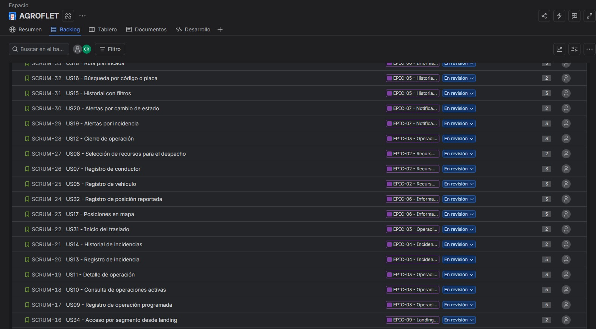

# Capítulo III: Requirements Specification

## 3.1. User Stories

En esta sección se especifican los requisitos del sistema AgroFlet mediante un conjunto de Epics, User Stories y Technical Stories derivadas del proceso de *needfinding*, el análisis competitivo y los segmentos objetivo identificados. Las User Stories representan funcionalidades de valor para los usuarios finales de la plataforma web y del *landing page*, mientras que las Technical Stories describen los requisitos funcionales del RESTful API que soporta el sistema.

#### **EPICS**

| Epic / Story   ID | Título                                    | Descripción                                                                                                                                                                                                            | Criterios de Aceptación                                                                                                                                                                                                                                                                                                                                                                                                                                                                                                | Relacionado con (Epic ID) |
| :------------------- | :---------------------------------------- | :--------------------------------------------------------------------------------------------------------------------------------------------------------------------------------------------------------------------- | :--------------------------------------------------------------------------------------------------------------------------------------------------------------------------------------------------------------------------------------------------------------------------------------------------------------------------------------------------------------------------------------------------------------------------------------------------------------------------------------------------------------------- | :------------------------ |
| **EPIC-01**          | Autenticación y cuenta                    | **Como** usuario de AgroFlet, **deseo** gestionar el registro, inicio, cierre y recuperación de mi cuenta, **para** acceder de forma segura a la plataforma según mi rol.                                        | **Escenario: Validación del alcance de autenticación y cuenta** **Given** que las historias US01, US02, US03 y US04 pertenecen a este epic, **When** el equipo evalúa el cumplimiento de EPIC-01, **Then** el epic se considera aceptado únicamente cuando las historias incluidas cumplen sus criterios de aceptación; el epic por sí solo no acredita implementación.                                                                                                                                       | —                         |
| **EPIC-02**          | Recursos de transporte                    | **Como** coordinador logístico, **deseo** gestionar vehículos y conductores asociados a mis despachos, **para** disponer de recursos válidos y disponibles antes de crear una operación.                         | **Escenario: Validación del alcance de recursos de transporte** **Given** que las historias US05, US06, US07 y US08 pertenecen a este epic, **When** el equipo evalúa el cumplimiento de EPIC-02, **Then** el epic se considera aceptado únicamente cuando dichas historias cumplen sus criterios y respetan las reglas de disponibilidad y propiedad de los recursos.                                                                                                                                        | —                         |
| **EPIC-03**          | Operaciones                               | **Como** coordinador logístico o participante autorizado, **deseo** gestionar el ciclo de vida de las operaciones de transporte, **para** programar, iniciar, consultar y cerrar los envíos de forma controlada. | **Escenario: Validación del ciclo de vida de una operación** **Given** que las historias US09, US10, US11, US12 y US31 pertenecen a este epic, **When** el equipo valida EPIC-03, **Then** las operaciones respetan el flujo planned → in_transit → delivered, permiten cancelled desde planned o in_transit y liberan los recursos cuando corresponde.                                                                                                                                                       | —                         |
| **EPIC-04**          | Incidencias                               | **Como** participante autorizado, **deseo** registrar y consultar incidencias de los envíos, **para** comprender los eventos que modifican o explican el desarrollo de una operación.                            | **Escenario: Validación de la gestión de incidencias** **Given** que las historias US13 y US14 pertenecen a este epic, **When** se registra o consulta una incidencia, **Then** la información queda asociada a una operación autorizada, es trazable y no se duplica ante reintentos equivalentes.                                                                                                                                                                                                           | —                         |
| **EPIC-05**          | Historial y búsqueda                      | **Como** participante autorizado, **deseo** consultar, filtrar y buscar operaciones anteriores o activas, **para** localizar información relevante y revisar antecedentes logísticos.                            | **Escenario: Validación de historial y búsqueda** **Given** que las historias US15 y US16 pertenecen a este epic, **When** el usuario aplica filtros o términos de búsqueda válidos, **Then** el sistema devuelve únicamente operaciones autorizadas que cumplen los criterios solicitados.                                                                                                                                                                                                                   | —                         |
| **EPIC-06**          | Información geográfica                    | **Como** participante autorizado, **deseo** consultar la ruta y las posiciones reportadas de mis operaciones, **para** interpretar correctamente la situación geográfica de cada envío.                          | **Escenario: Validación de información geográfica** **Given** que las historias US17, US18 y US32 pertenecen a este epic, **When** el usuario consulta o registra información geográfica, **Then** el sistema identifica la fecha y la fuente del dato y nunca presenta una posición inventada o desactualizada como una ubicación actual.                                                                                                                                                                    | —                         |
| **EPIC-07**          | Notificaciones                            | **Como** participante autorizado, **deseo** recibir notificaciones sobre incidencias y cambios de estado de mis operaciones, **para** conocer novedades relevantes sin monitorear manualmente cada envío.        | **Escenario: Validación de notificaciones** **Given** que las historias US19 y US20 pertenecen a este epic, **When** ocurre un evento notificable en una operación asociada, **Then** el sistema genera avisos solo para los destinatarios autorizados y evita duplicados para el mismo evento.                                                                                                                                                                                                               | —                         |
| **EPIC-08**          | Perfil y preferencias                     | **Como** usuario registrado, **deseo** administrar mis datos, contraseña e idioma preferido, **para** mantener mi cuenta actualizada y adaptar la plataforma a mis necesidades.                                  | **Escenario: Validación de perfil y preferencias** **Given** que las historias US21, US22 y US23 pertenecen a este epic, **When** el usuario modifica información permitida de su cuenta, **Then** el sistema valida los cambios, conserva las restricciones de seguridad y persiste las preferencias admitidas.                                                                                                                                                                                              | —                         |
| **EPIC-09**          | Landing page                              | **Como** visitante de AgroFlet, **deseo** conocer la propuesta, funcionalidades, condiciones y canales de acceso del producto, **para** evaluar la solución antes de continuar hacia la aplicación web.          | **Escenario: Validación del contenido y navegación del landing page** **Given** que las historias US24, US25, US26, US27, US28, US29, US30, US33 y US34 pertenecen a este epic, **When** el visitante navega por el landing page, **Then** el contenido es accesible, no presenta funciones proyectadas como implementadas y permite continuar al recorrido correspondiente sin otorgar permisos de autenticación por sí solo.                                                                                | —                         |

#### **USER STORIES and TECHNICAL STORIES**

| Epic / Story   ID | Título                                    | Descripción                                                                                                                                                                                                            | Criterios de Aceptación                                                                                                                                                                                                                                                                                                                                                                                                                                                                                                | Relacionado con (Epic ID) |
| :------------------- | :---------------------------------------- | :--------------------------------------------------------------------------------------------------------------------------------------------------------------------------------------------------------------------- | :--------------------------------------------------------------------------------------------------------------------------------------------------------------------------------------------------------------------------------------------------------------------------------------------------------------------------------------------------------------------------------------------------------------------------------------------------------------------------------------------------------------------- | :------------------------ |
| **US01**             | Registro de cuenta                        | **Como** visitante, **deseo** registrar mis datos, **para** disponer de una cuenta según mi rol.                                                                                                                 | **Escenario 1: Flujo esperado** **Given** datos válidos y un correo nuevo, **When** solicita registro, **Then** se crea la cuenta y se informa el siguiente paso de acceso.  **Escenario 2: Validación o caso alternativo** **Given** correo duplicado o datos inválidos, **When** solicita registro, **Then** no se crea otra cuenta y se informa el error.                                                                                                                                   | **EPIC-01**               |
| **US02**             | Inicio de sesión                          | **Como** usuario registrado, **deseo** autenticarme, **para** acceder a mis operaciones.                                                                                                                         | **Escenario 1: Flujo esperado** **Given** credenciales válidas, **When** solicita acceso, **Then** obtiene una sesión con su rol.  **Escenario 2: Validación o caso alternativo** **Given** credenciales incorrectas, **When** solicita acceso, **Then** recibe un error genérico sin revelar la existencia de la cuenta.                                                                                                                                                                      | **EPIC-01**               |
| **US03**             | Cierre de sesión                          | **Como** usuario autenticado, **deseo** terminar mi sesión, **para** proteger mi cuenta.                                                                                                                         | **Escenario 1: Validación o caso alternativo** **Given** una sesión vigente, **When** solicita cerrarla, **Then** la sesión queda invalidada.  **Escenario 2: Comportamiento complementario** **Given** una sesión cerrada, **When** solicita un recurso protegido, **Then** se rechaza el acceso.                                                                                                                                                                                             | **EPIC-01**               |
| **US04**             | Recuperación de contraseña                | **Como** usuario registrado, **deseo** restablecer mi contraseña, **para** recuperar acceso.                                                                                                                     | **Escenario 1: Flujo esperado** **Given** una solicitud de recuperación, **When** la procesa el sistema, **Then** devuelve confirmación genérica y envía instrucciones solo si la cuenta existe.  **Escenario 2: Validación o caso alternativo** **Given** un enlace vencido o utilizado, **When** intenta restablecer la contraseña, **Then** se rechaza el cambio.                                                                                                                           | **EPIC-01**               |
| **US05**             | Registro de vehículo                      | **Como** despachador, **deseo** registrar un vehículo propio o contratado, **para** asignarlo a mis despachos.                                                                                                   | **Escenario 1: Flujo esperado** **Given** placa y datos válidos y capacidad positiva, **When** registra el vehículo, **Then** queda disponible en su ámbito de gestión.  **Escenario 2: Validación o caso alternativo** **Given** placa duplicada en su ámbito o capacidad no positiva, **When** registra el vehículo, **Then** se rechaza sin duplicarlo.                                                                                                                                     | **EPIC-02**               |
| **US06**             | Consulta y edición de vehículos           | **Como** despachador, **deseo** mantener los datos de mis vehículos, **para** coordinar recursos correctos.                                                                                                      | **Escenario 1: Flujo esperado** **Given** un vehículo propio de su ámbito, **When** actualiza datos válidos, **Then** se conservan los cambios.  **Escenario 2: Comportamiento complementario** **Given** un vehículo reservado o en ruta, **When** intenta marcarlo disponible o en mantenimiento, **Then** se impide una modificación incompatible con la operación.                                                                                                                         | **EPIC-02**               |
| **US07**             | Registro de conductor                     | **Como** despachador, **deseo** registrar conductores, **para** asignar responsables del traslado.                                                                                                               | **Escenario 1: Flujo esperado** **Given** datos válidos de identidad, licencia y contacto, **When** registra al conductor, **Then** queda disponible.  **Escenario 2: Comportamiento complementario** **Given** identidad duplicada en su ámbito, **When** intenta crear otro registro, **Then** se rechaza la duplicación.                                                                                                                                                                    | **EPIC-02**               |
| **US08**             | Selección de recursos para el despacho    | **Como** despachador, **deseo** seleccionar vehículo y conductor, **para** preparar una operación coherente.                                                                                                     | **Escenario 1: Validación o caso alternativo** **Given** recursos disponibles, **When** prepara el despacho, **Then** conserva la selección provisional sin reservar recursos todavía.  **Escenario 2: Validación o caso alternativo** **Given** un recurso no disponible, **When** intenta seleccionarlo, **Then** se comunica su indisponibilidad.                                                                                                                                           | **EPIC-02**               |
| **US09**             | Registro de operación programada          | **Como** despachador, **deseo** registrar carga, ruta, comprador y recursos, **para** coordinar un nuevo traslado.                                                                                               | **Escenario 1: Validación o caso alternativo** **Given** carga positiva que no excede capacidad, comprador válido y recursos disponibles, **When** registra la operación, **Then** queda planned y se reservan ambos recursos en la misma transacción.  **Escenario 2: Validación o caso alternativo** **Given** dos solicitudes concurrentes para el mismo recurso, **When** se confirman, **Then** solo una reserva tiene éxito y no quedan registros parciales.                             | **EPIC-03**               |
| **US10**             | Consulta de operaciones activas           | **Como** despachador o comprador, **deseo** consultar mis operaciones, **para** identificar envíos que requieren atención.                                                                                       | **Escenario 1: Flujo esperado** **Given** operaciones autorizadas, **When** consulta actividad, **Then** obtiene estado, carga, llegada prevista y última actualización.  **Escenario 2: Validación o caso alternativo** **Given** que no existen operaciones autorizadas, **When** consulta actividad, **Then** recibe un resultado vacío; el comprador no obtiene permisos de creación.                                                                                                      | **EPIC-03**               |
| **US11**             | Detalle de operación                      | **Como** participante autorizado, **deseo** consultar los datos de un envío, **para** comprender la situación de la operación.                                                                                   | **Escenario 1: Flujo esperado** **Given** una operación asociada, **When** solicita detalle, **Then** obtiene sus datos, incidencias e historial permitidos.  **Escenario 2: Validación o caso alternativo** **Given** una operación ajena o inexistente, **When** solicita detalle, **Then** no obtiene datos ni información sobre su existencia.                                                                                                                                             | **EPIC-03**               |
| **US12**             | Cierre de operación                       | **Como** despachador, **deseo** registrar entrega o cancelación, **para** cerrar el traslado y liberar recursos.                                                                                                 | **Escenario 1: Flujo esperado** **Given** una operación in_transit, **When** registra entrega, **Then** pasa a delivered con autor, fecha e historial y libera recursos.  **Escenario 2: Validación o caso alternativo** **Given** una operación planned o in_transit y motivo válido, **When** la cancela, **Then** pasa a cancelled y libera recursos; una operación terminal no puede reabrirse por este flujo.                                                                             | **EPIC-03**               |
| **US13**             | Registro de incidencia                    | **Como** despachador, **deseo** registrar una incidencia y su impacto, **para** informar cambios en la llegada.                                                                                                  | **Escenario 1: Validación o caso alternativo** **Given** una operación in_transit y retraso no negativo, **When** registra la incidencia, **Then** queda asociada y se recalcula una vez la llegada estimada.  **Escenario 2: Validación o caso alternativo** **Given** una solicitud repetida con la misma clave de idempotencia, **When** se reenvía, **Then** no duplica la incidencia ni suma otra vez el retraso.                                                                         | **EPIC-04**               |
| **US14**             | Historial de incidencias                  | **Como** participante autorizado, **deseo** consultar eventos del viaje, **para** entender las variaciones de la operación.                                                                                      | **Escenario 1: Flujo esperado** **Given** incidencias registradas, **When** consulta el historial, **Then** las obtiene por fecha con tipo, descripción e impacto.  **Escenario 2: Validación o caso alternativo** **Given** una operación sin incidencias, **When** consulta, **Then** obtiene una lista vacía.                                                                                                                                                                               | **EPIC-04**               |
| **US15**             | Historial con filtros                     | **Como** participante autorizado, **deseo** filtrar operaciones, **para** revisar antecedentes.                                                                                                                  | **Escenario 1: Flujo esperado** **Given** filtros válidos de fechas, estado, carga y destino, **When** consulta, **Then** recibe solo operaciones autorizadas que cumplen todos los filtros.  **Escenario 2: Comportamiento complementario** **Given** un rango de fechas invertido, **When** consulta, **Then** recibe un error de validación.                                                                                                                                                | **EPIC-05**               |
| **US16**             | Búsqueda por código o placa               | **Como** participante autorizado, **deseo** localizar operaciones, **para** reducir el tiempo de búsqueda.                                                                                                       | **Escenario 1: Flujo esperado** **Given** código o placa coincidente, **When** busca, **Then** obtiene las operaciones autorizadas correspondientes.  **Escenario 2: Validación o caso alternativo** **Given** un término sin coincidencias, **When** busca, **Then** obtiene un resultado vacío.                                                                                                                                                                                              | **EPIC-05**               |
| **US17**             | Posiciones en mapa                        | **Como** participante autorizado, **deseo** consultar posiciones reportadas, **para** interpretar la situación geográfica.                                                                                       | **Escenario 1: Flujo esperado** **Given** posiciones disponibles, **When** consulta el mapa, **Then** cada posición identifica fecha y fuente, diferenciando los datos de demostración.  **Escenario 2: Validación o caso alternativo** **Given** ausencia de posición o dato antiguo, **When** consulta, **Then** se comunica esa condición sin presentar una posición inventada como actual.                                                                                                 | **EPIC-06**               |
| **US18**             | Ruta planificada                          | **Como** comprador, **deseo** consultar el recorrido previsto, **para** contextualizar el envío esperado.                                                                                                        | **Escenario 1: Validación o caso alternativo** **Given** origen y destino georreferenciados de una operación asociada, **When** consulta el recorrido, **Then** obtiene la ruta planificada identificada como tal.  **Escenario 2: Validación o caso alternativo** **Given** un fallo del proveedor de rutas, **When** consulta, **Then** conserva los datos del envío y se informa que la ruta no está disponible.                                                                            | **EPIC-06**               |
| **US19**             | Alertas por incidencia                    | **Como** participante autorizado, **deseo** recibir avisos de incidencias, **para** conocer novedades del envío.                                                                                                 | **Escenario 1: Flujo esperado** **Given** una incidencia guardada, **When** se genera el evento, **Then** existe una notificación para los participantes asociados.  **Escenario 2: Validación o caso alternativo** **Given** que el evento se procesa nuevamente, **When** se generan notificaciones, **Then** no se duplican para el mismo destinatario y evento.                                                                                                                            | **EPIC-07**               |
| **US20**             | Alertas por cambio de estado              | **Como** comprador, **deseo** recibir avisos sobre el estado del envío, **para** ajustar la recepción.                                                                                                           | **Escenario 1: Flujo esperado** **Given** un cambio de estado en su operación, **When** se registra, **Then** recibe una notificación vinculada al envío.  **Escenario 2: Validación o caso alternativo** **Given** una operación ajena, **When** cambia de estado, **Then** no recibe sus datos.                                                                                                                                                                                              | **EPIC-07**               |
| **US21**             | Edición de perfil                         | **Como** usuario, **deseo** mantener mis datos de contacto, **para** usar información actualizada.                                                                                                               | **Escenario 1: Flujo esperado** **Given** datos editables válidos, **When** actualiza su perfil, **Then** conserva los cambios.  **Escenario 2: Comportamiento complementario** **Given** que intenta cambiar el rol o el identificador mediante este flujo, **When** envía cambios, **Then** se rechazan esos campos.                                                                                                                                                                         | **EPIC-08**               |
| **US22**             | Cambio de contraseña                      | **Como** usuario, **deseo** cambiar mi contraseña, **para** proteger mi acceso.                                                                                                                                  | **Escenario 1: Validación o caso alternativo** **Given** contraseña actual correcta y nueva contraseña válida, **When** confirma el cambio, **Then** se actualiza y se invalidan las sesiones según la política documentada.  **Escenario 2: Validación o caso alternativo** **Given** contraseña actual incorrecta, **When** intenta cambiarla, **Then** se conserva la anterior.                                                                                                             | **EPIC-08**               |
| **US23**             | Idioma de la aplicación                   | **Como** usuario, **deseo** elegir inglés o español latinoamericano, **para** comprender la aplicación.                                                                                                          | **Escenario 1: Validación o caso alternativo** **Given** que no existe preferencia, **When** inicia la aplicación, **Then** usa en_US como predeterminado.  **Escenario 2: Validación o caso alternativo** **Given** selección es_419, **When** guarda preferencia, **Then** cambia los textos del sistema y conserva la preferencia; no traduce automáticamente contenido escrito por usuarios.                                                                                               | **EPIC-08**               |
| **US24**             | Propuesta de valor en landing             | **Como** visitante, **deseo** conocer el propósito de AgroFlet, **para** evaluar mi pertinencia.                                                                                                                 | **Escenario 1: Flujo esperado** **Given** acceso a la landing, **When** consulta la propuesta, **Then** identifica el problema, la solución y los dos segmentos.  **Escenario 2: Comportamiento complementario** **Given** acceso desde navegador móvil, **When** consulta, **Then** el contenido conserva legibilidad y acceso a sus acciones.                                                                                                                                                | **EPIC-09**               |
| **US25**             | Funcionalidades de landing                | **Como** visitante, **deseo** conocer las capacidades del producto, **para** evaluar mi utilidad.                                                                                                                | **Escenario 1: Flujo esperado** **Given** consulta de capacidades, **When** revisa su alcance, **Then** encuentra operaciones, incidencias, historial, mapa y notificaciones con su estado de disponibilidad.  **Escenario 2: Validación o caso alternativo** **Given** una función todavía proyectada, **When** consulta, **Then** no se presenta como implementada.                                                                                                                          | **EPIC-09**               |
| **US26**             | Modelo comercial y planes                 | **Como** visitante, **deseo** consultar modalidades de uso, **para** evaluar una posible contratación.                                                                                                           | **Escenario 1: Validación o caso alternativo** **Given** modalidades publicadas, **When** las consulta, **Then** distingue prestaciones y condiciones; precios no validados se identifican como propuesta.  **Escenario 2: Validación o caso alternativo** **Given** selección de una modalidad informativa, **When** continúa, **Then** no se registra un cobro ni una suscripción real sin el flujo correspondiente.                                                                         | **EPIC-09**               |
| **US27**             | Testimonios verificables                  | **Como** visitante, **deseo** consultar experiencias reales, **para** evaluar la confianza en el producto.                                                                                                       | **Escenario 1: Flujo esperado** **Given** testimonios autorizados de uso real, **When** los consulta, **Then** encuentra su procedencia y experiencia.  **Escenario 2: Validación o caso alternativo** **Given** ausencia de testimonios verificados, **When** consulta el contenido, **Then** no se presentan opiniones ficticias como experiencias reales.                                                                                                                                   | **EPIC-09**               |
| **US28**             | Contacto                                  | **Como** visitante, **deseo** enviar una consulta, **para** comunicarme con el equipo.                                                                                                                           | **Escenario 1: Flujo esperado** **Given** datos válidos y servicio receptor disponible, **When** envía una consulta, **Then** se confirma solo después de su recepción efectiva.  **Escenario 2: Validación o caso alternativo** **Given** fallo del servicio receptor, **When** intenta enviar, **Then** se informa el fallo y no se declara un envío exitoso.                                                                                                                                | **EPIC-09**               |
| **US29**             | Navegación de landing                     | **Como** visitante, **deseo** acceder al contenido informativo, **para** encontrar la información pertinente.                                                                                                    | **Escenario 1: Flujo esperado** **Given** una sección existente, **When** solicita acceder, **Then** llega a su contenido.  **Escenario 2: Validación o caso alternativo** **Given** navegación por teclado, **When** recorre las acciones, **Then** puede activar los destinos sin quedar atrapado.                                                                                                                                                                                           | **EPIC-09**               |
| **US30**             | Idioma de landing                         | **Como** visitante, **deseo** elegir idioma, **para** comprender la propuesta.                                                                                                                                   | **Escenario 1: Validación o caso alternativo** **Given** primera visita sin preferencia, **When** carga la landing, **Then** usa en_US.  **Escenario 2: Comportamiento complementario** **Given** selección es_419, **When** cambia idioma, **Then** actualiza contenido, mensajes y etiquetas y conserva la elección.                                                                                                                                                                         | **EPIC-09**               |
| **US31**             | Inicio del traslado                       | **Como** despachador, **deseo** registrar la salida efectiva, **para** distinguir programación y ejecución.                                                                                                      | **Escenario 1: Flujo esperado** **Given** operación planned con recursos reservados, **When** confirma salida, **Then** pasa a in_transit y registra actualDepartureAt.  **Escenario 2: Comportamiento complementario** **Given** operación delivered o cancelled, **When** intenta iniciarla, **Then** se rechaza la transición.                                                                                                                                                              | **EPIC-03**               |
| **US32**             | Registro de posición reportada            | **Como** despachador, **deseo** registrar una ubicación recibida, **para** compartir mi última referencia del envío.                                                                                             | **Escenario 1: Flujo esperado** **Given** operación in_transit y coordenadas válidas con fecha y fuente, **When** registra posición, **Then** queda vinculada y trazable.  **Escenario 2: Validación o caso alternativo** **Given** coordenadas fuera de rango o sin fuente, **When** registra, **Then** se rechaza; la posición del equipo en oficina no se atribuye automáticamente al camión.                                                                                               | **EPIC-06**               |
| **US33**             | Términos del servicio                     | **Como** visitante o usuario, **deseo** consultar las condiciones de uso, **para** conocer el alcance del servicio.                                                                                              | **Escenario 1: Flujo esperado** **Given** acceso a landing o aplicación, **When** consulta términos, **Then** obtiene condiciones, alcance y canal de contacto en el idioma seleccionado.  **Escenario 2: Validación o caso alternativo** **Given** una función simulada, **When** consulta sus condiciones, **Then** se informa que no constituye un servicio logístico operativo.                                                                                                            | **EPIC-09**               |
| **US34**             | Acceso por segmento desde landing         | **Como** visitante despachador o comprador, **deseo** acceder al recorrido de mi segmento, **para** continuar en la aplicación web.                                                                              | **Escenario 1: Flujo esperado** **Given** que el visitante elige su segmento, **When** continúa desde la landing, **Then** llega a la vista correspondiente del frontend desplegado.  **Escenario 2: Validación o caso alternativo** **Given** un segmento en la URL, **When** accede, **Then** la selección orienta el recorrido pero no concede permisos autenticados por sí sola.                                                                                                           | **EPIC-09**               |
| **TS01**             | POST /api/v1/auth/register                | **Como** Developer, **deseo** disponer de este contrato **para** soportar US01.                                                                                                                                        | **Escenario 1: Validación o caso alternativo** **Given** una solicitud válida y autorizada cuando corresponda, **When** el servidor la procesa, **Then** responde 201 con id, firstName, lastName, email y userType; no devuelve contraseña ni hash.  **Escenario 2: Validación o caso alternativo** **Given** una condición inválida, **When** procesa la solicitud, **Then** responde: 409 si correo duplicado; 400 si faltan datos.                                                         | **EPIC-01**               |
| **TS02**             | POST /api/v1/auth/login                   | **Como** Developer, **deseo** disponer de este contrato **para** soportar US02.                                                                                                                                        | **Escenario 1: Validación o caso alternativo** **Given** una solicitud válida y autorizada cuando corresponda, **When** el servidor la procesa, **Then** responde 200 con accessToken, expiresIn y perfil mínimo.  **Escenario 2: Validación o caso alternativo** **Given** una condición inválida, **When** procesa la solicitud, **Then** responde: 401 genérico ante credenciales incorrectas.                                                                                              | **EPIC-01**               |
| **TS03**             | GET /api/v1/shipments                     | **Como** Developer, **deseo** disponer de este contrato **para** soportar US10.                                                                                                                                        | **Escenario 1: Flujo esperado** **Given** una solicitud válida y autorizada cuando corresponda, **When** el servidor la procesa, **Then** responde 200 con data, totalRecords, currentPage, pageSize y totalPages; solo envíos autorizados.  **Escenario 2: Validación o caso alternativo** **Given** una condición inválida, **When** procesa la solicitud, **Then** responde: 401 sin sesión; 400 para paginación inválida.                                                                  | **EPIC-03**               |
| **TS04**             | POST /api/v1/shipments                    | **Como** Developer, **deseo** disponer de este contrato **para** soportar US09.                                                                                                                                        | **Escenario 1: Flujo esperado** **Given** una solicitud válida y autorizada cuando corresponda, **When** el servidor la procesa, **Then** responde 201 con operación planned; valida buyerId, vehicleId, driverId, capacidad y plannedDepartureAt; reserva atómica.  **Escenario 2: Validación o caso alternativo** **Given** una condición inválida, **When** procesa la solicitud, **Then** responde: 409 por conflicto de reserva; 400 por formato inválido; 422 si carga supera capacidad. | **EPIC-03**               |
| **TS05**             | GET /api/v1/shipments/{id}                | **Como** Developer, **deseo** disponer de este contrato **para** soportar US11.                                                                                                                                        | **Escenario 1: Flujo esperado** **Given** una solicitud válida y autorizada cuando corresponda, **When** el servidor la procesa, **Then** responde 200 con detalle autorizado, ruta, fechas y proyecciones permitidas de recursos.  **Escenario 2: Validación o caso alternativo** **Given** una condición inválida, **When** procesa la solicitud, **Then** responde: 404 para recurso inexistente o ajeno; no expone DNI al comprador.                                                       | **EPIC-03**               |
| **TS06**             | PATCH /api/v1/shipments/{id}/status       | **Como** Developer, **deseo** disponer de este contrato **para** soportar US12, US31.                                                                                                                                  | **Escenario 1: Flujo esperado** **Given** una solicitud válida y autorizada cuando corresponda, **When** el servidor la procesa, **Then** responde 200 tras transición válida; acepta inicio, entrega o cancelación con historial y versión esperada.  **Escenario 2: Validación o caso alternativo** **Given** una condición inválida, **When** procesa la solicitud, **Then** responde: 409 ante transición incompatible o versión obsoleta; 400 sin motivo de cancelación.                  | **EPIC-03**               |
| **TS07**             | POST /api/v1/shipments/{id}/incidents     | **Como** Developer, **deseo** disponer de este contrato **para** soportar US13.                                                                                                                                        | **Escenario 1: Flujo esperado** **Given** una solicitud válida y autorizada cuando corresponda, **When** el servidor la procesa, **Then** responde 201 con incident y updatedEstimatedArrival; acepta estimatedDelayMinutes >= 0 y clave de idempotencia.  **Escenario 2: Validación o caso alternativo** **Given** una condición inválida, **When** procesa la solicitud, **Then** responde: 422 si no está in_transit; reintento idéntico retorna recurso existente sin duplicarlo.          | **EPIC-04**               |
| **TS08**             | GET /api/v1/shipments/{id}/incidents      | **Como** Developer, **deseo** disponer de este contrato **para** soportar US14.                                                                                                                                        | **Escenario 1: Flujo esperado** **Given** una solicitud válida y autorizada cuando corresponda, **When** el servidor la procesa, **Then** responde 200 con lista por occurredAt descendente, incluso vacía.  **Escenario 2: Validación o caso alternativo** **Given** una condición inválida, **When** procesa la solicitud, **Then** responde: 404 si operación no accesible.                                                                                                                 | **EPIC-04**               |
| **TS09**             | GET /api/v1/vehicles                      | **Como** Developer, **deseo** disponer de este contrato **para** soportar US05, US08.                                                                                                                                  | **Escenario 1: Flujo esperado** **Given** una solicitud válida y autorizada cuando corresponda, **When** el servidor la procesa, **Then** responde 200 con vehículos del despachador y filtro de disponibilidad.  **Escenario 2: Validación o caso alternativo** **Given** una condición inválida, **When** procesa la solicitud, **Then** responde: 403 si un comprador intenta administrar flota.                                                                                            | **EPIC-02**               |
| **TS10**             | POST /api/v1/vehicles                     | **Como** Developer, **deseo** disponer de este contrato **para** soportar US05.                                                                                                                                        | **Escenario 1: Flujo esperado** **Given** una solicitud válida y autorizada cuando corresponda, **When** el servidor la procesa, **Then** responde 201 con placa, marca, modelo, año, capacidad, carrocería y estado available.  **Escenario 2: Validación o caso alternativo** **Given** una condición inválida, **When** procesa la solicitud, **Then** responde: 409 ante placa duplicada en el ámbito; 400 ante formato inválido.                                                          | **EPIC-02**               |
| **TS11**             | GET /api/v1/drivers                       | **Como** Developer, **deseo** disponer de este contrato **para** soportar US07, US08.                                                                                                                                  | **Escenario 1: Flujo esperado** **Given** una solicitud válida y autorizada cuando corresponda, **When** el servidor la procesa, **Then** responde 200 con conductores del despachador y disponibilidad.  **Escenario 2: Validación o caso alternativo** **Given** una condición inválida, **When** procesa la solicitud, **Then** responde: 403 para rol sin permiso.                                                                                                                         | **EPIC-02**               |
| **TS12**             | POST /api/v1/drivers                      | **Como** Developer, **deseo** disponer de este contrato **para** soportar US07.                                                                                                                                        | **Escenario 1: Flujo esperado** **Given** una solicitud válida y autorizada cuando corresponda, **When** el servidor la procesa, **Then** responde 201 con identidad y datos de licencia y contacto.  **Escenario 2: Validación o caso alternativo** **Given** una condición inválida, **When** procesa la solicitud, **Then** responde: 409 ante DNI duplicado en el ámbito; 400 ante formato inválido.                                                                                       | **EPIC-02**               |
| **TS13**             | GET /api/v1/shipments con filtros         | **Como** Developer, **deseo** disponer de este contrato **para** soportar US15, US16.                                                                                                                                  | **Escenario 1: Flujo esperado** **Given** una solicitud válida y autorizada cuando corresponda, **When** el servidor la procesa, **Then** responde 200 con el mismo contrato de TS03; filtros cargoType, status, destination, startDate, endDate, search.  **Escenario 2: Validación o caso alternativo** **Given** una condición inválida, **When** procesa la solicitud, **Then** responde: 400 si fechas invertidas; resultados sin coincidencias devuelven data vacía.                     | **EPIC-05**               |
| **TS14**             | GET /api/v1/shipments/active/locations    | **Como** Developer, **deseo** disponer de este contrato **para** soportar US17.                                                                                                                                        | **Escenario 1: Flujo esperado** **Given** una solicitud válida y autorizada cuando corresponda, **When** el servidor la procesa, **Then** responde 200 con shipmentId, latitude, longitude, reportedAt, source e isStale, solo de operaciones autorizadas.  **Escenario 2: Validación o caso alternativo** **Given** una condición inválida, **When** procesa la solicitud, **Then** responde: Sin posición: coordenadas null y condición explícita; no inventa una estimación.                | **EPIC-06**               |
| **TS15**             | GET /api/v1/notifications                 | **Como** Developer, **deseo** disponer de este contrato **para** soportar US19, US20.                                                                                                                                  | **Escenario 1: Flujo esperado** **Given** una solicitud válida y autorizada cuando corresponda, **When** el servidor la procesa, **Then** responde 200 con notificaciones del usuario y filtro isRead.  **Escenario 2: Validación o caso alternativo** **Given** una condición inválida, **When** procesa la solicitud, **Then** responde: 401 sin autenticación; nunca mezcla destinatarios.                                                                                                  | **EPIC-07**               |
| **TS16**             | PATCH /api/v1/notifications/{id}/read     | **Como** Developer, **deseo** disponer de este contrato **para** soportar US19, US20.                                                                                                                                  | **Escenario 1: Validación o caso alternativo** **Given** una solicitud válida y autorizada cuando corresponda, **When** el servidor la procesa, **Then** responde 200 con isRead y readAt; repetición no cambia la primera fecha.  **Escenario 2: Validación o caso alternativo** **Given** una condición inválida, **When** procesa la solicitud, **Then** responde: 404 para notificación ajena o inexistente.                                                                               | **EPIC-07**               |
| **TS17**             | GET /api/v1/users/profile                 | **Como** Developer, **deseo** disponer de este contrato **para** soportar US21, US23.                                                                                                                                  | **Escenario 1: Flujo esperado** **Given** una solicitud válida y autorizada cuando corresponda, **When** el servidor la procesa, **Then** responde 200 con perfil propio y preferredLanguage.  **Escenario 2: Validación o caso alternativo** **Given** una condición inválida, **When** procesa la solicitud, **Then** responde: 401 sin sesión.                                                                                                                                              | **EPIC-08**               |
| **TS18**             | PUT /api/v1/users/profile                 | **Como** Developer, **deseo** disponer de este contrato **para** soportar US21, US23.                                                                                                                                  | **Escenario 1: Flujo esperado** **Given** una solicitud válida y autorizada cuando corresponda, **When** el servidor la procesa, **Then** responde 200 con firstName, lastName, phone, companyName y preferredLanguage actualizados.  **Escenario 2: Validación o caso alternativo** **Given** una condición inválida, **When** procesa la solicitud, **Then** responde: 400 ante idioma no admitido; no acepta actualización del rol.                                                         | **EPIC-08**               |
| **TS19**             | PATCH /api/v1/vehicles/{id}/status        | **Como** Developer, **deseo** disponer de este contrato **para** soportar US06.                                                                                                                                        | **Escenario 1: Validación o caso alternativo** **Given** una solicitud válida y autorizada cuando corresponda, **When** el servidor la procesa, **Then** responde 200 para available ↔ under_maintenance sin reserva activa; reserved e in_route los gestiona el flujo de envío.  **Escenario 2: Validación o caso alternativo** **Given** una condición inválida, **When** procesa la solicitud, **Then** responde: 409 si existe reserva; 400 para estado no administrable.                  | **EPIC-02**               |
| **TS20**             | GET /api/v1/shipments/{id}/status-history | **Como** Developer, **deseo** disponer de este contrato **para** soportar US11.                                                                                                                                        | **Escenario 1: Flujo esperado** **Given** una solicitud válida y autorizada cuando corresponda, **When** el servidor la procesa, **Then** responde 200 con previousStatus, newStatus, changedAt y changedBy; comienza con planned.  **Escenario 2: Validación o caso alternativo** **Given** una condición inválida, **When** procesa la solicitud, **Then** responde: 404 si operación no accesible.                                                                                          | **EPIC-03**               |
| **TS21**             | POST /api/v1/auth/logout                  | **Como** Developer, **deseo** disponer de este contrato **para** soportar US03.                                                                                                                                        | **Escenario 1: Validación o caso alternativo** **Given** una solicitud válida y autorizada cuando corresponda, **When** el servidor la procesa, **Then** responde 204 al invalidar la sesión identificada en servidor.  **Escenario 2: Validación o caso alternativo** **Given** una condición inválida, **When** procesa la solicitud, **Then** responde: Una solicitud posterior usando esa sesión devuelve 401.                                                                             | **EPIC-01**               |
| **TS22**             | POST /api/v1/auth/password-reset-requests | **Como** Developer, **deseo** disponer de este contrato **para** soportar US04.                                                                                                                                        | **Escenario 1: Flujo esperado** **Given** una solicitud válida y autorizada cuando corresponda, **When** el servidor la procesa, **Then** responde 202 genérico; si cuenta existe genera token de un solo uso con vencimiento documentado.  **Escenario 2: Validación o caso alternativo** **Given** una condición inválida, **When** procesa la solicitud, **Then** responde: No revela existencia de cuenta; limita solicitudes repetidas.                                                   | **EPIC-01**               |
| **TS23**             | POST /api/v1/auth/password-resets         | **Como** Developer, **deseo** disponer de este contrato **para** soportar US04.                                                                                                                                        | **Escenario 1: Validación o caso alternativo** **Given** una solicitud válida y autorizada cuando corresponda, **When** el servidor la procesa, **Then** responde 204 tras token válido y nueva contraseña; invalida token y sesiones.  **Escenario 2: Validación o caso alternativo** **Given** una condición inválida, **When** procesa la solicitud, **Then** responde: 400 ante token inválido, vencido o usado.                                                                           | **EPIC-01**               |
| **TS24**             | PUT /api/v1/users/password                | **Como** Developer, **deseo** disponer de este contrato **para** soportar US22.                                                                                                                                        | **Escenario 1: Flujo esperado** **Given** una solicitud válida y autorizada cuando corresponda, **When** el servidor la procesa, **Then** responde 204 con contraseña actual correcta y nueva válida; revoca sesiones previas.  **Escenario 2: Validación o caso alternativo** **Given** una condición inválida, **When** procesa la solicitud, **Then** responde: 400 si validación falla, sin alterar credenciales.                                                                          | **EPIC-08**               |
| **TS25**             | PUT /api/v1/vehicles/{id}                 | **Como** Developer, **deseo** disponer de este contrato **para** soportar US06.                                                                                                                                        | **Escenario 1: Validación o caso alternativo** **Given** una solicitud válida y autorizada cuando corresponda, **When** el servidor la procesa, **Then** responde 200 con datos editables actualizados, sin cambiar dueño ni reserva.  **Escenario 2: Validación o caso alternativo** **Given** una condición inválida, **When** procesa la solicitud, **Then** responde: 404 para vehículo ajeno; 409 si cambio de capacidad contradice carga reservada.                                      | **EPIC-02**               |
| **TS26**             | POST /api/v1/shipments/{id}/positions     | **Como** Developer, **deseo** disponer de este contrato **para** soportar US32.                                                                                                                                        | **Escenario 1: Flujo esperado** **Given** una solicitud válida y autorizada cuando corresponda, **When** el servidor la procesa, **Then** responde 201 con coordenadas, reportedAt, recordedAt, source y recordedBy; valida rangos y autorización.  **Escenario 2: Validación o caso alternativo** **Given** una condición inválida, **When** procesa la solicitud, **Then** responde: 400 ante coordenadas inválidas; 422 si operación terminal; reintentos no duplican un mismo eventId.     | **EPIC-06**               |
| **TS27**             | POST /api/v1/contact-messages             | **Como** Developer, **deseo** disponer de este contrato **para** soportar US28.                                                                                                                                        | **Escenario 1: Validación o caso alternativo** **Given** una solicitud válida y autorizada cuando corresponda, **When** el servidor la procesa, **Then** responde 201 tras recepción efectiva de nombre, email y mensaje; mensaje no se publica.  **Escenario 2: Validación o caso alternativo** **Given** una condición inválida, **When** procesa la solicitud, **Then** responde: 400 ante formato inválido; 503 si no se puede aceptar la solicitud.                                       | **EPIC-09**               |

## 3.2. Impact Mapping

En esta sección se presenta el Impact Mapping del modelo de negocio AgroFlet. Esto nos permite visualizar de manera estructurada los objetivos estratégicos del proyecto y cómo estos se relacionan con los actores involucrados y las funcionalidades que se implementarán, asegurándonos de que cada característica del producto tenga un propósito claro y medible.

  
   <em>Figura 1: Captura del Impact Mapping hecho en UXPressia</em>

El Impact Mapping elaborado para AgroFlet ilustra de manera estratégica cómo las funcionalidades de nuestra plataforma tecnológica contribuye a alcanzar nuestros objetivos de negocio. Para esta fase del proyecto, hemos definido un objetivo SMART (Business Goal) enfocados tanto en la adopción empresarial como en la penetración en el usuario final.

**Alineación del Business Goal 1:** Nuestro primer objetivo de negocio busca reducir en un 35% el tiempo promedio de coordinación, asignación de flota y registro de despacho de cargamentos agrícolas durante los primeros 6 meses de operación. Para alcanzar esta meta, hemos identificado a dos actores clave de la cadena agropecuaria que nos permitirán materializarla: los medianos productores / acopiadores y los compradores mayoristas. 
- En el caso de los medianos productores / acopiadores, el impacto que necesitamos generar es que digitalicen y sistematicen el registro de sus despachos y la administración de sus recursos de transporte, dejando atrás las llamadas telefónicas y registros manuales para agilizar la salida de alimentos perecibles hacia los mercados. Como solución digital, provocaremos este impacto construyendo un Módulo de Gestión de Flotas, Conductores y Registro Operativo (Deliverable), el cual se materializa en historias de usuario enfocadas en dar de alta las unidades vehiculares, registrar choferes, vincularlos formalmente para el servicio y crear operaciones de transporte completas con su carga y ruta programada (US05, US07, US08, US09).  
- Por el lado de los compradores mayoristas, el impacto esperado es que adopten AgroFlet como su canal centralizado para planificar las ventanas de descarga y supervisar el flujo de camiones que ingresan a sus almacenes o puestos comerciales, reduciendo tiempos muertos en muelle. Para facilitar este comportamiento, implementaremos un Dashboard de Monitoreo Centralizado y Consulta Operativa (Deliverable), soportado por funcionalidades que permiten visualizar en tiempo casi real las operaciones en tránsito, consultar el detalle de los envíos en camino y revisar el historial de despachos pasados con filtros por fecha o tipo de alimento para coordinar la logística de recepción (US10, US11, US15).

## 3.3. Product Backlog

A continuación, se presenta el Product Backlog del proyecto AgroFlet, organizado y priorizado de acuerdo con el valor que cada User Story aporta al negocio y al funcionamiento principal del producto. La priorización no representa necesariamente el orden exacto en el que se desarrollarán técnicamente las funcionalidades, sino el nivel de importancia que tienen para validar y entregar valor al usuario.

| # Orden | User Story Id | Título | Descripción | Story Points |
|---|---|---|---|---|
| 1 | US24 | Propuesta de valor en landing | Como visitante, deseo conocer el propósito de AgroFlet, para evaluar su pertinencia. | 2 |
| 2 | US25 | Funcionalidades de landing | Como visitante, deseo conocer las capacidades del producto, para evaluar su utilidad. | 2 |
| 3 | US34 | Acceso por segmento desde landing | Como visitante despachador o comprador, deseo acceder al recorrido de su segmento, para continuar en la aplicación web. | 2 |
| 4 | US09 | Registro de operación programada | Como despachador, deseo registrar carga, ruta, comprador y recursos, para coordinar un nuevo traslado. | 5 |
| 5 | US10 | Consulta de operaciones activas | Como despachador o comprador, deseo consultar sus operaciones, para identificar envíos que requieren atención. | 5 |
| 6 | US11 | Detalle de operación | Como participante autorizado, deseo consultar los datos de un envío, para comprender su situación. | 3 |
| 7 | US13 | Registro de incidencia | Como despachador, deseo registrar una incidencia y su impacto, para informar cambios de llegada. | 5 |
| 8 | US14 | Historial de incidencias | Como participante autorizado, deseo consultar eventos del viaje, para entender las variaciones de la operación. | 2 |
| 9 | US31 | Inicio del traslado | Como despachador, deseo registrar la salida efectiva, para distinguir programación y ejecución. | 2 |
| 10 | US17 | Posiciones en mapa | Como participante autorizado, deseo consultar posiciones reportadas, para interpretar la situación geográfica. | 5 |
| 11 | US32 | Registro de posición reportada | Como despachador, deseo registrar una ubicación recibida, para compartir su última referencia del envío. | 3 |
| 12 | US05 | Registro de vehículo | Como despachador, deseo registrar un vehículo propio o contratado, para asignarlo a sus despachos. | 3 |
| 13 | US07 | Registro de conductor | Como despachador, deseo registrar conductores, para asignar responsables del traslado. | 3 |
| 14 | US08 | Selección de recursos para el despacho | Como despachador, deseo seleccionar vehículo y conductor, para preparar una operación coherente. | 2 |
| 15 | US12 | Cierre de operación | Como despachador, deseo registrar entrega o cancelación, para cerrar el traslado y liberar recursos. | 3 |
| 16 | US19 | Alertas por incidencia | Como participante autorizado, deseo recibir avisos de incidencias, para conocer novedades del envío. | 3 |
| 17 | US20 | Alertas por cambio de estado | Como comprador, deseo recibir avisos sobre el estado del envío, para ajustar la recepción. | 2 |
| 18 | US15 | Historial con filtros | Como participante autorizado, deseo filtrar operaciones, para revisar antecedentes. | 3 |
| 19 | US16 | Búsqueda por código o placa | Como participante autorizado, deseo localizar operaciones, para reducir el tiempo de búsqueda. | 2 |
| 20 | US18 | Ruta planificada | Como comprador, deseo consultar el recorrido previsto, para contextualizar el envío esperado. | 3 |
| 21 | US29 | Navegación de landing | Como visitante, deseo acceder al contenido informativo, para encontrar información pertinente. | 2 |
| 22 | US30 | Idioma de landing | Como visitante, deseo elegir idioma, para comprender la propuesta. | 2 |
| 23 | US33 | Términos del servicio | Como visitante o usuario, deseo consultar las condiciones de uso, para conocer el alcance del servicio. | 2 |
| 24 | US26 | Modelo comercial y planes | Como visitante, deseo consultar modalidades de uso, para evaluar una posible contratación. | 2 |
| 25 | US28 | Contacto | Como visitante, deseo enviar una consulta, para comunicarse con el equipo. | 3 |
| 26 | US23 | Idioma de la aplicación | Como usuario, deseo elegir inglés o español latinoamericano, para comprender la aplicación. | 2 |
| 27 | US01 | Registro de cuenta | Como visitante, deseo registrar sus datos, para disponer de una cuenta según su rol. | 3 |
| 28 | US02 | Inicio de sesión | Como usuario registrado, deseo autenticarse, para acceder a sus operaciones. | 3 |
| 29 | US03 | Cierre de sesión | Como usuario autenticado, deseo terminar su sesión, para proteger su cuenta. | 2 |
| 30 | US21 | Edición de perfil | Como usuario, deseo mantener sus datos de contacto, para usar información actualizada. | 2 |
| 31 | US06 | Consulta y edición de vehículos | Como despachador, deseo mantener los datos de sus vehículos, para coordinar recursos correctos. | 3 |
| 32 | US04 | Recuperación de contraseña | Como usuario registrado, deseo restablecer su contraseña, para recuperar acceso. | 5 |
| 33 | US22 | Cambio de contraseña | Como usuario, deseo cambiar su contraseña, para proteger su acceso. | 3 |
| 34 | US27 | Testimonios verificables | Como visitante, deseo consultar experiencias reales, para evaluar la confianza en el producto. | 2 |

Para la estimación del esfuerzo se utiliza la secuencia de Fibonacci (1, 2, 3, 5 y 8 Story Points), considerando factores como complejidad, esfuerzo, incertidumbre y dependencias técnicas. Las 34 User Stories representan una estimación total propuesta de 96 Story Points, la cual deberá ser revisada y acordada por el equipo durante las sesiones de refinamiento del Product Backlog.

Las Technical Stories (TS) se gestionan como trabajo técnico asociado a las User Stories correspondientes y no se suman nuevamente a los Story Points del Product Backlog, con el objetivo de evitar una doble estimación del mismo esfuerzo. Estas historias técnicas incluyen, principalmente, la implementación de endpoints, validaciones, mecanismos de autenticación, consultas y operaciones necesarias para soportar las funcionalidades definidas en las User Stories.

Finalmente, la gestión y seguimiento del Product Backlog se realiza mediante Jira Software, donde las funcionalidades se organizan mediante una jerarquía de Epics, User Stories y Technical Stories, permitiendo administrar su prioridad, estimación, estado, dependencias y avance durante el desarrollo del proyecto.

  
   <em>Figura 2: Captura del Product Backlog hecho en Jira</em>

