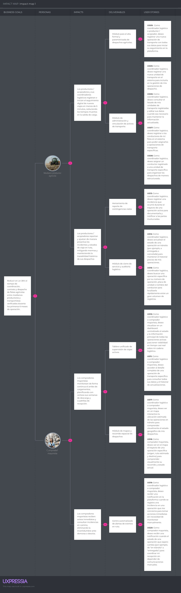

# Capítulo III: Requirements Specification

## 3.1. User Stories

En esta sección se especifican los requisitos del sistema AgroFlet mediante un conjunto de Epics, User Stories y Technical Stories derivadas del proceso de *needfinding*, el análisis competitivo y los segmentos objetivo identificados. Las User Stories representan funcionalidades de valor para los usuarios finales de la plataforma web y del *landing page*, mientras que las Technical Stories describen los requisitos funcionales del RESTful API que soporta el sistema.

Los criterios de aceptación de cada User Story están redactados en tiempo presente, tercera persona y en formato Gherkin (Given-When-Then), sin referencia a detalles de implementación de interfaz. Los Epics agrupan User Stories relacionadas por dominio funcional.
---
**Epics**
 

| Epic / Story   ID | Título | Descripción |
| :--- | :--- | :--- |
| **EPIC-01** | Autenticación y Gestión de Cuenta | **Como** visitante de AgroFlet, **quiero** registrarme, iniciar sesión y gestionar mis credenciales, **para** acceder de forma segura a las funcionalidades de la plataforma según mi rol.                     |
| **EPIC-02** | Gestión de Flotas y Conductores |**Como** coordinador logístico, **quiero** registrar, consultar y administrar las unidades de transporte y conductores, **para** gestionar adecuadamente la flota asignada a las operaciones logísticas.       |
| **EPIC-03** | Registro y Monitoreo de Operaciones | **Como** coordinador logístico, **quiero** crear y monitorear operaciones de transporte en tiempo casi real, **para** conocer su estado, ubicación e información durante el traslado de la carga.              |
| **EPIC-04** | Registro y Gestión de Incidencias en Ruta | **Como** coordinador logístico, **quiero** registrar y consultar las incidencias ocurridas durante una operación, **para** documentar retrasos o interrupciones y gestionar oportunamente sus efectos.         |
| **EPIC-05** | Historial y Consulta de Operaciones | **Como** coordinador logístico, **quiero** consultar, filtrar y buscar operaciones de transporte realizadas, **para** acceder rápidamente al historial de operaciones y revisar su información.                |
| **EPIC-06** | Visualización Geográfica | **Como** coordinador logístico, **quiero** visualizar las rutas y posiciones de las operaciones activas en un mapa interactivo, **para** conocer geográficamente el estado de los transportes en curso.        |
| **EPIC-07** | Alertas y Notificaciones | **Como** usuario de AgroFlet, **quiero** recibir notificaciones sobre cambios de estado e incidencias de mis operaciones, **para** mantenerme informado oportunamente sobre eventos relevantes del transporte. |
| **EPIC-08** | Perfil de Usuario y Configuración | **Como** usuario autenticado, **quiero** gestionar mis datos personales, preferencias de idioma y credenciales de seguridad, **para** mantener actualizada y personalizada mi cuenta.                          |
| **EPIC-09** | Landing Page | **Como** visitante de AgroFlet, **quiero** consultar la propuesta de valor, funcionalidades, planes y canales de contacto de la plataforma, **para** conocer el servicio antes de registrarme o utilizarlo.    |

**User Stories**
| Epic / Story   ID | Título | Descripción | Criterios de Aceptación | Relacionado con (Epic ID) |
| :--- | :--- | :--- | :--- | :--- |
| **UH01** | Registro de nuevo usuario | **Como** visitante de la plataforma, **quiero** registrarme con mis datos básicos, **para** crear una cuenta y acceder a las funcionalidades de AgroFlet según mi rol (coordinador logístico o comprador mayorista). | **Escenario:** Registro exitoso con datos válidos  **Given** el visitante se encuentra en la vista de registro de AgroFlet,  **When** completa todos los campos obligatorios (nombre, apellido, correo, contraseña, tipo de usuario) con datos válidos y confirma el registro,  **Then** el sistema crea la cuenta, envía un correo de confirmación al correo registrado y redirige al usuario al dashboard principal.   **Escenario:** Intento de registro con correo ya existente  **Given** el visitante ingresa un correo electrónico que ya se encuentra registrado en el sistema  **When** intenta enviar el formulario de registro  **Then** el sistema muestra un mensaje de error indicando que el correo ya está en uso y no crea una cuenta duplicada.   **Escenario:** Formulario enviado con campos obligatorios vacíos  **Given** el visitante deja uno o más campos obligatorios sin completar  **When** intenta enviar el formulario de registro  **Then** el sistema resalta visualmente los campos vacíos y muestra un mensaje indicando que son requeridos para continuar.| **EPIC-01** |
| **UH02** | Inicio de sesión con credenciales registradas | **Como** usuario registrado, **quiero** iniciar sesión con mi correo y contraseña, **para** acceder al sistema con mi información y configuraciones guardadas. | **Escenario:** Inicio de sesión exitoso **Given** el usuario se encuentra en la vista de inicio de sesión,  **When** ingresa un correo electrónico y contraseña que coinciden con una cuenta registrada en el sistema,  **Then** el sistema autentica al usuario y lo redirige al dashboard principal correspondiente a su tipo de usuario.   **Escenario:** Credenciales incorrectas  **Given** el usuario ingresa una contraseña que no coincide con el correo registrado  **When** intenta iniciar sesión  **Then** el sistema muestra un mensaje de error genérico sin especificar si el error corresponde al correo o a la contraseña.  **Escenario:** Cuenta no registrada  **Given** el usuario ingresa un correo electrónico que no existe en el sistema  **When** intenta iniciar sesión  **Then** el sistema muestra el mismo mensaje de error genérico y no revela información sobre qué cuentas están registradas.| **EPIC-01** |
| **UH03** | Cierre de sesión seguro | **Como** usuario autenticado, **quiero** cerrar mi sesión de forma segura, **para** proteger el acceso a mi cuenta cuando termino de usar la plataforma. | **Escenario:** Cierre de sesión exitoso **Given** el usuario está autenticado y activo en la plataforma, **When** selecciona la opción de cerrar sesión desde el menú de usuario, **Then** el sistema invalida la sesión activa y redirige al usuario a la vista de inicio de sesión.   **Escenario:** Intento de acceso a ruta protegida tras cerrar sesión **Given** el usuario ha cerrado su sesión previamente  **When** intenta acceder directamente a una ruta protegida mediante la URL del navegador  **Then** el sistema detecta que no existe sesión activa y redirige automáticamente a la vista de inicio de sesión. | **EPIC-01** |
| **UH04** | Recuperación de contraseña olvidada | **Como** usuario registrado que olvidó su contraseña, **quiero** recuperarla a través de mi correo electrónico, **para** recuperar el acceso a mi cuenta sin perder mis datos. | **Escenario:** Envío de correo de recuperación con cuenta existente  **Given** el usuario se encuentra en la vista de recuperación de contraseña,  **When** ingresa su correo electrónico registrado y solicita el restablecimiento,  **Then** el sistema envía un correo con un enlace de recuperación válido por 24 horas y muestra un mensaje de confirmación.   **Escenario:** Correo de recuperación no registrado  **Given** el usuario ingresa un correo electrónico que no existe en el sistema  **When** solicita el restablecimiento de contraseña  **Then** el sistema muestra el mismo mensaje de confirmación genérico para no revelar qué correos están registrados.   **Escenario:** Restablecimiento exitoso de contraseña  **Given** el usuario accede al enlace de recuperación dentro del plazo de validez de 24 horas  **When** ingresa y confirma una nueva contraseña que cumple los requisitos mínimos de seguridad  **Then** el sistema actualiza la contraseña y redirige al usuario a la vista de inicio de sesión.| **EPIC-01** |
| **UH05** | Registro de nueva unidad de transporte | **Como** coordinador logístico, **quiero** registrar una nueva unidad de transporte en el sistema, **para** incluirla en la gestión de mis operaciones de despacho de carga agrícola. | **Escenario:** Registro exitoso de unidad de transporte  **Given** el coordinador se encuentra en el módulo de gestión de flotas ,  **When** completa todos los campos obligatorios del formulario (placa, marca, modelo, año, capacidad de carga en toneladas, tipo de carrocería) con datos válidos y guarda el registro ,  **Then** el sistema registra la unidad con estado disponible y la muestra en el listado de flotas del coordinador.   **Escenario:** Intento de registro con placa duplicada  **Given** el coordinador intenta registrar una unidad con una placa que ya existe en el sistema  **When** envía el formulario de registro  **Then** el sistema muestra un mensaje indicando que esa placa ya está registrada y no permite crear un registro duplicado.   **Escenario:** Formulario con campos obligatorios incompletos  **Given** el coordinador omite uno o más campos obligatorios del formulario de registro de unidad  **When** intenta guardar el registro  **Then** el sistema resalta los campos faltantes y no permite continuar hasta que todos los campos obligatorios estén completos.| **EPIC-02** |
| **UH06** | Consulta y edición de unidades de transporte registradas | **Como** coordinador logístico, **quiero** consultar el listado de mis unidades registradas y editar sus datos cuando sea necesario, **para** mantener la información de mi flota siempre actualizada. | **Escenario:** Visualización del listado de unidades registradas  **Given** el coordinador accede al módulo de gestión de flotas ,  **When** el sistema carga la vista principal del módulo ,  **Then** muestra el listado paginado de todas las unidades registradas con su placa, modelo, tipo de carrocería y estado actual (disponible, en ruta, en mantenimiento).   **Escenario:** Edición exitosa de datos de una unidad  **Given** el coordinador selecciona una unidad del listado y accede a su formulario de edición  **When** modifica uno o más campos con datos válidos y guarda los cambios  **Then** el sistema actualiza la información de la unidad y refleja los cambios inmediatamente en el listado.   **Escenario:** Cambio de estado de una unidad a en mantenimiento  **Given** el coordinador selecciona una unidad disponible y cambia su estado a en mantenimiento  **When** confirma el cambio de estado  **Then** el sistema actualiza el estado de la unidad y esta deja de aparecer como disponible para nuevas asignaciones de operaciones. | **EPIC-02** |
| **UH07** | Registro de conductor | **Como** coordinador logístico, **quiero** registrar a los conductores de mi flota en el sistema, **para** poder asignarlos a operaciones de transporte y gestionar su disponibilidad. | **Escenario:** Registro exitoso de conductor  **Given** el coordinador accede al módulo de gestión de conductores ,  **When** completa el formulario con los datos del conductor (nombres, apellidos, DNI, número de licencia de conducir, categoría de licencia, número de teléfono de contacto) y guarda el registro ,  **Then** el sistema registra al conductor con estado disponible y lo muestra en el listado de conductores del coordinador.   **Escenario:** Intento de registro con DNI duplicado  **Given** el coordinador intenta registrar un conductor con un DNI que ya existe en el sistema  **When** envía el formulario de registro  **Then** el sistema muestra un aviso de duplicado y no permite crear un segundo registro con el mismo DNI. | **EPIC-02** |
| **UH08** | Asignación de conductor a unidad de transporte | **Como** coordinador logístico, **quiero** asignar un conductor registrado a una unidad de transporte específica, **para** organizar los despachos de carga de forma estructurada antes de crear una operación. | **Escenario:** Asignación exitosa de conductor a unidad disponible  **Given** el coordinador selecciona una unidad con estado disponible y elige un conductor disponible desde el listado registrado ,  **When** confirma la asignación ,  **Then** el sistema vincula al conductor con la unidad y actualiza el estado de ambos como asignados.   **Escenario:** Intento de asignar conductor ya vinculado a otra operación activa  **Given** el coordinador intenta asignar un conductor que ya está vinculado a una operación en tránsito  **When** intenta confirmar la nueva asignación  **Then** el sistema muestra un aviso indicando que el conductor no está disponible y no realiza la asignación. | **EPIC-02** |
| **UH09** | Registro de nueva operación de transporte | **Como** coordinador logístico o productor/acopiador, **quiero** registrar una nueva operación de transporte con todos sus datos, **para** iniciar su seguimiento en la plataforma desde el momento del despacho. | **Escenario:** Registro exitoso de nueva operación  **Given** el usuario accede al formulario de nueva operación de transporte ,  **When** completa todos los campos obligatorios (tipo y cantidad de alimento, región de origen, región de destino, fecha y hora de salida, unidad asignada, conductor asignado) con datos válidos y guarda el registro ,  **Then** el sistema crea la operación con estado en tránsito y la muestra en el dashboard de monitoreo del usuario.   **Escenario:** Formulario enviado con campos obligatorios incompletos  **Given** el usuario omite uno o más campos obligatorios del formulario de nueva operación  **When** intenta guardar el registro  **Then** el sistema resalta los campos faltantes y no permite crear la operación hasta que estén completos.   **Escenario:** Selección de unidad no disponible  **Given** el usuario selecciona una unidad cuyo estado es en ruta o en mantenimiento  **When** intenta confirmar la nueva operación  **Then** el sistema muestra un aviso indicando que la unidad seleccionada no está disponible para nuevas asignaciones en este momento. | **EPIC-03** |
| **UH10** | Visualización del dashboard de monitoreo logístico | **Como** coordinador logístico o comprador mayorista, **quiero** visualizar en un dashboard centralizado el estado y la información principal de todas las operaciones activas, **para** tener visibilidad en tiempo casi real sobre mi cadena logística sin realizar llamadas manuales. | **Escenario:** Dashboard cargado con operaciones activas  **Given** el usuario accede al dashboard principal de monitoreo ,  **When** existen operaciones con estado en tránsito registradas en el sistema ,  **Then** el sistema muestra una tarjeta por cada operación activa con la información clave: tipo de alimento, región de origen, región de destino, estado, fecha estimada de llegada y conductor asignado.   **Escenario:** Dashboard sin operaciones activas en curso  **Given** el usuario accede al dashboard principal y no existen operaciones activas registradas  **When** el sistema carga la vista  **Then** muestra un mensaje indicando que no hay operaciones en curso y proporciona un acceso directo para registrar una nueva operación.   **Escenario:** Actualización del estado de una operación visible en el dashboard  **Given** el usuario se encuentra en el dashboard con operaciones activas visibles  **When** el estado de una operación cambia (por ejemplo, se registra una incidencia o se marca como entregada)  **Then** el sistema actualiza la información de la tarjeta correspondiente sin necesidad de que el usuario recargue la página manualmente. | **EPIC-03** |
| **UH11** | Visualización del detalle completo de una operación | **Como** coordinador logístico o comprador mayorista, **quiero** acceder al detalle completo de una operación de transporte específica, **para** consultar todos sus datos, el historial de cambios de estado y las incidencias registradas. | **Escenario:** Acceso exitoso al detalle de una operación existente  **Given** el usuario selecciona una operación desde el dashboard o el historial ,  **When** el sistema carga la vista de detalle de la operación ,  **Then** muestra todos los datos de la operación: tipo y cantidad de alimento, origen, destino, fechas de salida y llegada estimada, unidad asignada, conductor asignado, estado actual e historial cronológico de incidencias registradas.   **Escenario:** Acceso a una operación que no existe en el sistema  **Given** el usuario intenta acceder directamente mediante URL a una operación con un identificador que no existe  **When** el sistema intenta cargar el recurso  **Then** muestra un mensaje indicando que la operación no fue encontrada y ofrece una opción para regresar al dashboard. | **EPIC-03** |
| **UH12** | Actualización del estado de una operación activa | **Como** coordinador logístico, **quiero** actualizar el estado de una operación en tránsito (a entregada o cancelada), **para** mantener el historial preciso de mis operaciones y liberar los recursos asignados. | **Escenario:** Marcado exitoso de operación como entregada  **Given** el coordinador accede al detalle de una operación con estado en tránsito ,  **When** selecciona la opción de marcar como entregada y confirma la acción ,  **Then** el sistema actualiza el estado de la operación a entregada, registra la fecha y hora exacta de la entrega y mueve la operación al historial, liberando la unidad y el conductor.   **Escenario:** Cancelación de una operación activa con motivo registrado  **Given** el coordinador accede al detalle de una operación activa  **When** selecciona la opción de cancelar, ingresa el motivo de cancelación y confirma  **Then** el sistema actualiza el estado a cancelada, registra el motivo en el historial de la operación y libera la unidad y el conductor asignados. | **EPIC-03** |
| **UH13** | Registro de incidencia durante el trayecto | **Como** coordinador logístico, **quiero** registrar una incidencia que ocurrió durante el trayecto de una operación activa, **para** documentarla formalmente y actualizar el tiempo estimado de llegada informando a las partes involucradas. | **Escenario:** Registro exitoso de incidencia con impacto en tiempo de llegada  **Given** el coordinador accede al detalle de una operación con estado en tránsito ,  **When** selecciona la opción de registrar incidencia, completa los campos requeridos (tipo de incidencia, descripción del evento, horas estimadas de retraso) y confirma ,  **Then** el sistema guarda la incidencia asociada a la operación, actualiza la fecha y hora estimada de llegada sumando el retraso indicado y muestra la nueva estimación en el dashboard.   **Escenario:** Registro de incidencia sin impacto en tiempo de llegada  **Given** el coordinador registra una incidencia con cero horas de impacto estimado (por ejemplo, parada técnica breve)  **When** completa y confirma el formulario de incidencia  **Then** el sistema guarda la incidencia en el historial de la operación sin modificar la fecha estimada de llegada original.   **Escenario:** Intento de registrar incidencia con campos obligatorios vacíos  **Given** el coordinador accede al formulario de registro de incidencia  **When** intenta guardar sin completar el tipo de incidencia o la descripción  **Then** el sistema resalta los campos faltantes y no permite guardar la incidencia hasta que estén completos. | **EPIC-04** |
| **UH14** | Visualización del historial de incidencias de una operación | **Como** coordinador logístico o comprador mayorista, **quiero** ver el historial cronológico de incidencias registradas en una operación específica, **para** comprender qué eventos afectaron su trayecto y justificar los retrasos ante mis clientes o proveedores. | **Escenario:** Operación con incidencias registradas  **Given** el usuario accede al detalle de una operación que tiene incidencias registradas ,  **When** el sistema carga la sección de incidencias de la vista de detalle ,  **Then** muestra cada incidencia en orden cronológico descendente con su tipo, descripción, impacto en horas y fecha y hora exacta del registro.   **Escenario:** Operación sin incidencias registradas  **Given** el usuario accede al detalle de una operación que no tiene incidencias registradas  **When** el sistema carga la sección de incidencias  **Then** muestra la sección vacía con un mensaje indicando que no se han reportado incidencias para esta operación. | **EPIC-04** |
| **UH15** | Consulta del historial de operaciones con filtros | **Como** coordinador logístico o comprador mayorista, **quiero** acceder a un listado histórico de todas mis operaciones de transporte y filtrarlas por distintos criterios, **para** analizar el desempeño logístico y generar reportes internos. | **Escenario:** Consulta del historial sin filtros aplicados  **Given** el usuario accede a la sección de historial de operaciones ,  **When** el sistema carga la vista sin filtros activos ,  **Then** muestra el listado paginado de todas las operaciones registradas (activas e históricas) ordenadas por fecha de salida descendente.   **Escenario:** Filtrado del historial por rango de fechas  **Given** el usuario aplica un filtro de fecha de inicio y fecha de fin en el historial  **When** el sistema procesa el filtro  **Then** muestra únicamente las operaciones cuya fecha de salida se encuentra dentro del rango de fechas seleccionado.   **Escenario:** Filtrado combinado por múltiples criterios  **Given** el usuario aplica simultáneamente filtros de tipo de alimento, estado y región de destino  **When** el sistema procesa los filtros  **Then** muestra únicamente las operaciones que cumplen con todos los criterios seleccionados de forma simultánea.   **Escenario:** Búsqueda sin resultados coincidentes  **Given** el usuario aplica criterios de filtrado que no coinciden con ninguna operación registrada  **When** el sistema procesa la búsqueda  **Then** muestra un mensaje indicando que no se encontraron operaciones que cumplan con los criterios seleccionados. | **EPIC-05** |
| **UH16** | Búsqueda de operación por identificador o placa | **Como** coordinador logístico, **quiero** buscar una operación específica por su número de operación o placa de unidad, **para** localizarla rápidamente entre un alto volumen de registros históricos. | **Escenario:** Búsqueda exitosa por placa de unidad  **Given** el usuario ingresa una placa de unidad válida en la barra de búsqueda del historial ,  **When** el sistema procesa la consulta ,  **Then** muestra todas las operaciones realizadas con esa unidad de transporte, ordenadas por fecha descendente.   **Escenario:** Búsqueda exitosa por número de operación  **Given** el usuario ingresa el número exacto de una operación en la barra de búsqueda  **When** el sistema procesa la búsqueda  **Then** muestra el registro correspondiente a ese número de operación con todos sus datos principales.   **Escenario:** Búsqueda sin coincidencias  **Given** el usuario ingresa un término de búsqueda que no coincide con ninguna operación, unidad o conductor registrado  **When** el sistema procesa la búsqueda  **Then** muestra un mensaje indicando que no se encontraron resultados para el término ingresado. | **EPIC-05** |
| **UH17** | Visualización de operaciones activas en mapa interactivo | **Como** coordinador logístico o comprador mayorista, **quiero** ver en un mapa interactivo la ubicación estimada de las operaciones en tránsito, **para** comprender de forma visual el estado geográfico de mis despachos activos sin depender exclusivamente de texto. | **Escenario:** Mapa con operaciones activas marcadas  **Given** el usuario accede a la vista de mapa interactivo de AgroFlet ,  **When** existen operaciones con estado en tránsito registradas en el sistema ,  **Then** el sistema muestra el mapa con un marcador por cada operación activa posicionado en su ubicación aproximada, identificado por el número de operación o la placa de la unidad.   **Escenario:** Selección de marcador para ver resumen de operación  **Given** el usuario visualiza el mapa con marcadores de operaciones activas  **When** selecciona un marcador específico en el mapa  **Then** el sistema muestra un panel lateral o emergente con el resumen de la operación: tipo de alimento, origen, destino, fecha estimada de llegada y estado actual.   **Escenario:** Mapa sin operaciones activas  **Given** el usuario accede a la vista de mapa y no hay operaciones con estado en tránsito  **When** el sistema carga la vista  **Then** muestra el mapa vacío con un mensaje indicando que no hay operaciones activas en este momento. | **EPIC-06** |
| **UH18** | Visualización del trayecto de una operación específica en el mapa | **Como** comprador mayorista, **quiero** ver en el mapa el trayecto de una operación específica que espero recibir, incluyendo su origen, ruta estimada y destino, **para** comprender visualmente el recorrido del envío y estimar mejor la hora de llegada. | **Escenario:** Trayecto completo de operación activa mostrado en el mapa  **Given** el usuario accede al detalle de una operación con estado en tránsito y selecciona la opción de ver en mapa ,  **When** el sistema procesa la solicitud de visualización ,  **Then** muestra el mapa con el punto de origen, la ruta terrestre estimada hacia el destino y el punto de destino claramente diferenciados por íconos o colores.   **Escenario:** Visualización de operación sin geolocalización activa  **Given** el usuario solicita ver en mapa una operación cuya unidad no tiene posición GPS actualizada  **When** el sistema intenta cargar la vista de mapa  **Then** muestra el origen y el destino de la operación sin marcador de posición actual e indica mediante un mensaje que la ubicación en tiempo real no está disponible para esta operación. | **EPIC-06** |
| **UH19** | Recepción de alerta por incidencia registrada en una operación | **Como** coordinador logístico o comprador mayorista, **quiero** recibir una notificación en la plataforma cuando se registra una incidencia en una operación que me concierne, **para** tomar acciones correctivas de forma inmediata sin necesidad de monitorear manualmente. | **Escenario:** Notificación generada al registrar una incidencia  **Given** un coordinador registra una incidencia en una operación activa vinculada a un comprador ,  **When** el sistema procesa y guarda el registro de la incidencia ,  **Then** genera automáticamente una notificación en la plataforma para todos los usuarios vinculados a esa operación (coordinador y comprador asociado) indicando el tipo de incidencia y el impacto en el tiempo de llegada.   **Escenario:** Visualización de notificaciones no leídas en el centro de notificaciones  **Given** el usuario tiene notificaciones no leídas generadas por incidencias en sus operaciones  **When** accede a su centro de notificaciones  **Then** el sistema muestra las notificaciones ordenadas cronológicamente con el tipo de evento, el número de operación afectada y la fecha y hora del registro. | **EPIC-07** |
| **UH20** | Recepción de alerta por cambio de estado de operación | **Como** comprador mayorista, **quiero** recibir una notificación cuando el estado de una operación que espero cambia (por ejemplo, de en tránsito a entregada o cancelada), **para** coordinar mi recepción sin depender de comunicaciones manuales con el transportista. | **Escenario:** Notificación generada al marcar operación como entregada  **Given** un coordinador marca una operación como entregada en el sistema ,  **When** el sistema actualiza el estado de la operación ,  **Then** genera automáticamente una notificación para el comprador vinculado a esa operación indicando que su envío fue marcado como entregado y registrando la fecha y hora de la actualización.   **Escenario:** Notificación generada al cancelar una operación activa  **Given** un coordinador cancela una operación que tiene un comprador vinculado  **When** el sistema procesa la cancelación  **Then** genera una notificación para todos los usuarios vinculados a la operación indicando el estado cancelado y el motivo de cancelación registrado por el coordinador. | **EPIC-07** |
| **UH21** | Edición de datos del perfil de usuario | **Como** usuario registrado, **quiero** editar mis datos de perfil (nombre, teléfono, nombre de empresa), **para** mantener mi información actualizada en la plataforma y garantizar que mis contactos puedan ubicarme correctamente. | **Escenario:** Edición exitosa del perfil con datos válidos  **Given** el usuario accede a la vista de su perfil en la plataforma,  **When** modifica uno o más campos editables (nombre, apellido, número de teléfono, nombre de empresa) con datos en formato válido y guarda los cambios ,  **Then** el sistema actualiza la información del perfil y muestra un mensaje de confirmación indicando que los cambios fueron guardados correctamente.   **Escenario:** Intento de guardar perfil con número de teléfono en formato inválido  **Given** el usuario modifica el campo de número de teléfono con un valor que no cumple el formato esperado (9 dígitos numéricos para Perú)  **When** intenta guardar los cambios  **Then** el sistema muestra un mensaje indicando el formato esperado para el número de teléfono y no actualiza el perfil hasta que el dato sea corregido.| **EPIC-08** |
| **UH22** | Cambio de contraseña desde la configuración del perfil | **Como** usuario registrado, **quiero** cambiar mi contraseña desde la configuración de mi perfil, **para** mantener la seguridad de mi cuenta de forma periódica sin necesidad de usar el flujo de recuperación por correo. | **Escenario:** Cambio de contraseña exitoso con contraseña actual correcta  **Given** el usuario accede a la sección de seguridad de su perfil ,  **When** ingresa su contraseña actual correctamente y establece una nueva contraseña que cumple los requisitos mínimos (al menos 8 caracteres, una letra mayúscula y un número) y confirma ,  **Then** el sistema actualiza la contraseña y muestra un mensaje de confirmación indicando que el cambio fue realizado correctamente.   **Escenario:** Contraseña actual ingresada incorrectamente **Given** el usuario ingresa una contraseña actual que no coincide con la registrada en el sistema  **When** intenta confirmar el cambio de contraseña  **Then** el sistema muestra un mensaje de error indicando que la contraseña actual es incorrecta y no realiza ningún cambio.| **EPIC-08** |
| **UH23** | Cambio de idioma de la plataforma desde el perfil | **Como** usuario registrado, **quiero** cambiar el idioma de la plataforma entre español e inglés desde mi configuración de perfil, **para** usar la aplicación en el idioma de mi preferencia. | **Escenario:** Cambio de idioma a inglés desde la configuración de perfil  **Given** el usuario accede a la sección de preferencias de idioma en su perfil ,  **When** selecciona el idioma inglés y guarda la configuración ,  **Then** el sistema actualiza todos los textos de la interfaz de usuario, mensajes del sistema y etiquetas al idioma inglés sin recargar la página completa.   **Escenario:** Idioma español latinoamericano configurado por defecto **Given** un nuevo usuario se registra en la plataforma sin haber configurado preferencias de idioma  **When** accede a la plataforma por primera vez  **Then** el sistema muestra la interfaz en español latinoamericano como idioma predeterminado.| **EPIC-08** |
| **UH24** | Visualización de la propuesta de valor en el landing page | **Como** visitante del landing page, **quiero** ver de forma clara y visual la propuesta de valor de AgroFlet en la sección principal, **para** entender rápidamente qué problema resuelve la plataforma y a qué segmentos de usuarios está dirigida. | **Escenario:** Carga de la sección principal del landing page en escritorio  **Given** el visitante accede al landing page de AgroFlet desde un navegador de escritorio ,  **When** la página carga completamente ,  **Then** la sección principal muestra el nombre de la plataforma, un titular descriptivo de la propuesta de valor orientado al transporte de alimentos agrícolas y un llamado a la acción diferenciado para cada segmento objetivo (productor/acopiador y comprador mayorista).   **Escenario:** Visualización adaptada en dispositivo móvil **Given** el visitante accede al landing page desde un dispositivo móvil  **When** la página carga  **Then** la sección principal se adapta al ancho del dispositivo sin pérdida de legibilidad, sin elementos visuales cortados y manteniendo los llamados a la acción accesibles con el dedo.| **EPIC-09** |
| **UH25** | Consulta de funcionalidades principales desde el landing page | **Como** visitante del landing page interesado en la plataforma, **quiero** ver una descripción visual de las funcionalidades principales de AgroFlet, **para** evaluar si la solución responde a mis necesidades operativas antes de registrarme. | **Escenario:** Visualización de la sección de funcionalidades  **Given** el visitante navega hacia la sección de funcionalidades del landing page,  **When** el sistema carga el contenido de esa sección ,  **Then** muestra al menos cinco funcionalidades clave de la plataforma (dashboard de monitoreo, registro de incidencias, mapa interactivo, historial de operaciones, alertas automáticas) con una descripción breve e ícono representativo para cada una.   **Escenario:** Acceso a funcionalidades desde el menú de navegación **Given** el visitante hace clic en el ítem Funcionalidades del menú de navegación del landing page  **When** el sistema procesa la interacción  **Then** la página se desplaza suavemente hacia la sección de funcionalidades sin recargar la página.| **EPIC-09** |
| **UH26** | Consulta de planes y precios en el landing page | **Como** visitante del landing page interesado en suscribirse, **quiero** ver los planes de suscripción disponibles con sus precios y características incluidas, **para** tomar una decisión de contratación informada. | **Escenario:** Visualización de los planes de suscripción disponibles  **Given** el visitante navega hacia la sección de planes del landing page ,  **When** el sistema carga el contenido de esa sección ,  **Then** muestra los planes disponibles (básico, estándar y profesional) con su precio mensual en soles, el número máximo de unidades incluidas y las funcionalidades habilitadas en cada plan.   **Escenario:** Redirección al registro desde el botón de un plan **Given** el visitante selecciona el botón de contratar o comenzar de un plan específico  **When** el sistema procesa la interacción  **Then** redirige al visitante a la vista de registro de la aplicación web con el plan seleccionado preconfigurado en el formulario.| **EPIC-09** |
| **UH27** | Consulta de testimonios de usuarios en el landing page | **Como** visitante del landing page, **quiero** ver testimonios de usuarios reales que ya usan AgroFlet, **para** generar confianza en la plataforma antes de decidir registrarme. | **Escenario:** Visualización de testimonios de usuarios  **Given** el visitante navega hacia la sección de testimonios del landing page ,  **When** el sistema carga el contenido de esa sección ,  **Then** muestra al menos dos testimonios de usuarios con nombre, cargo o rol, empresa o cooperativa de procedencia y una descripción de su experiencia con la plataforma.| **EPIC-09** |
| **UH28** | Envío de mensaje de contacto desde el landing page | **Como** visitante del landing page con preguntas específicas antes de registrarme, **quiero** acceder a un formulario de contacto, **para** comunicarme con el equipo de AgroFlet y recibir una respuesta personalizada. | **Escenario:** Envío exitoso del formulario de contacto   **Given** el visitante completa el formulario de contacto con nombre, correo electrónico válido y mensaje,  **When** selecciona el botón de enviar,  **Then** el sistema registra el mensaje, muestra un mensaje de confirmación en pantalla y envía una copia de confirmación al correo electrónico indicado por el visitante.   **Escenario:** Intento de envío con campo de correo vacío  **Given** el visitante completa el formulario de contacto omitiendo el campo de correo electrónico  **When** intenta enviar el formulario  **Then** el sistema resalta el campo de correo como requerido y no procesa el envío hasta que sea completado.| **EPIC-09** |
| **UH29** | Navegación fluida entre secciones del landing page | **Como** visitante del landing page, **quiero** navegar entre las secciones de la página de forma rápida e intuitiva, **para** acceder fácilmente a la información que busco sin necesidad de desplazarme manualmente por toda la página. | **Escenario:** Navegación por menú de la barra principal  **Given** el visitante se encuentra en cualquier sección del landing page ,  **When** hace clic en un ítem del menú de navegación principal (Inicio, Funcionalidades, Planes, Testimonios, Contacto) ,  **Then** la página se desplaza suavemente hacia la sección correspondiente sin recargar la página completa.   **Escenario:** Regreso al inicio desde la parte inferior de la página **Given** el visitante se encuentra en la parte inferior del landing page  **When** hace clic en el botón de regreso al inicio o en el logotipo de AgroFlet en el encabezado  **Then** la página regresa al inicio de forma animada y suave.| **EPIC-09** |
| **UH30** | Visualización del landing page en múltiples idiomas | **Como** visitante del landing page de habla inglesa o hispanohablante, **quiero** poder cambiar el idioma del contenido del landing page entre español e inglés, **para** comprender mejor la propuesta de la plataforma en mi idioma preferido. | **Escenario:** Cambio de idioma del landing page a inglés  **Given** el visitante se encuentra en el landing page en su versión en español ,  **When** selecciona el idioma inglés en el selector de idiomas del encabezado ,  **Then** todos los textos visibles del landing page se actualizan al idioma inglés sin recargar la página.   **Escenario:** Idioma español configurado como predeterminado al cargar el landing page **Given** un visitante accede al landing page por primera vez sin preferencia de idioma configurada  **When** la página carga completamente  **Then** el contenido se muestra en español latinoamericano como idioma predeterminado.| **EPIC-09** |
| **TS01** | Endpoint POST `/api/v1/auth/register` — Registro de usuario | **Como** Developer, **deseo** contar con un endpoint que permita registrar nuevos usuarios en el sistema con validación de campos y unicidad de correo, **para** que el frontend implemente el flujo de registro de forma segura. | **Escenario:** Registro exitoso de nuevo usuario  **Given** el desarrollador realiza una solicitud POST a `/api/v1/auth/register` con un cuerpo JSON válido que contiene name, lastName, email, password y userType,  **When** el servidor valida los campos y verifica que el correo no está registrado,  **Then** retorna un código HTTP 201 con un objeto JSON que incluye el id del usuario creado, su correo y el tipo de usuario registrado.   **Escenario:** Correo electrónico ya registrado en el sistema  **Given** el desarrollador realiza una solicitud POST a `/api/v1/auth/register` con un correo que ya existe en la base de datos ,  **When** el servidor valida la unicidad del correo ,  **Then** retorna un código HTTP 409 con un mensaje de error indicando que el correo ya está en uso.   **Escenario:** Cuerpo de solicitud con campo obligatorio faltante  **Given** el desarrollador envía la solicitud sin el campo email en el cuerpo JSON ,  **When** el servidor valida la estructura del cuerpo,  **Then** retorna un código HTTP 400 con un mensaje detallando qué campo obligatorio está ausente. | **EPIC-01** |
| **TS02** | Endpoint POST `/api/v1/auth/login` — Autenticación con JWT | **Como** Developer, **deseo** contar con un endpoint de autenticación que valide credenciales y retorne un token JWT, **para** que el frontend implemente el inicio de sesión seguro y proteja las rutas de la aplicación. | **Escenario:** Login exitoso con credenciales válidas  **Given** el desarrollador realiza una solicitud POST a `/api/v1/auth/login` con un cuerpo JSON que contiene email y password válidos y registrados ,  **When** el servidor valida las credenciales contra la base de datos ,  **Then** retorna un código HTTP 200 con un objeto JSON que contiene el accessToken JWT, el tiempo de expiración en segundos y los datos básicos del usuario autenticado (id, name, userType).   **Escenario:** Login con credenciales incorrectas  **Given** el desarrollador envía la solicitud con una contraseña que no coincide con el correo registrado ,  **When** el servidor valida las credenciales ,  **Then** retorna un código HTTP 401 con un mensaje de error genérico sin especificar si el error es de correo o contraseña.   **Escenario:** Solicitud con token expirado en rutas protegidas  **Given** el desarrollador realiza una solicitud a un endpoint protegido con un token JWT cuyo tiempo de expiración ha vencido ,  **When** el servidor verifica la validez del token ,  **Then** retorna un código HTTP 401 con un mensaje indicando que el token ha expirado y debe renovarse. | **EPIC-01** |
| **TS03** | Endpoint GET `/api/v1/shipments` — Listar operaciones de transporte | **Como** Developer, **deseo** contar con un endpoint que retorne el listado paginado de operaciones de transporte con soporte de filtros por estado, tipo de alimento y rango de fechas, **para** que el frontend implemente el dashboard y el historial. | **Escenario:** Listado exitoso de operaciones sin filtros  **Given** el desarrollador realiza una solicitud GET a `/api/v1/shipments` con un token de autenticación válido ,  **When** el servidor procesa la solicitud ,  **Then** retorna un código HTTP 200 con un objeto JSON paginado que contiene un arreglo de operaciones, cada una con los campos: id, cargoType, origin, destination, departureDatetime, estimatedArrival, status y assignedVehiclePlate.   **Escenario:** Filtrado de operaciones por estado  **Given** el desarrollador realiza una solicitud GET a `/api/v1/shipments?status=in_transit` con token válido ,  **When** el servidor aplica el filtro de estado ,  **Then** retorna un código HTTP 200 únicamente con las operaciones cuyo campo status es igual a in_transit.   **Escenario:** Solicitud sin token de autenticación o con token inválido  **Given** el desarrollador realiza la solicitud GET sin incluir un token JWT en el encabezado Authorization ,  **When** el servidor verifica la autenticación ,  **Then** retorna un código HTTP 401 con un mensaje indicando que la autenticación es requerida para acceder a este recurso. | **EPIC-03** |
| **TS04** | Endpoint POST `/api/v1/shipments` — Crear operación de transporte | **Como** Developer, **deseo** contar con un endpoint que permita crear una nueva operación de transporte con validación de disponibilidad de vehículo y conductor, **para** que el frontend implemente el flujo de registro de despachos. | **Escenario:** Creación exitosa de operación de transporte  **Given** el desarrollador realiza una solicitud POST a /api/v1/shipments con un cuerpo JSON válido que contiene cargoType, cargoQuantityTons, origin, destination, departureDatetime, vehicleId y driverId, y un token válido ,  **When** el servidor valida los datos y la disponibilidad de los recursos asignados ,  **Then** retorna un código HTTP 201 con el objeto completo de la operación creada incluyendo su id asignado y el campo status con valor in_transit.   **Escenario:** Creación con vehículo no disponible  **Given** el desarrollador envía la solicitud con un vehicleId cuyo estado en la base de datos no es available ,  **When** el servidor verifica la disponibilidad del vehículo ,  **Then** retorna un código HTTP 422 con un mensaje indicando que el vehículo seleccionado no está disponible para nuevas operaciones.   **Escenario:** Cuerpo de solicitud con campo obligatorio ausente  **Given** el desarrollador realiza la solicitud sin incluir el campo cargoType en el cuerpo JSON ,  **When** el servidor valida la estructura del cuerpo ,  **Then** retorna un código HTTP 400 con un mensaje detallando el campo faltante. | **EPIC-03** |
| **TS05** | Endpoint GET `/api/v1/shipments/{id}` — Obtener detalle de operación | **Como** Developer, **deseo** contar con un endpoint que retorne el detalle completo de una operación por su identificador único, incluyendo los datos del vehículo, conductor e incidencias asociadas, **para** que el frontend implemente la vista de detalle. | **Escenario:** Operación encontrada por identificador válido  **Given** el desarrollador realiza una solicitud GET a `/api/v1/shipments/{id}` con un id existente y un token válido ,  **When** el servidor busca el recurso en la base de datos ,  **Then** retorna un código HTTP 200 con el objeto completo de la operación, incluyendo los sub-objetos de vehicle, driver e incidents con todos sus campos.   **Escenario:** Operación no encontrada por identificador inexistente  **Given** el desarrollador realiza la solicitud con un id que no corresponde a ninguna operación registrada ,  **When** el servidor busca el recurso ,  **Then** retorna un código HTTP 404 con un mensaje indicando que el recurso solicitado no fue encontrado. | **EPIC-03** |
| **TS06** | Endpoint PATCH `/api/v1/shipments/{id}/status` — Actualizar estado de operación | **Como** Developer, **deseo** contar con un endpoint que permita actualizar el estado de una operación activa, **para** que el frontend implemente los flujos de marcado como entregada y cancelación de despachos. | **Escenario:** Actualización exitosa de estado a entregada  **Given** el desarrollador realiza una solicitud PATCH a `/api/v1/shipments/{id}/status` con un cuerpo JSON que contiene status igual a delivered y un token válido ,  **When** el servidor procesa la actualización de estado ,  **Then** retorna un código HTTP 200 con el objeto de la operación actualizado, incluyendo el campo deliveredAt con la fecha y hora del momento de la actualización.   **Escenario:** Actualización a cancelada con motivo de cancelación  **Given** el desarrollador realiza la solicitud con status igual a cancelled y el campo cancellationReason con un texto de al menos 10 caracteres ,  **When** el servidor procesa la actualización ,  **Then** retorna un código HTTP 200 con el objeto actualizado incluyendo el estado cancelled y el motivo registrado.   **Escenario:** Valor de estado no reconocido por el sistema  **Given** el desarrollador envía la solicitud con un valor de status que no existe en el sistema (por ejemplo, archived) ,  **When** el servidor valida el campo ,  **Then** retorna un código HTTP 400 con un mensaje indicando los únicos valores válidos para el campo status: in_transit, delivered y cancelled. | **EPIC-03** |
| **TS07** | Endpoint POST `/api/v1/shipments/{id}/incidents` — Registrar incidencia en operación| **Como** Developer, **deseo** contar con un endpoint que permita registrar incidencias sobre una operación activa y actualizar automáticamente su tiempo estimado de llegada, **para** que el frontend implemente el módulo de registro de incidencias. | **Escenario:** Registro exitoso de incidencia con impacto en ETA  **Given** el desarrollador realiza una solicitud POST a `/api/v1/shipments/{id}/incidents` con un cuerpo JSON válido que contiene incidentType, description y estimatedDelayHours (mayor a cero), y un token válido ,  **When** el servidor valida los datos y el estado de la operación ,  **Then** retorna un código HTTP 201 con el objeto de la incidencia creada y el campo updatedEstimatedArrival en el objeto de la operación con la nueva fecha y hora de llegada estimada.   **Escenario:** Registro de incidencia en operación no activa  **Given** el desarrollador intenta registrar una incidencia en una operación cuyo estado es delivered o cancelled ,  **When** el servidor verifica el estado de la operación ,  **Then** retorna un código HTTP 422 con un mensaje indicando que solo se pueden registrar incidencias en operaciones con estado in_transit.   **Escenario:** Cuerpo de solicitud con campo incidentType ausente  **Given** el desarrollador envía la solicitud sin el campo incidentType en el cuerpo JSON ,  **When** el servidor valida la estructura del cuerpo ,  **Then** retorna un código HTTP 400 con un mensaje detallando que el campo incidentType es requerido. | **EPIC-04** |
| **TS08** | Endpoint GET `/api/v1/shipments/{id}/incidents` — Listar incidencias de una operación| **Como** Developer, **deseo** contar con un endpoint que retorne el listado cronológico de incidencias registradas para una operación específica, **para** que el frontend implemente la sección de historial de incidencias en la vista de detalle. | **Escenario:** Listado de incidencias de una operación con eventos registrados  **Given** el desarrollador realiza una solicitud GET a `/api/v1/shipments/{id}/incidents` con un id válido y un token de autenticación vigente ,  **When** el servidor procesa la solicitud ,  **Then** retorna un código HTTP 200 con un arreglo de incidencias ordenadas por fecha de registro descendente, cada una con los campos: id, incidentType, description, estimatedDelayHours y registeredAt.   **Escenario:** Operación sin incidencias registradas  **Given** el desarrollador realiza la solicitud para una operación que no tiene incidencias asociadas,  **When** el servidor procesa la consulta,  **Then** retorna un código HTTP 200 con un arreglo vacío sin retornar un código de error. | **EPIC-04** |
| **TS09** | Endpoint GET `api/v1/vehicles` — Listar unidades de transporte| **Como** Developer, **deseo** contar con un endpoint que retorne el listado de unidades de transporte registradas con soporte de filtro por disponibilidad, **para** que el frontend implemente los selectores de asignación de flota en el formulario de nueva operación. | **Escenario:** Listado exitoso de todas las unidades registradas  **Given** el desarrollador realiza una solicitud GET a `/api/v1/vehicles` con un token de autenticación válido ,  **When** el servidor procesa la solicitud,  **Then** retorna un código HTTP 200 con un arreglo de objetos de unidades, cada uno con los campos: id, licensePlate, brand, model, year, capacityTons, bodyType y status.   **Escenario:** Filtrado de unidades por estado disponible  **Given** el desarrollador realiza la solicitud GET a `/api/v1/vehicles?status=available` ,  **When** el servidor aplica el filtro de estado ,  **Then** retorna un código HTTP 200 únicamente con las unidades cuyo campo status es igual a available.   **Escenario:** Solicitud realizada sin token de autenticación  **Given** el desarrollador realiza la solicitud sin incluir un token JWT en el encabezado Authorization ,  **When** el servidor verifica la autenticación ,  **Then** retorna un código HTTP 401 con un mensaje indicando que el acceso a este recurso requiere autenticación. | **EPIC-02** |
| **TS10** | Endpoint POST `/api/v1/vehicles` — Registrar unidad de transporte| **Como** Developer, **deseo** contar con un endpoint que permita registrar una nueva unidad de transporte con validación de unicidad de placa, **para** que el frontend implemente el formulario de alta de vehículos en el módulo de flotas. | **Escenario:** Registro exitoso de nueva unidad  **Given** el desarrollador realiza una solicitud POST a `/api/v1/vehicles` con un cuerpo JSON válido que contiene licensePlate, brand, model, year, capacityTons y bodyType, y un token válido ,  **When** el servidor valida los datos y verifica la unicidad de la placa ,  **Then** retorna un código HTTP 201 con el objeto de la unidad creada incluyendo su id asignado y el campo status con valor available.   **Escenario:** Placa de vehículo ya registrada en el sistema  **Given** el desarrollador envía la solicitud con un valor de licensePlate que ya existe en la base de datos ,  **When** el servidor verifica la unicidad de la placa ,  **Then** retorna un código HTTP 409 con un mensaje indicando que esa placa ya está registrada en el sistema. | **EPIC-02** |
| **TS11** | Endpoint GET `/api/v1/drivers` — Listar conductores registrados | **Como** Developer, **deseo** contar con un endpoint que retorne el listado de conductores registrados con soporte de filtro por disponibilidad, **para** que el frontend implemente los selectores de asignación de conductor en los formularios de operación. | **Escenario:** Listado exitoso de todos los conductores registrados  **Given** el desarrollador realiza una solicitud GET a `/api/v1/drivers` con un token de autenticación válido ,  **When** el servidor procesa la solicitud,  **Then** retorna un código HTTP 200 con un arreglo de objetos de conductores, cada uno con los campos: id, firstName, lastName, dni, licenseNumber, licenseCategory, phone y status.   **Escenario:** Filtrado de conductores disponibles  **Given** el desarrollador realiza la solicitud GET a `/api/v1/drivers?status=available` ,  **When** el servidor aplica el filtro ,  **Then** retorna un código HTTP 200 únicamente con los conductores cuyo campo status es available, es decir no asignados a ninguna operación activa. | **EPIC-02** |
| **TS12** | Endpoint POST `/api/v1/drivers` — Registrar conductor | **Como** Developer, **deseo** contar con un endpoint que permita registrar un nuevo conductor con validación de unicidad de DNI, **para** que el frontend implemente el formulario de alta de conductores en el módulo de gestión de flota. | **Escenario:** Registro exitoso de nuevo conductor  **Given** el desarrollador realiza una solicitud POST a `/api/v1/drivers` con un cuerpo JSON válido que contiene firstName, lastName, dni, licenseNumber, licenseCategory y phone, y un token válido ,  **When** el servidor valida los datos y verifica la unicidad del DNI ,  **Then** retorna un código HTTP 201 con el objeto del conductor creado incluyendo su id asignado y el campo status con valor available.   **Escenario:** DNI del conductor ya registrado en el sistema  **Given** el desarrollador envía la solicitud con un valor de dni que ya existe en la base de datos ,  **When** el servidor verifica la unicidad del DNI ,  **Then** retorna un código HTTP 409 con un mensaje indicando que ese DNI ya está registrado en el sistema. | **EPIC-02** |
| **TS13** | Endpoint GET `/api/v1/shipments` con paginación y múltiples filtros — Historial avanzado | **Como** Developer, **deseo** que el endpoint de listado de operaciones soporte parámetros de paginación y filtros combinados por tipo de alimento, región de destino y rango de fechas, **para** que el frontend implemente el módulo de historial con búsqueda avanzada. | **Escenario:** Paginación correcta del listado de operaciones  **Given** el desarrollador realiza una solicitud GET a `/api/v1/shipments?page=2&pageSize=10` con token válido ,  **When** el servidor aplica los parámetros de paginación ,  **Then** retorna un código HTTP 200 con el objeto de respuesta paginada que incluye los campos data (arreglo de operaciones de la página solicitada), totalRecords, currentPage y totalPages.   **Escenario:** Filtrado combinado por tipo de alimento y rango de fechas  **Given** el desarrollador realiza la solicitud con los parámetros cargoType=papa&startDate=2026-01-01&endDate=2026-03-31 ,  **When** el servidor aplica todos los filtros simultáneamente ,  **Then** retorna un código HTTP 200 con únicamente las operaciones que tienen cargoType igual a papa y fecha de salida dentro del rango de fechas indicado. | **EPIC-05** |
| **TS14** | Endpoint GET `/api/v1/shipments/active/locations` — Ubicaciones de operaciones activas para mapa| **Como** Developer, **deseo** contar con un endpoint que retorne las ubicaciones estimadas de todas las operaciones activas en un formato optimizado, **para** que el frontend raderice marcadores en el mapa interactivo. | **Escenario:** Retorno exitoso de ubicaciones de operaciones activas  **Given** el desarrollador realiza una solicitud GET a `/api/v1/shipments/active/locations` con un token de autenticación válido,  **When** el servidor procesa la solicitud,  **Then** retorna un código HTTP 200 con un arreglo de objetos, cada uno con los campos: shipmentId, licensePlate, cargoType, estimatedLatitude, estimatedLongitude, origin, destination y estimatedArrival.   **Escenario:** Sin operaciones activas en el momento de la solicitud  **Given** el desarrollador realiza la solicitud y no existen operaciones con estado in_transit en la base de datos,  **When** el servidor procesa la consulta,  **Then** retorna un código HTTP 200 con un arreglo vacío sin retornar un código de error. | **EPIC-06** |
| **TS15** | Endpoint GET `/api/v1/notifications` — Listar notificaciones del usuario autenticado| **Como** Developer, **deseo** contar con un endpoint que retorne las notificaciones del usuario autenticado ordenadas cronológicamente con soporte de filtro por estado de lectura, **para** que el frontend implemente el centro de notificaciones. | **Escenario:** Listado de notificaciones del usuario autenticado  **Given** el desarrollador realiza una solicitud GET a `/api/v1/notifications` con un token de autenticación válido,  **When** el servidor procesa la solicitud,  **Then** retorna un código HTTP 200 con un arreglo de notificaciones del usuario, ordenadas por fecha de creación descendente, cada una con los campos: id, eventType, relatedShipmentId, message, isRead y createdAt.   **Escenario:** Filtrado de notificaciones no leídas  **Given** el desarrollador realiza la solicitud GET a `/api/v1/notifications?isRead=false` ,  **When** el servidor aplica el filtro ,  **Then** retorna únicamente las notificaciones cuyo campo isRead es false. | **EPIC-07** |
| **TS16** | Endpoint PATCH `/api/v1/notifications/{id}/read` — Marcar notificación como leída| **Como** Developer, **deseo** contar con un endpoint que permita marcar una notificación específica como leída, **para** que el frontend actualice el estado visual del centro de notificaciones del usuario. | **Escenario:** Marcado exitoso de notificación como leída  **Given** el desarrollador realiza una solicitud PATCH a `/api/v1/notifications/{id}/read` con un id de notificación perteneciente al usuario autenticado y un token válido ,  **When** el servidor actualiza el estado de la notificación ,  **Then** retorna un código HTTP 200 con el objeto de notificación actualizado, donde el campo isRead tiene valor true y el campo readAt contiene la fecha y hora de la marcación.   **Escenario:** Intento de marcar notificación de otro usuario  **Given** el desarrollador realiza la solicitud con el id de una notificación que pertenece a un usuario diferente al autenticado ,  **When** el servidor verifica la propiedad del recurso ,  **Then** retorna un código HTTP 403 con un mensaje indicando que el usuario no tiene permisos para modificar ese recurso. | **EPIC-07** |
| **TS17** | Endpoint GET `/api/v1/users/profile` — Obtener perfil del usuario autenticado| **Como** Developer, **deseo** contar con un endpoint que retorne los datos del perfil del usuario autenticado, **para** que el frontend implemente la vista de perfil y pre-cargue el formulario de edición con los datos actuales. | **Escenario:** Retorno exitoso del perfil del usuario autenticado  **Given** el desarrollador realiza una solicitud GET a `/api/v1/users/profile` con un token de autenticación válido,  **When** el servidor procesa la solicitud y recupera los datos del usuario ,  **Then** retorna un código HTTP 200 con un objeto JSON que contiene los campos: id, firstName, lastName, email, phone, companyName, userType y preferredLanguage.   **Escenario:** Solicitud realizada con token inválido o expirado  **Given** el desarrollador realiza la solicitud con un token JWT malformado o expirado ,  **When** el servidor verifica el token ,  **Then** retorna un código HTTP 401 con un mensaje indicando que el token no es válido o ha expirado. | **EPIC-08** |
| **TS18** | Endpoint PUT `/api/v1/users/profile` — Actualizar perfil del usuario autenticado| **Como** Developer, **deseo** contar con un endpoint que permita actualizar los datos editables del perfil del usuario autenticado con validación de formato, **para** que el frontend implemente el formulario de edición de perfil. | **Escenario:** Actualización exitosa del perfil con datos válidos  **Given** el desarrollador realiza una solicitud PUT a `/api/v1/users/profile` con un cuerpo JSON que contiene firstName, lastName, phone, companyName y preferredLanguage con valores válidos, y un token vigente ,  **When** el servidor valida los campos y actualiza el perfil ,  **Then** retorna un código HTTP 200 con el objeto de perfil actualizado reflejando los nuevos valores.   **Escenario:** Actualización con número de teléfono en formato inválido  **Given** el desarrollador envía la solicitud con el campo phone con un valor que no cumple el formato de 9 dígitos numéricos ,  **When** el servidor valida el formato del campo ,  **Then** retorna un código HTTP 400 con un mensaje indicando que el campo phone debe contener exactamente 9 dígitos numéricos. | **EPIC-08** |
| **TS19** | Endpoint PATCH `/api/v1/vehicles/{id}/status` — Actualizar estado de unidad de transporte | **Como** Developer, **deseo** contar con un endpoint que permita actualizar el estado de una unidad de transporte registrada, **para** que el frontend implemente la gestión del ciclo de vida de los vehículos de la flota (disponible, en ruta, en mantenimiento). | **Escenario:** Actualización exitosa del estado de una unidad  **Given** el desarrollador realiza una solicitud PATCH a `/api/v1/vehicles/{id}/status` con un cuerpo JSON que contiene el campo status con un valor válido (available, in_route o under_maintenance) y un token de autenticación válido ,  **When** el servidor valida el valor del campo y actualiza el registro ,  **Then** retorna un código HTTP 200 con el objeto de la unidad actualizado reflejando el nuevo estado y la fecha de la última actualización.   **Escenario:** Valor de estado no reconocido por el sistema  **Given** el desarrollador envía la solicitud con un valor de status que no existe en el catálogo del sistema ,  **When** el servidor valida el campo ,  **Then** retorna un código HTTP 400 con un mensaje indicando los únicos valores válidos: available, in_route y under_maintenance. | **EPIC-02** |
| **TS20** | Endpoint GET `/api/v1/shipments/{id}/status-history` — Historial de estados de una operación | **Como** Developer, **deseo** contar con un endpoint que retorne el historial cronológico de cambios de estado de una operación específica, **para** que el frontend implemente la línea de tiempo de eventos en la vista de detalle de la operación. | **Escenario:** Retorno exitoso del historial de estados de una operación  **Given** el desarrollador realiza una solicitud GET a `/api/v1/shipments/{id}/status-history` con un id de operación existente y un token de autenticación válido ,  **When** el servidor procesa la solicitud y recupera el historial ,  **Then** retorna un código HTTP 200 con un arreglo de objetos de cambio de estado ordenados cronológicamente, cada uno con los campos: previousStatus, newStatus, changedAt y changedBy (identificador del usuario que realizó el cambio).   **Escenario:** Operación con un único estado registrado (sin historial de cambios)  **Given** el desarrollador solicita el historial de una operación que nunca cambió de estado desde su creación ,  **When** el servidor procesa la consulta,  **Then** retorna un código HTTP 200 con un arreglo que contiene un único objeto representando el estado inicial in_transit con la fecha de creación de la operación. | **EPIC-03** |

## 3.2. Impact Mapping

En esta sección se presenta el Impact Mapping del modelo de negocio AgroFlet. Esto nos permite visualizar de manera estructurada los objetivos estratégicos del proyecto y cómo estos se relacionan con los actores involucrados y las funcionalidades que se implementarán, asegurándonos de que cada característica del producto tenga un propósito claro y medible.

El Impact Mapping elaborado para AgroFlet ilustra de manera estratégica cómo las funcionalidades de nuestra plataforma tecnológica contribuye a alcanzar nuestros objetivos de negocio. Para esta fase del proyecto, hemos definido un objetivo SMART (Business Goal) enfocados tanto en la adopción empresarial como en la penetración en el usuario final.

**Alineación del Business Goal 1:** Nuestro primer objetivo de negocio busca reducir en un 35% el tiempo promedio de coordinación, asignación de flota y registro de despacho de cargamentos agrícolas durante los primeros 6 meses de operación. Para alcanzar esta meta, hemos identificado a dos actores clave de la cadena agropecuaria que nos permitirán materializarla: los medianos productores / acopiadores y los compradores mayoristas. 
- En el caso de los medianos productores / acopiadores, el impacto que necesitamos generar es que digitalicen y sistematicen el registro de sus despachos y la administración de sus recursos de transporte, dejando atrás las llamadas telefónicas y registros manuales para agilizar la salida de alimentos perecibles hacia los mercados. Como solución digital, provocaremos este impacto construyendo un Módulo de Gestión de Flotas, Conductores y Registro Operativo (Deliverable), el cual se materializa en historias de usuario enfocadas en dar de alta las unidades vehiculares, registrar choferes, vincularlos formalmente para el servicio y crear operaciones de transporte completas con su carga y ruta programada (US05, US07, US08, US09).  
- Por el lado de los compradores mayoristas, el impacto esperado es que adopten AgroFlet como su canal centralizado para planificar las ventanas de descarga y supervisar el flujo de camiones que ingresan a sus almacenes o puestos comerciales, reduciendo tiempos muertos en muelle. Para facilitar este comportamiento, implementaremos un Dashboard de Monitoreo Centralizado y Consulta Operativa (Deliverable), soportado por funcionalidades que permiten visualizar en tiempo casi real las operaciones en tránsito, consultar el detalle de los envíos en camino y revisar el historial de despachos pasados con filtros por fecha o tipo de alimento para coordinar la logística de recepción (US10, US11, US15).

## 3.3. Product Backlog
