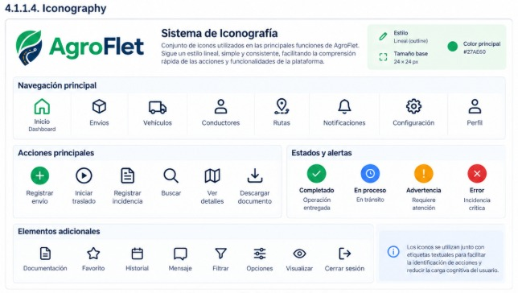
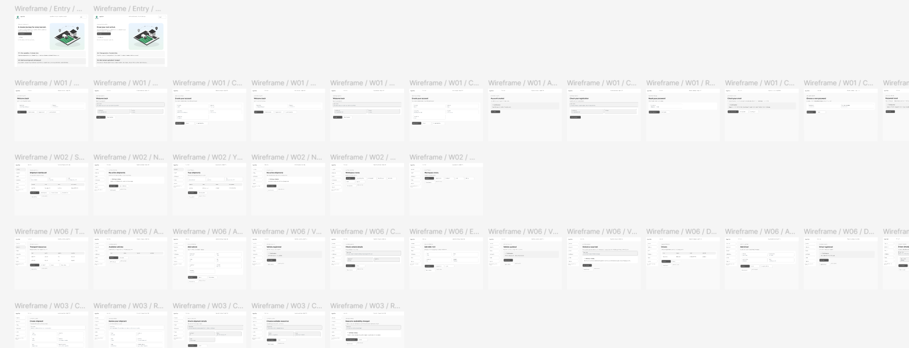
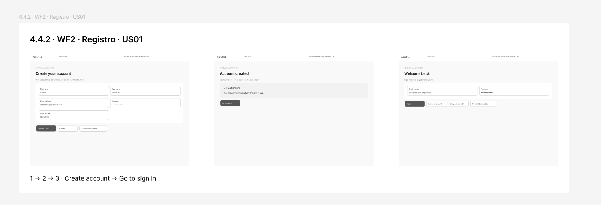
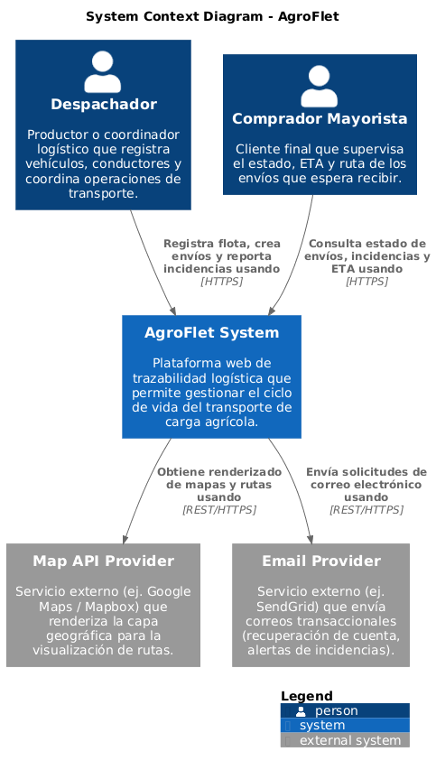
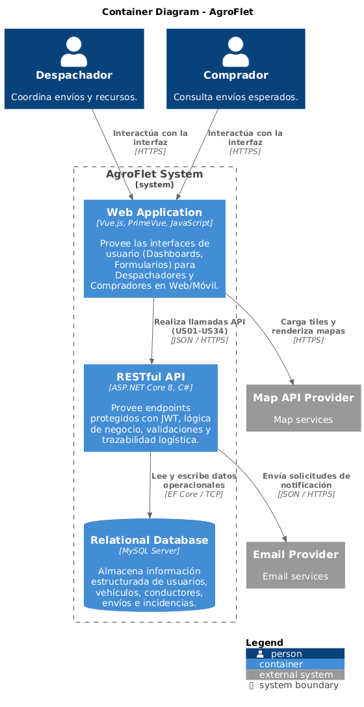
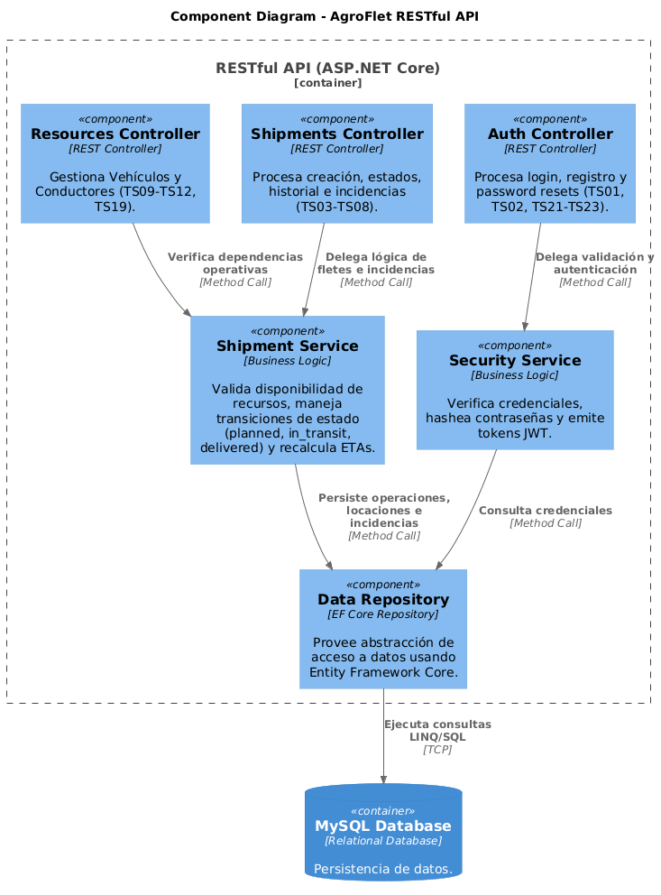
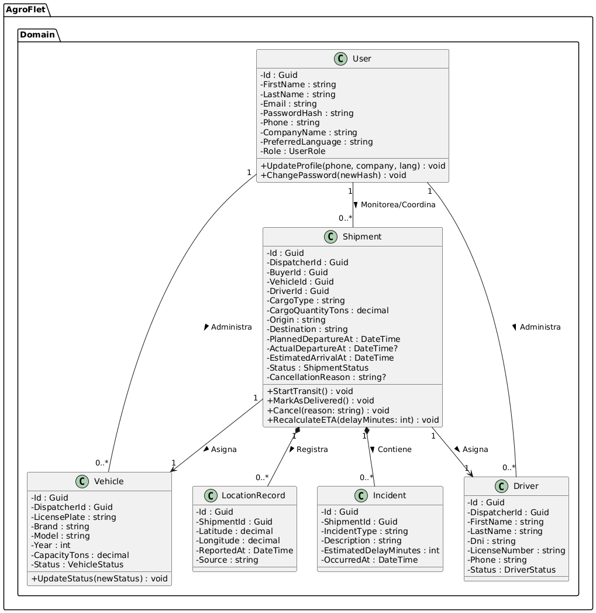

# Capítulo IV: Product Design

## 4.1. Style Guidelines

El sistema de diseño de AgroFlet se fundamenta en principios de claridad, confianza y accesibilidad universal. Dado que la plataforma será utilizada por actores con diversos niveles de alfabetización digital (desde coordinadores logísticos en oficinas hasta conductores en zonas rurales), la interfaz debe priorizar la legibilidad, la intuición y la consistencia visual en todos los puntos de contacto.

### 4.1.1. General Style Guidelines

La identidad visual de AgroFlet se fundamenta en los elementos conceptuales del logotipo oficial, el cual fusiona un pin de geolocalización, una hoja representativa del sector agrícola y un circuito de ruta logística. El tono de comunicación es profesional, directo y resolutivo, diseñado para transmitir confianza B2B en el ecosistema logístico.

La identidad visual de AgroFlet se fundamenta en principios de claridad, confianza y eficiencia operativa, alineados con el ecosistema agro-logístico.

**4.1.1.1. Branding**

Para AgroFlet, el branding se diseñó para mostrar confianza corporativa y eficiencia operativa, abarcando el sector de la logística agroalimentaria. Los tres elementos conceptuales del isotipo (el pin de ubicación, la hoja y la carretera en forma de circuito) representan la trazabilidad en tiempo real, el origen agrícola de la carga y la digitalización del transporte terrestre que nuestra plataforma web promete mediante sus funcionalidades principales. En el tema de colores, el color verde representa la frescura de los alimentos perecibles y la sostenibilidad, mientras que el azul marino corporativo representa la seguridad y formalidad B2B, contrastando de buena manera con los detalles naranjas que dinamizan la ruta. El diseño incluye el imagotipo y el nombre del producto dividido cromáticamente ("Agro" y "Flet") para que sea fácil de leer y asociar rápidamente con nuestro modelo de negocio.

 

  

**4.1.1.1. Typography:**

La tipografía de AgroFlet ha sido definida con el objetivo de mantener una interfaz clara, profesional y legible en contextos donde los usuarios necesitan consultar y gestionar información relacionada con el transporte agrícola de manera rápida. Esto incluye el registro de envíos, consulta del estado de las operaciones, revisión de incidencias, posiciones reportadas, rutas planificadas, notificaciones y gestión de recursos de transporte. La familia tipográfica principal de la plataforma es Inter, seleccionada por su alta legibilidad en interfaces digitales y su versatilidad para establecer distintos niveles de jerarquía visual. Su uso se mantiene de manera consistente tanto en la aplicación web como en los componentes informativos asociados a AgroFlet.
Se emplean diferentes pesos de Inter según la importancia del contenido, permitiendo diferenciar títulos, encabezados, textos principales, información auxiliar y etiquetas sin recurrir a una cantidad excesiva de estilos tipográficos.

La jerarquía tipográfica de AgroFlet se organiza de la siguiente manera:

* **Page Title / H1:** Inter Bold, 32 px
* **Section Heading / H2:** Inter SemiBold, 24 px
* **Subheading / H3:** Inter SemiBold, 20 px
* **Body Text:** Inter Regular, 16 px
* **Small / Auxiliary Text:** Inter Regular, 14 px
* **Labels / Caption:** Inter Regular, 12 px

El interlineado se establece aproximadamente entre 1.3 y 1.5 veces el tamaño de la fuente, favoreciendo la lectura tanto en bloques de contenido como en interfaces que presentan información operativa. Esta configuración permite mantener una separación visual adecuada entre títulos, datos de los envíos, estados, formularios y mensajes del sistema. La consistencia tipográfica contribuye a que el usuario pueda identificar rápidamente la importancia de cada elemento. Por ejemplo, el título de una operación utiliza una jerarquía mayor, mientras que información complementaria como “Última actualización: 09:30” utiliza un tamaño menor para evitar competir visualmente con los datos principales.

 

  
  <em>Nota. Sistema tipográfico utilizado en la identidad visual de Agroflet.</em>

**4.1.1.2. Paleta de Colores:**

La paleta de colores de AgroFlet ha sido definida con el propósito de transmitir una identidad visual moderna, confiable y relacionada con el entorno agrícola y logístico. El sistema combina colores propios de la marca con tonos estructurales, fondos neutros y colores semánticos que permiten diferenciar acciones, estados e información dentro de la plataforma.

El **Primary Green (`#27AE60`)** constituye uno de los principales colores de identidad de AgroFlet. El verde representa la relación de la plataforma con el sector agrícola, la sostenibilidad y el entorno productivo. Se utiliza principalmente en elementos de identidad, iconografía destacada y determinados componentes visuales.

Para las acciones principales se utiliza el **Action Green (`#176B3A`)**, un tono de mayor contraste pensado para elementos interactivos como botones principales, confirmaciones y acciones relevantes dentro de la aplicación. Su utilización permite distinguir las acciones disponibles sin depender únicamente del color para comunicar su función.

El **Navy (`#0B3B60`)** se emplea principalmente en títulos, navegación y elementos estructurales. Este tono aporta contraste al verde principal y busca transmitir confianza, estabilidad y profesionalismo dentro del contexto logístico.

Como color complementario se utiliza el **Accent Orange (`#F39C12`)**, reservado para elementos de énfasis, indicadores y determinadas acciones que requieren atención sin representar necesariamente una situación de error.

Los colores principales de AgroFlet son:

* **Primary Green:** `#27AE60` — identidad de marca y elementos destacados.
* **Action Green:** `#176B3A` — botones y acciones principales.
* **Navy:** `#0B3B60` — navegación, encabezados y elementos estructurales.
* **Accent Orange:** `#F39C12` — elementos de énfasis e indicadores.

Para fondos y superficies se utilizan principalmente tonos claros que facilitan la organización de la información:

* **White:** `#FFFFFF` — fondo principal.
* **Background Light:** `#F8F9FA` — superficies, tarjetas y formularios.
* **Blue Tint:** `#EAF4FF` — secciones informativas o áreas destacadas.

AgroFlet también incorpora colores semánticos para comunicar los resultados de determinadas operaciones. El **Success Green (`#059669`)** representa procesos completados correctamente; el **Warning Orange (`#F59E0B`)** se utiliza para advertencias o situaciones que requieren atención; y el **Error Red (`#D32F2F`)** identifica errores, cancelaciones o incidencias críticas.

El color no se utiliza como único mecanismo para comunicar un estado. Los indicadores se complementan con texto, iconografía y etiquetas, permitiendo que el significado pueda ser interpretado incluso cuando el usuario no diferencia correctamente determinados colores.

Por ejemplo, un envío no se identifica únicamente mediante un indicador verde, sino mediante una combinación como icono + “En tránsito”. De la misma manera, una incidencia crítica utiliza un icono, una descripción y el color correspondiente.

El uso consistente de esta paleta permite establecer una jerarquía visual clara, diferenciar acciones y estados y, al mismo tiempo, reforzar la identidad gráfica de AgroFlet.

 

  
   <em>Nota. Sistema cromático utilizado en la identidad visual de AgroFlet.</em>

**4.1.1.3. Spacing:**

El sistema de espaciado de AgroFlet se basa en una cuadrícula de 4 píxeles, permitiendo mantener consistencia entre los diferentes componentes de la interfaz. A partir de esta unidad base se utilizan principalmente valores de 4, 8, 12, 16, 24 y 32 píxeles, dependiendo de la relación existente entre los elementos y del nivel de separación requerido.

Los espacios de **4 px** se emplean entre elementos estrechamente relacionados, como un icono y su etiqueta. Los **8 px** permiten separar controles o elementos pertenecientes al mismo grupo, mientras que los **12 px** se utilizan en componentes pequeños o separaciones internas frecuentes.

Los **16 px** se emplean principalmente como espaciado interno de tarjetas, formularios y grupos de información. Los **24 px** permiten establecer una separación visual más clara entre componentes o subsecciones, mientras que los **32 px** se utilizan para dividir bloques principales dentro de una vista.

La escala de espaciado utilizada en AgroFlet es:

* **4 px:** separación mínima.
* **8 px:** elementos relacionados.
* **12 px:** componentes pequeños.
* **16 px:** separación interna de componentes.
* **24 px:** tarjetas y secciones.
* **32 px:** bloques principales.

Este sistema facilita la organización visual de información relacionada con operaciones logísticas, como tarjetas de envíos, formularios de registro, información del vehículo, conductor, incidencias y estados de transporte.

Asimismo, permite evitar la saturación visual y mantener una experiencia predecible entre las distintas vistas de la plataforma, especialmente cuando el usuario necesita revisar una cantidad considerable de información operativa.

 

  
  <em>Nota. Sistema de espaciado utilizado en la interfaz de AgroFlet.</em>

**4.1.1.4. Iconography:**

La iconografía de AgroFlet sigue un estilo simple, lineal, reconocible y consistente, orientado a facilitar la identificación rápida de las principales funciones de la plataforma. Los iconos funcionan como apoyo visual para elementos de navegación, acciones, formularios, estados y diferentes procesos relacionados con la coordinación del transporte agrícola.

Se priorizan iconos de apariencia limpia, evitando ilustraciones excesivamente complejas que puedan aumentar la carga visual de la interfaz. Los iconos mantienen proporciones y estilos similares dentro de cada contexto de uso, contribuyendo a generar una experiencia visual uniforme.

Entre los principales elementos representados mediante iconografía se encuentran:

* **Inicio / Dashboard**
* **Envíos**
* **Vehículos**
* **Conductores**
* **Notificaciones**
* **Buscar**
* **Registrar envío**
* **Rutas**
* **Configuración**
* **Perfil**

Los iconos asociados a acciones principales pueden utilizar los tonos verdes de AgroFlet, mientras que los elementos secundarios emplean colores neutros o el **Navy (`#0B3B60`)**. Los estados críticos pueden utilizar el **Error Red (`#D32F2F`)** y las advertencias el **Accent Orange (`#F39C12`)**.

Los iconos no reemplazan por completo al contenido textual en las operaciones importantes. Cuando una acción puede resultar ambigua, se acompaña de una etiqueta descriptiva, por ejemplo “Registrar envío”, “Notificaciones”, “Configuración” o “Ver detalles”.

Este enfoque reduce la carga cognitiva del usuario y permite reconocer más rápidamente las acciones disponibles, especialmente en vistas que contienen múltiples operaciones, vehículos, conductores o notificaciones.

 

  
  <em>Nota. Sistema de iconografía utilizado en la interfaz de AgroFlet.</em>

**4.1.1.5. Tone of Communication and Applied Language:**

El tono de comunicación de AgroFlet es claro, profesional, respetuoso, sereno y orientado a la acción, priorizando la precisión sobre la certeza absoluta. Dado que la plataforma gestiona operaciones agrícolas, se evitan tecnicismos innecesarios y expresiones absolutas cuando solo se cuenta con datos estimados o reportados previamente.

* Se utilizan términos precisos como “Ruta planificada”, “Posición reportada” o “Llegada estimada”.
* Los mensajes de error describen primero el problema y luego la solución (por ejemplo, *"Ubicación no disponible. Última actualización: 09:30"*).
* La interfaz prioriza instrucciones breves y se encuentra disponible tanto en español latinoamericano como en inglés, manteniendo la misma claridad en ambos idiomas.

Algunos ejemplos clave del lenguaje empleado en la plataforma son:

* **Acciones:** “Registrar envío”, “Iniciar traslado”, “Registrar incidencia”, “Ver detalles”.
* **Estados y datos:** “Posición reportada”, “Ruta planificada”, “Ubicación no disponible”, “Operación entregada”.

Este enfoque reduce la ambigüedad y genera confianza tanto en los despachadores como en los compradores que consultan el estado de las operaciones.

 

  

  <em>Nota. Tono de comunicación y lenguaje aplicado en la interfaz de AgroFlet.</em>

### 4.1.2. Web Style Guidelines

En el diseño visual de AgroFlet se adopta una línea gráfica moderna, profesional y funcional, enfocada en la eficiencia operativa y la claridad de la información logística. La jerarquía visual se construye mediante el uso de tipografías bien definidas (familia Inter), tamaños diferenciados y colores de alto contraste (verde agrícola y azul marino corporativo) que permiten identificar rápidamente los elementos más importantes, como los estados de los fletes. Los botones interactivos y componentes basados en Material Design y PrimeVue presentan estados visuales claros (normal, hover y activo), brindando retroalimentación inmediata al usuario. El uso de tarjetas (cards) con bordes suaves y sombras sutiles contribuye a una interfaz limpia y organizada, evitando distracciones innecesarias durante el monitoreo de rutas. Asimismo, los componentes visuales están diseñados para mantener consistencia en toda la plataforma, facilitando la navegación y reduciendo la curva de aprendizaje del usuario (productores y compradores mayoristas). Finalmente, cada elemento del diseño ha sido pensado para cumplir un propósito funcional dentro de la experiencia de gestión de flotas, asegurando que la interfaz no solo sea atractiva, sino también eficiente en contextos donde la rapidez y la precisión son esenciales. Además, el diseño considera principios de diseño responsive, asegurando que la interfaz mantenga su funcionalidad y claridad en distintos dispositivos y tamaños de pantalla, tanto en la aplicación web como en el Landing Page.

## 4.2. Information Architecture

### 4.2.1. Organization Systems

Para nuestra plataforma se opta por una organización visual jerárquica con elementos secuenciales. Esto permite que el usuario identifique fácilmente los puntos clave, organizando el contenido en categorías principales como "Dashboard", "Flota", "Historial de Operaciones" y "Configuración", y en subcategorías dentro de cada una. Así, la información logística y los datos de rastreo se presentan de forma clara y sin sobrecargar la pantalla.

Además, en ciertas secciones se incorporan flujos secuenciales que guían al usuario paso a paso para completar tareas o llegar a páginas específicas (por ejemplo, el registro de una nueva unidad de transporte o el reporte de una incidencia en ruta). Esta estructura facilita aplicar principios de arquitectura de información como claridad, accesibilidad, navegación enfocada y facilidad de uso. Finalmente, gracias a la investigación previa y la definición de los User Personas, se asegura que el contenido de cada categoría sea relevante y útil para el usuario.

  

  Nota: Diagrama de organización de información del landing page. 

<strong>Acceso al diagrama de la Arquitectura de Información (Miro):</strong> 
https://miro.com/app/board/uXjVHpjtvic=/?share_link_id=251750996606

### 4.2.2. Labeling Systems

El sistema de internacionalización (i18n) de AgroFlet soporta los idiomas inglés (`en_US` como predeterminado) y español latinoamericano (`es_419`), asegurando que la terminología operativa se mantenga uniforme y clara en ambas configuraciones regionales.

| Inglés (`en_US`) | Español Latinoamericano (`es_419`) |
| :---: | :---: |
| **Inicio / Home** | Presenta una visión general de AgroFlet, destacando la gestión logística, el transporte agrícola y el seguimiento de envíos en tiempo real. |
| **Nosotros / About Us** | Describe al equipo detrás de AgroFlet, su misión, visión y el impacto que busca generar en el sector agrologístico peruano. |
| **Servicios / Services** | Explica los beneficios principales de la plataforma: coordinación de transportes, asignación de flotas y monitoreo de entregas. |
| **Envíos / Shipments** | Permite explorar y registrar los envíos de productos agrícolas, incluyendo el estado actual, rutas y detalles del transporte. |
| **Flota / Fleet** | Muestra el estado de los vehículos disponibles, capacidad de carga, asignación de conductores y disponibilidad operativa. |
| **Conductores / Drivers** | Gestiona la información del personal de transporte, licencias, contacto y asignación a rutas específicas. |
| **Planes / Plans** | Presenta los planes y opciones de la plataforma con sus características y diferencias, permitiendo elegir el modelo ideal para cada empresa o productor. |
| **Despachador / Dispatcher** | Sección dirigida a los encargados de coordinar la logística, con herramientas para crear envíos, asignar flotas y supervisar rutas. |
| **Comprador / Buyer** | Sección dirigida a los clientes o compradores, con información sobre el seguimiento de sus pedidos y recepción de mercancía. |
| **Contacto / Contact Us** | Proporciona los medios de comunicación disponibles: correo electrónico, WhatsApp y canales de soporte del equipo. |
| **Registro / Sign Up** | Permite crear una cuenta en la plataforma eligiendo el rol correspondiente para personalizar la experiencia operativa desde el inicio. |
| **Iniciar sesión / Log In** | Permite a los usuarios registrados acceder a su cuenta y retomar su actividad en la plataforma de gestión. |

## 4.2.3. SEO Tags and Meta Tags

Los SEO Tags y Meta Tags de AgroFlet se definen con el objetivo de describir correctamente el contenido de las principales páginas públicas de la plataforma y proporcionar información clara al navegador y a los motores de búsqueda.

En la Landing Page se priorizan términos relacionados con logística agrícola, transporte de productos agrícolas, coordinación de envíos y seguimiento de operaciones. En las vistas internas de la Web Application, los metadatos permiten identificar claramente la función de cada página, aunque estas vistas requieren autenticación y no están orientadas al posicionamiento público.

| Página | Title | Description | Keywords | Author |
| :---: | :---: | :---: | :---: | :---: |
| **Landing Page** | AgroFlet \| Coordinación de transporte agrícola | Coordina envíos agrícolas, consulta incidencias y revisa información actualizada de tus operaciones logísticas mediante AgroFlet. | logística agrícola, transporte agrícola, envíos, AgroFlet, coordinación logística | AgroFlet Development Team |
| **Login / Registro** | Accede a AgroFlet \| Iniciar sesión o registrarse | Inicia sesión o crea una cuenta en AgroFlet para gestionar y consultar operaciones de transporte agrícola según tu rol. | AgroFlet, iniciar sesión, registro, despachador, comprador | AgroFlet Development Team |
| **Dashboard** | Dashboard \| AgroFlet | Consulta tus operaciones activas, estados, incidencias y últimas actualizaciones desde el panel principal de AgroFlet. | dashboard, envíos, logística agrícola, operaciones, seguimiento | AgroFlet Development Team |
| **Envíos** | Envíos \| AgroFlet | Consulta y administra las operaciones de transporte agrícola asociadas a tu cuenta. | envíos agrícolas, operaciones, transporte, logística | AgroFlet Development Team |
| **Historial** | Historial de envíos \| AgroFlet | Busca y consulta operaciones anteriores utilizando filtros de fecha, estado, producto y destino. | historial de envíos, incidencias, logística, operaciones | AgroFlet Development Team |
| **Configuración** | Configuración \| AgroFlet | Administra la información de tu perfil, contraseña y preferencias de idioma en AgroFlet. | perfil, configuración, preferencias, AgroFlet | AgroFlet Development Team |

Las páginas públicas utilizan el atributo `lang` de acuerdo con el idioma seleccionado y el Meta Tag `viewport` para mantener una presentación adaptable a diferentes tamaños de pantalla. AgroFlet contempla inglés y español latinoamericano, por lo que los títulos y descripciones pueden adaptarse al idioma seleccionado por el usuario.

Las vistas privadas, como Dashboard, Envíos, Historial o Configuración, requieren autenticación y deben configurarse para evitar su indexación pública. Los Meta Tags permiten identificar correctamente cada vista dentro del navegador, pero no sustituyen los mecanismos de autenticación y autorización.

> **Nota.** La tabla muestra los principales SEO Tags y Meta Tags definidos para las páginas de AgroFlet.

---

## 4.2.4. Searching Systems

AgroFlet incorpora mecanismos de búsqueda y filtrado con el propósito de facilitar la localización de operaciones sin que los usuarios tengan que recorrer manualmente grandes cantidades de registros. Los criterios disponibles dependen del contexto de uso y del rol del usuario. Las búsquedas siempre se realizan únicamente sobre aquellas operaciones a las que el usuario tiene autorización de acceso.

### Searching System para operaciones
La sección de operaciones dispone de una barra de búsqueda que permite localizar rápidamente un envío mediante información identificable de la operación.

| Criterio | Descripción |
| :---: | :--- |
| **Código de envío** | Permite localizar directamente una operación utilizando su identificador o número de envío. |
| **Placa del vehículo** | Permite encontrar operaciones relacionadas con una unidad de transporte determinada. |
| **Destino** | Permite localizar operaciones cuyo destino coincide con la ubicación ingresada. |

Los resultados muestran únicamente las operaciones vinculadas al usuario autenticado y presentan información como código de envío, producto o carga, origen, destino, estado, fecha estimada de llegada y última actualización. Cuando no existen coincidencias, la aplicación muestra un mensaje indicando que no se encontraron operaciones para el criterio ingresado.

> **Nota.** La tabla muestra los principales criterios de búsqueda disponibles para las operaciones de AgroFlet.

### Searching System mediante filtros
Además de la búsqueda directa, AgroFlet permite combinar diferentes filtros para reducir el número de resultados y facilitar la consulta del historial de operaciones.

| Filtro | Descripción |
| :---: | :--- |
| **Fecha** | Permite limitar las operaciones según una fecha inicial y final determinadas por el usuario. |
| **Estado** | Filtra las operaciones según su estado: Programado, En tránsito, Entregado o Cancelado. |
| **Producto / Tipo de carga** | Permite mostrar únicamente operaciones relacionadas con un producto o tipo de carga determinado. |
| **Destino** | Permite visualizar operaciones relacionadas con una ubicación o destino específico. |

Los filtros pueden aplicarse simultáneamente. Cuando el usuario utiliza más de un criterio, el sistema muestra únicamente aquellas operaciones que cumplen con todas las condiciones seleccionadas. La interfaz presenta los filtros activos y proporciona una opción para limpiar filtros y regresar al listado completo permitido para el usuario.

El sistema no incluye búsquedas globales mediante información sensible como DNI para compradores. La búsqueda se limita a información relacionada directamente con las operaciones autorizadas.

> **Nota.** La tabla muestra los filtros disponibles para consultar y organizar las operaciones de AgroFlet.

### Searching System para el Despachador
El Despachador puede utilizar la búsqueda y los filtros para localizar rápidamente operaciones creadas dentro de su ámbito de gestión. Esto facilita tareas como revisar una operación específica, consultar viajes anteriores, comprobar el estado de un despacho o encontrar las operaciones asociadas a determinado vehículo.

### Searching System para el Comprador
El Comprador dispone de los mismos mecanismos básicos de búsqueda y filtrado, pero únicamente sobre los envíos en los que se encuentra asociado como participante. De esta manera, el sistema evita mostrar operaciones pertenecientes a otros compradores o despachadores y mantiene la búsqueda dentro del conjunto autorizado.

---

## 4.2.5. Navigation Systems

El sistema de navegación de AgroFlet ha sido diseñado para permitir que los usuarios recorran las principales funcionalidades de manera clara, predecible y coherente con su rol dentro de la plataforma. La navegación se divide entre la Landing Page y la Web Application. Dentro de la aplicación, las opciones disponibles cambian según si el usuario corresponde al perfil de Despachador o Comprador.

### Navigation System de la Landing Page
La Landing Page utiliza una navegación horizontal en escritorio y un menú adaptable en dispositivos móviles. Su finalidad es presentar la propuesta de valor de AgroFlet y permitir que el visitante conozca las principales características de la solución antes de ingresar a la aplicación.

| Nombre | Descripción |
| :---: | :--- |
| **Inicio / Home** | Presenta la propuesta principal de AgroFlet y una introducción a la solución de coordinación logística agrícola. |
| **Funcionalidades / Features** | Describe las principales capacidades de la plataforma, como gestión de operaciones, incidencias, mapas, historial y notificaciones. |
| **Planes / Plans** | Presenta las modalidades de uso o propuestas comerciales disponibles para los usuarios. |
| **Contacto / Contact** | Permite enviar una consulta al equipo de AgroFlet mediante un formulario. |
| **Términos / Terms** | Permite consultar las condiciones generales y el alcance del servicio. |
| **Iniciar sesión** | Permite acceder a una cuenta previamente registrada. |
| **Registrarse** | Permite iniciar el proceso de creación de una cuenta en AgroFlet. |

La Landing Page incorpora además llamados a la acción diferenciados para los dos segmentos de la plataforma:
* **Despachador** $\rightarrow$ dirige al flujo relacionado con la administración y coordinación de operaciones.
* **Comprador** $\rightarrow$ dirige al flujo orientado a consultar los envíos que espera recibir.

La selección realizada en la Landing Page únicamente orienta la navegación inicial y no concede privilegios ni reemplaza la autenticación del usuario.

> **Nota.** La tabla muestra los principales apartados del sistema de navegación de la Landing Page de AgroFlet.

### Navigation System para el Despachador
La Web Application destinada al Despachador organiza la navegación en función de las principales tareas relacionadas con la coordinación del transporte agrícola.

| Nombre | Descripción |
| :---: | :--- |
| **Dashboard** | Presenta un resumen de las operaciones activas y la información principal que requiere atención. |
| **Envíos / Shipments** | Permite registrar, consultar y gestionar las operaciones de transporte. |
| **Vehículos / Vehicles** | Permite registrar, consultar y actualizar las unidades de transporte disponibles. |
| **Conductores / Drivers** | Permite registrar conductores y consultar su disponibilidad para nuevas operaciones. |
| **Notificaciones / Notifications** | Presenta avisos relacionados con incidencias y cambios relevantes en las operaciones. |
| **Configuración / Settings** | Permite gestionar los datos de perfil, contraseña y preferencias de idioma del usuario. |

Dentro de cada operación se presentan acciones contextuales como *Iniciar traslado*, *Registrar incidencia*, *Registrar posición*, *Marcar como entregada*, *Cancelar operación* o *Ver detalles*. Estas acciones no se colocan como opciones permanentes en la navegación principal, sino que aparecen únicamente cuando corresponden al estado actual de la operación.

> **Nota.** La tabla muestra los apartados principales del sistema de navegación para el Despachador de AgroFlet.

### Navigation System para el Comprador
La interfaz correspondiente al Comprador presenta una navegación enfocada principalmente en la consulta y seguimiento de los envíos que tiene asociados.

| Nombre | Descripción |
| :---: | :--- |
| **Envíos por recibir / Incoming Shipments** | Presenta las operaciones activas asociadas al comprador. |
| **Detalle del envío / Shipment Details** | Permite consultar información completa de una operación determinada. |
| **Historial / History** | Permite consultar operaciones anteriores y aplicar filtros de búsqueda. |
| **Notificaciones / Notifications** | Presenta avisos relacionados con incidencias y cambios de estado de los envíos. |
| **Configuración / Settings** | Permite administrar datos del perfil, contraseña y preferencias de idioma. |

El comprador puede acceder al detalle de una operación para consultar información como estado actual, origen, destino, llegada estimada, ruta planificada, posiciones reportadas, incidencias e historial de estados. A diferencia del Despachador, el Comprador no dispone de opciones para registrar vehículos, conductores o crear operaciones de transporte.

> **Nota.** La tabla muestra los apartados principales del sistema de navegación para el Comprador de AgroFlet.

### Navigation System del detalle de una operación
Dentro del detalle de cada envío se utiliza una navegación contextual que organiza la información de la operación en diferentes apartados.

| Nombre | Descripción |
| :---: | :--- |
| **Resumen / Summary** | Presenta los principales datos de la operación, estado, carga, origen, destino y fechas relevantes. |
| **Ruta planificada / Planned Route** | Permite visualizar el recorrido previsto entre el punto de origen y el destino. |
| **Posiciones reportadas / Reported Positions** | Presenta las ubicaciones registradas para la operación junto con la fecha y fuente correspondiente. |
| **Incidencias / Incidents** | Permite revisar los eventos registrados durante el traslado y su impacto sobre la operación. |
| **Historial de estados / Status History** | Presenta cronológicamente los cambios de estado realizados sobre la operación. |

La información geográfica se comunica indicando explícitamente si corresponde a una ruta planificada o una posición reportada, evitando presentar una ubicación estimada como si correspondiera a seguimiento GPS continuo. Asimismo, al regresar desde el detalle hacia el historial o listado de operaciones, se busca conservar los filtros utilizados previamente para evitar que el usuario tenga que repetir su búsqueda.

> **Nota.** La tabla muestra la navegación contextual disponible dentro del detalle de una operación de AgroFlet.
## 4.3. Landing Page UI Design

### 4.3.1. Landing Page Wireframe

El wireframe establece la estructura de la página de aterrizaje en escala de grises. Se prioriza la propuesta de valor en la sección *Hero*, seguida de los beneficios, planes de suscripción y un formulario de contacto. Elaborado utilizando Figma.

### Wireframes Desktop de la Landing Page

**Landing Wireframe Desktop 1**

**Landing Wireframe Desktop 2**

**Landing Wireframe Desktop 3**

**Landing Wireframe Desktop 4**

**Landing Wireframe Desktop 5**

**Landing Wireframe Desktop 6**

**Landing Wireframe Desktop 7**

### Wireframes Mobile de la Landing Page

**Landing Wireframe Mobile 1**

**Landing Wireframe Mobile 2**

**Landing Wireframe Mobile 3**

**Landing Wireframe Mobile 4**

**Landing Wireframe Mobile 5**

**Landing Wireframe Mobile 6**

**Landing Wireframe Mobile 7**

**Link de figma:** [Ver en Figma](https://www.figma.com/design/gKyUHMHD9eKJ3KUjmugVd1/Landing-Page---AgroFlet?node-id=0-1&t=iTO54ThcvYOIGSXQ-1)

### 4.3.2. Landing Page Mock-up

El Mock-up de alta fidelidad integra el isotipo de AgroFlet, la paleta de colores oficial (Azul Marino y Verde AgroFlet) y tipografía Inter. Se evidencia la aplicación de atributos ARIA para accesibilidad (a11y) y selectores de idioma.

### Mockups Desktop de la Landing Page

**Landing Mockup Desktop 1**

**Landing Mockup Desktop 2**

**Landing Mockup Desktop 3**

**Landing Mockup Desktop 4**

**Landing Mockup Desktop 5**

**Landing Mockup Desktop 6**

**Landing Mockup Desktop 7**

### Mockups Mobile de la Landing Page

**Landing Mockup Mobile 1**

**Landing Mockup Mobile 2**

**Landing Mockup Mobile 3**

**Landing Mockup Mobile 4**

**Landing Mockup Mobile 5**

**Landing Mockup Mobile 6**

**Landing Mockup Mobile 7**

**Link de figma:** [Ver en Figma](https://www.figma.com/design/gKyUHMHD9eKJ3KUjmugVd1/Landing-Page---AgroFlet?node-id=0-1&t=iTO54ThcvYOIGSXQ-1)

## 4.4. Web Applications UX/UI Design

El diseño de la aplicacion web de   Agroflet oorganiza las experiencias de los dos roles principales: Desapachador, encargado de coordinar las operaciones, y Comprador, orientado a consultar los envios asociados a su recepción.

El trabajo registrado en Figma comprende wireframes, mockups y represtaciones de flujos. Su relacion con las ohistoprias de usuario permite revusar que las interfaves respondan a las tareas del negocio u que las acciones ofrecidas sean cogerentes con el rol t el estado de cada operacion.

### 4.4.1. Web Applications Wireframes

Los wireframes elaborados establecen la distribución de los contenidos y controles de la aplicación. En el dashboard se trabajó una composición con aproximadamente 70 % del espacio destinado al mapa y 30 % al listado de operaciones, como referencia de la vista amplia. Esta distribución debe adaptarse al navegador móvil, conservando la información esencial y evitando reducir excesivamente los elementos.

Las familias de vistas utilizadas para organizar y revisar el diseño se relacionan con las historias de la siguiente manera:

  
| Familia de vistas | Propósito | Historias relacionadas |
| :--- | :--- | :--- |
| Acceso y cuenta | Registro, inicio, cierre de sesión y recuperación de contraseña. | US01–US04 |
| Dashboard | Consulta de operaciones, estados y últimas actualizaciones. | US10 |
| Nueva operación | Selección de recursos y registro de un envío programado. | US08, US09 |
| Detalle de operación | Consulta del envío, inicio efectivo y cierre. | US11, US12, US31 |
| Incidencias | Registro y consulta de eventos del traslado. | US13, US14 |
| Recursos de transporte | Registro de vehículos y conductores, y actualización de vehículos. | US05–US07 |
| Historial y búsqueda | Consulta mediante filtros, código de envío o placa. | US15, US16 |
| Información geográfica | Ruta planificada y posiciones reportadas. | US17, US18, US32 |
| Notificaciones | Avisos sobre incidencias y cambios de estado. | US19, US20 |
| Perfil y preferencias | Actualización de datos, contraseña e idioma. | US21–US23 |
| Condiciones de uso | Consulta de los términos del servicio. | US33 |

 

  
  <em>Esta relación establece la trazabilidad para revisar los frames; no sustituye las capturas de los wireframes ni acredita por sí sola la cobertura de todos los escenarios.</em>

### 4.4.2. Web Applications Wireflow Diagrams

Los wireflows organizan la secuencia de pantallas que recorre el usuario para alcanzar un objetivo. El registro de elaboración incluye estos artefactos, cuya revisión permite relacionar las acciones del usuario con los cambios representados en las interfaces.
Entre los recorridos centrales de AgroFlet se consideran:

 
  
| Usuario y objetivo | Secuencia funcional de referencia |
| :--- | :--- |
| Despachador: preparar un envío | Consultar operaciones → completar datos → seleccionar recursos → revisar → confirmar operación programada. |
| Despachador: comunicar una incidencia | Consultar envío en tránsito → registrar evento e impacto → confirmar → consultar incidencia y estimación actualizada. |
| Comprador: organizar la recepción | Acceder a sus envíos → consultar detalle → revisar llegada estimada, incidencias e información geográfica. |
| Participante autorizado: revisar antecedentes | Acceder al historial → buscar o filtrar → consultar resultados → abrir detalle. |

 

  
   
   
  <em>Cada wireflow debe mostrar los wireframes correspondientes, las acciones que conectan sus pasos y las variantes relevantes. La revisión pendiente debe confirmar que un cambio de estado se representa mediante una pantalla diferenciada y que también se cubren los objetivos complementarios de cuenta, recursos y preferencias.</em>

Para su presentación académica, cada wireflow debe mostrar los wireframes correspondientes, las acciones que conectan sus pasos y las variantes relevantes. La revisión pendiente debe confirmar que un cambio de estado se representa mediante una pantalla diferenciada y que también se cubren los objetivos complementarios de cuenta, recursos y preferencias.

### 4.4.3. Web Applications Mock-ups

Los mockups desarrollan las interfaces de AgroFlet con mayor detalle visual, incorporando la organización de contenidos, los controles, los estados de las operaciones y los elementos de navegación. El trabajo registrado incluye el dashboard con mapa y listado, así como modales conectados para explorar interacciones.

La propuesta toma como referencia un diseño basado en Material Design, compatible con la posterior implementación en Vue y PrimeVue. Los mockups representan decisiones visuales; no implican que los componentes de PrimeVue estén ejecutándose dentro de Figma.

La diferenciación entre roles constituye un criterio central de revisión: el despachador dispone de acciones de gestión, mientras que el comprador consulta la información de sus envíos. Asimismo, la información geográfica debe distinguir entre ruta planificada y posición reportada, indicando la fuente y la fecha del dato.

### 4.4.4. Web Applications User Flow Diagrams

Las representaciones de decisiones desarrolladas complementan la secuencia de pantallas al incorporar las condiciones que determinan cómo continúa una interacción. Para su presentación como User Flow Diagrams, deben relacionarse con los mockups y mostrar tanto el recorrido esperado como las alternativas.

El flujo de operaciones utiliza como referencia las siguientes reglas:

* La selección provisional de recursos no realiza una reserva.
* La creación válida registra una operación `planned`.
* El inicio efectivo cambia la operación a `in transit`.
* La entrega permite pasar de `in_transit` a `delivered`.
* La cancelación se permite desde `planned` o `in transit`, con motivo registrado.
* Las operaciones entregadas o canceladas no se reabren mediante estos recorridos.

Las alternativas incluyen datos inválidos, recursos no disponibles, errores de guardado, ausencia de posición y restricciones de acceso. La revisión final debe comprobar que las ramas permiten corregir, cancelar o regresar, y que no existen conexiones incompatibles con las historias de usuario.

### 4.5. Web Applications Prototyping

El prototipo de AgroFlet reúne las interfaces y conexiones de navegación para explorar la experiencia antes de su implementación. El registro de trabajo incluye modales conectados y transiciones visuales, que permiten representar cambios de pantalla y acciones dentro del diseño.

Los recorridos se orientan a la preparación y consulta de envíos, el registro de incidencias y la revisión de información logística por parte de despachadores y compradores. Su evaluación debe comprobar la continuidad de las interacciones en escritorio y navegador móvil, incluyendo acciones de retorno, cancelación y recuperación ante errores.

El prototipo constituye una simulación de la experiencia de uso. No demuestra autenticación real, persistencia de datos, transacciones, envío de correos ni integración operativa con servicios geográficos.

Antes de cerrar esta sección deben completarse la revisión de recorridos, las traducciones y la iconografía. Asimismo, el informe debe incorporar las capturas seleccionadas y el video de navegación exigido por el curso.

> `[Insertar screenshot del prototipo en Figma]`
> **Enlace al Video Demostrativo:** `[Insertar URL de Microsoft Stream del recorrido del prototipo]`

## 4.6. Domain-Driven Software Architecture

### 4.6.1. Design-Level EventStorming

faltaaaaaaaaaaaaaaaaaaaaaaaaaaaaaaaaaaaaaa

### 4.6.2. Software Architecture Context Level Diagram

En esta sección se presenta el diagrama de contexto correspondiente al Nivel 1 del Modelo C4. El propósito de este nivel es ilustrar el sistema AgroFlet como una caja negra en el centro de su ecosistema, identificando a los usuarios principales que interactúan con la plataforma y los sistemas externos de los cuales depende para cumplir con sus procesos logísticos y de comunicación.  El ecosistema está compuesto por dos actores clave: el Despachador (quien registra flotas, coordina y emite el envío) y el Comprador Mayorista (quien consume la información de llegada). Asimismo, AgroFlet se integra con un Servicio Externo de Mapas para la renderización de coordenadas y un Servicio de Correos para notificaciones transaccionales.

  

  Nota: Diagrama de Contexto elaborado en planttext aplicando el Modelo C4. 

### 4.6.3. Software Architecture Container Level Diagrams

A continuación, se detalla el diagrama de contenedores (Nivel 2 del Modelo C4), el cual expone la arquitectura de alto nivel de AgroFlet, mostrando las unidades de despliegue independientes y las decisiones tecnológicas adoptadas.  La arquitectura se divide en tres contenedores principales: una Single-Page Application (SPA) desarrollada en Vue.js que provee la interfaz responsiva; un RESTful API en ASP.NET Core (C#) que centraliza la lógica de negocio, validaciones y autenticación JWT; y una Base de Datos Relacional en MySQL que garantiza la integridad transaccional (ACID) de los registros logísticos

  

  Nota: Diagrama de Contenedores elaborado en planttext aplicando el Modelo C4. 

### 4.6.4. Software Architecture Component Level Diagrams

Este diagrama de componentes (Nivel 3 del Modelo C4) descompone el contenedor del RESTful API. Refleja la separación de responsabilidades arquitectónicas (Clean Architecture/N-Capas) mediante el uso de Controladores (Controllers), Servicios de Negocio (Business Services) y Componentes de Acceso a Datos (Repositories).  Se ilustra cómo las peticiones HTTP son interceptadas por los Controladores correspondientes a cada Bounded Context (Identidad, Recursos, Operaciones), delegando las reglas de negocio a los servicios y orquestando la persistencia mediante Entity Framework Core. 

  

  Nota: Diagrama de Componentes del API elaborado en planttext. 

## 4.7. Software Object-Oriented Design

El diseño orientado a objetos encapsula el dominio logístico de AgroFlet, protegiendo las reglas de negocio mediante modificadores de acceso (private, public) y comportamientos ricos en lugar de modelos anémicos.

### 4.7.1. Class Diagrams

Este diagrama de clases UML modela las entidades extraídas del análisis de las Historias de Usuario (US) y Technical Stories (TS). Se incluyen las propiedades completas (ej. CargoType, EstimatedDelayMinutes, PreferredLanguage) y los métodos que controlan la máquina de estados de las operaciones (StartTransit(), Cancel(), MarkAsDelivered()).  

  

  Nota: Diagrama de Clases UML modelando los Bounded Contexts principales en planttext. 

## 4.8. Database Design

El diseño de la base de datos asegura la persistencia estructural de AgroFlet mediante un modelo relacional en MySQL.  

### 4.8.1. Database Diagrams

El siguiente Diagrama Entidad-Relación (ERD) documenta las tablas, columnas, tipos de datos, llaves primarias (PK) en formato UUID (CHAR 36) y restricciones de llave foránea (FK) que garantizan la integridad referencial del sistema logístico. Se evidencia la trazabilidad histórica de ubicaciones e incidencias hacia su envío matriz.  

  

  Nota: Diagrama Entidad-Relación (ERD) hecho en planttext. 

