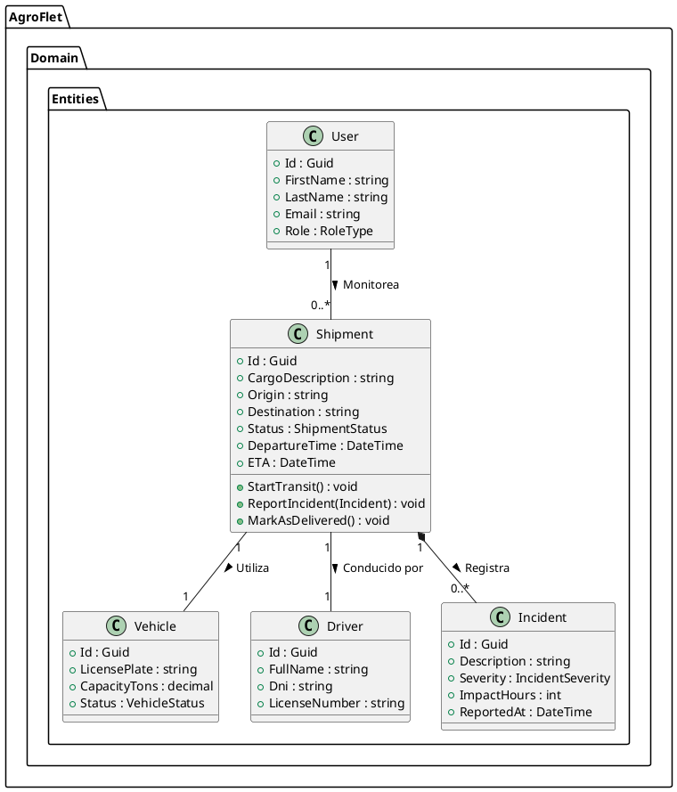
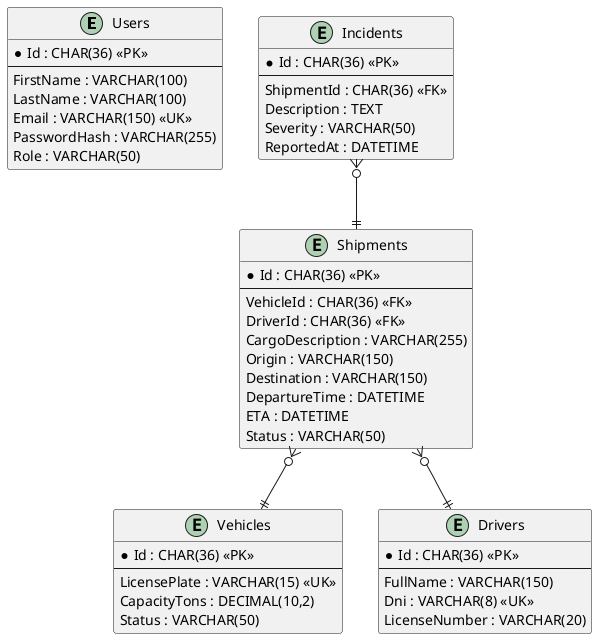

# Capítulo IV: Product Design

## 4.1. Style Guidelines

El sistema de diseño de AgroFlet se fundamenta en principios de claridad, confianza y accesibilidad universal. Dado que la plataforma será utilizada por actores con diversos niveles de alfabetización digital (desde coordinadores logísticos en oficinas hasta conductores en zonas rurales), la interfaz debe priorizar la legibilidad, la intuición y la consistencia visual en todos los puntos de contacto.

### 4.1.1. General Style Guidelines

La identidad visual de AgroFlet se fundamenta en los elementos conceptuales del logotipo oficial, el cual fusiona un pin de geolocalización, una hoja representativa del sector agrícola y un circuito de ruta logística. El tono de comunicación es profesional, directo y resolutivo, diseñado para transmitir confianza B2B en el ecosistema logístico.

La identidad visual de AgroFlet se fundamenta en principios de claridad, confianza y eficiencia operativa, alineados con el ecosistema agro-logístico.

**Branding**

Para AgroFlet, el branding se diseñó para mostrar confianza corporativa y eficiencia operativa, abarcando el sector de la logística agroalimentaria. Los tres elementos conceptuales del isotipo (el pin de ubicación, la hoja y la carretera en forma de circuito) representan la trazabilidad en tiempo real, el origen agrícola de la carga y la digitalización del transporte terrestre que nuestra plataforma web promete mediante sus funcionalidades principales. En el tema de colores, el color verde representa la frescura de los alimentos perecibles y la sostenibilidad, mientras que el azul marino corporativo representa la seguridad y formalidad B2B, contrastando de buena manera con los detalles naranjas que dinamizan la ruta. El diseño incluye el imagotipo y el nombre del producto dividido cromáticamente ("Agro" y "Flet") para que sea fácil de leer y asociar rápidamente con nuestro modelo de negocio.

<p align="center">
  
</p>

**Tipografía:**
Se adopta la familia tipográfica **Inter** (sans-serif) por su alta legibilidad en interfaces densas y tablas de datos. Se establecen jerarquías estrictas: *Headings* (H1-H3) en pesos *SemiBold* y *Body* en peso *Regular*.

<p align="center">
  
</p>

**Paleta de Colores:**
La paleta de colores de aGROFLET se compone de 5 colores y sus variantes. Los colores, en conjunto, permiten mostrar una claridad en el diseño de las dos aplicaciones.

<p align="center">
  
</p>

* *Primary (Verde AgroFlet):* `#27AE60`. Transmite sostenibilidad, frescura agrícola y acciones de éxito.
* *Secondary (Azul Marino Corporativo):* `#0B3B60`. Utilizado en tipografía principal, menús de navegación (*Sidebar*) y elementos que requieren transmitir seguridad y formalidad institucional.
* *Accent (Naranja Ruta):* `#F39C12`. Utilizado para resaltar rutas activas, estados pendientes o alertas de nivel medio.
* *Error/Crítico:* `#D32F2F`. Exclusivo para incidencias graves, bloqueos o retrasos críticos.
* *Neutrales:* Escala de grises desde `#F8F9FA` (fondos) hasta `#212529` (texto base).

**Spacing:**

El diseño de la aplicación web de AgroFlet utiliza un sistema de espaciado estructurado para mantener el orden y la legibilidad entre los distintos componentes de la interfaz. Al ser una herramienta que maneja un alto volumen de información (mapas de rutas, listas de fletes, tablas de datos), cada componente fue posicionado con márgenes consistentes para evitar la sobrecarga visual y no mostrarse abultado. En toda la aplicación, existe un espacio en blanco predefinido que facilita la lectura rápida de métricas logísticas, y los componentes están diseñados de forma responsiva para que el espaciado se ajuste automáticamente según la resolución del dispositivo, ya sea un monitor de oficina o un teléfono móvil en el campo.
</br><br>
**Tono de comunicación y Lenguaje aplicado:**

Para AgroFlet, hemos tomado la decisión de tener un tono de comunicación **profesional, resolutivo y claro**. Esto debido a que nuestros usuarios principales (productores, coordinadores logísticos y compradores mayoristas) operan en un entorno de alta presión donde el tiempo de tránsito y el estado de los alimentos perecibles son factores críticos.

Nosotros como desarrolladores tenemos que tomar en cuenta lo siguiente:

* Debemos utilizar un lenguaje que transmita control y eficiencia operativa, empleando la terminología precisa del sector agro-logístico (términos como "flete", "operación en tránsito", "incidencia en ruta", "tiempo estimado de llegada") para que el usuario se sienta en un entorno familiar.
* Se deben evitar por completo los tecnicismos informáticos o de software que puedan confundir a usuarios con menor alfabetización digital.
* Las alertas, notificaciones y mensajes de error deben ser directos y orientados a la acción (ej. *"Retraso de 2 horas reportado en ruta. Actualice la hora de recepción"*), permitiendo que los usuarios tomen decisiones rápidas sin ambigüedades ante cualquier emergencia en la carretera.

### 4.1.2. Web Style Guidelines

En el diseño visual de AgroFlet se adopta una línea gráfica moderna, profesional y funcional, enfocada en la eficiencia operativa y la claridad de la información logística. La jerarquía visual se construye mediante el uso de tipografías bien definidas (familia Inter), tamaños diferenciados y colores de alto contraste (verde agrícola y azul marino corporativo) que permiten identificar rápidamente los elementos más importantes, como los estados de los fletes. Los botones interactivos y componentes basados en Material Design y PrimeVue presentan estados visuales claros (normal, hover y activo), brindando retroalimentación inmediata al usuario. El uso de tarjetas (cards) con bordes suaves y sombras sutiles contribuye a una interfaz limpia y organizada, evitando distracciones innecesarias durante el monitoreo de rutas. Asimismo, los componentes visuales están diseñados para mantener consistencia en toda la plataforma, facilitando la navegación y reduciendo la curva de aprendizaje del usuario (productores y compradores mayoristas). Finalmente, cada elemento del diseño ha sido pensado para cumplir un propósito funcional dentro de la experiencia de gestión de flotas, asegurando que la interfaz no solo sea atractiva, sino también eficiente en contextos donde la rapidez y la precisión son esenciales. Además, el diseño considera principios de diseño responsive, asegurando que la interfaz mantenga su funcionalidad y claridad en distintos dispositivos y tamaños de pantalla, tanto en la aplicación web como en el Landing Page.

## 4.2. Information Architecture

### 4.2.1. Organization Systems

Para nuestra plataforma se opta por una organización visual jerárquica con elementos secuenciales. Esto permite que el usuario identifique fácilmente los puntos clave, organizando el contenido en categorías principales como "Dashboard", "Flota", "Historial de Operaciones" y "Configuración", y en subcategorías dentro de cada una. Así, la información logística y los datos de rastreo se presentan de forma clara y sin sobrecargar la pantalla.

Además, en ciertas secciones se incorporan flujos secuenciales que guían al usuario paso a paso para completar tareas o llegar a páginas específicas (por ejemplo, el registro de una nueva unidad de transporte o el reporte de una incidencia en ruta). Esta estructura facilita aplicar principios de arquitectura de información como claridad, accesibilidad, navegación enfocada y facilidad de uso. Finalmente, gracias a la investigación previa y la definición de los User Personas, se asegura que el contenido de cada categoría sea relevante y útil para el usuario.


### 4.2.2. Labeling Systems

Para cumplir con los estándares de internacionalización (i18n) y garantizar una curva de aprendizaje mínima, se emplea el *Ubiquitous Language* del dominio agro-logístico.

* **Etiquetas de Navegación:** "Dashboard", "Flota", "Historial", "Configuración".
* **Etiquetas de Acción:** Verbos en infinitivo precisos. Ej. "Registrar Unidad", "Asignar Conductor", "Registrar Incidencia".
* **Etiquetas de Estado:** Representan la máquina de estados. Ej. "En Tránsito", "Entregado", "Retrasado", "Cancelado".

### 4.2.3. SEO Tags and Meta Tags

Para maximizar la indexación del *Landing Page* en buscadores B2B, se definen las siguientes etiquetas:

* **Title:** `AgroFlet | Monitoreo y Trazabilidad de Transporte Agrícola en Perú`
* **Meta Description:** `Plataforma web para monitorear en tiempo casi real el transporte terrestre de alimentos perecibles. Reduce mermas y gestiona tu flota logística eficientemente.`
* **Meta Keywords:** `logística agrícola, transporte de alimentos, monitoreo GPS camiones, trazabilidad agroalimentaria, AgroFlet, gestión de flotas Perú`
* **Meta Author:** `AgroFlet Team`

### 4.2.4. Searching Systems

* **Búsqueda Global:** Barra persistente superior para localizar operaciones por ID, placa de la unidad o DNI del conductor.
* **Filtrado Facetado:** En el módulo de historial, filtros combinados (fecha, origen, destino, estado) con actualización en tiempo real en la *Data Table* de PrimeVue.

### 4.2.5. Navigation Systems

* **Global Navigation:** Menú lateral (*Sidebar*) colapsable.
* **Contextual Navigation:** *Breadcrumbs* (migas de pan) para orientar al usuario (ej. `Dashboard > Historial de Operaciones > Viaje #1024`).
* **Local Navigation:** Pestañas (*Tabs*) en vistas detalladas para separar "Información General", "Mapa de Ruta" e "Incidencias".

## 4.3. Landing Page UI Design

### 4.3.1. Landing Page Wireframe

El wireframe establece la estructura de la página de aterrizaje en escala de grises. Se prioriza la propuesta de valor en la sección *Hero*, seguida de los beneficios, planes de suscripción y un formulario de contacto. Elaborado utilizando Figma.

> `[Insertar captura de imagen del Wireframe del Landing Page elaborado en Figma]`

### 4.3.2. Landing Page Mock-up

El Mock-up de alta fidelidad integra el isotipo de AgroFlet, la paleta de colores oficial (Azul Marino y Verde AgroFlet) y tipografía Inter. Se evidencia la aplicación de atributos ARIA para accesibilidad (a11y) y selectores de idioma.

> `[Insertar captura de imagen del Mock-up del Landing Page elaborado en Figma]`

## 4.4. Web Applications UX/UI Design

### 4.4.1. Web Applications Wireframes

Los wireframes de la aplicación web estructuran las vistas protegidas, distribuyendo espacialmente los componentes del *Dashboard* (área de mapa al 70%, lista de operaciones al 30%). Elaborado utilizando Figma.

> `[Insertar capturas de imagen de los Wireframes de la App elaborados en Figma]`

### 4.4.2. Web Applications Wireflow Diagrams

Diagrama que ilustra la progresión lineal de pantallas (User Goal). Muestra el flujo desde la selección de una operación activa en el *Dashboard* hasta la apertura del modal para reportar una incidencia. Elaborado utilizando FigJam / LucidChart.

> `[Insertar captura de imagen del Wireflow]`

### 4.4.3. Web Applications Mock-ups

Interfaces de alta fidelidad construidas aplicando los componentes de la biblioteca PrimeVue (Material Design). Se visualizan las *Data Tables*, tarjetas de resumen, marcadores del mapa y modales de registro con jerarquía de color.

> `[Insertar capturas de imagen de los Mock-ups de la App elaborados en Figma]`

### 4.4.4. Web Applications User Flow Diagrams

Diagrama que mapea las decisiones algorítmicas del usuario (Happy Path y Unhappy Paths). Incluye validaciones lógicas, como el intento de asignar un conductor que ya se encuentra "En Tránsito". Elaborado utilizando FigJam / LucidChart.

> `[Insertar captura de imagen del User Flow]`

## 4.5. Web Applications Prototyping

El prototipo interactivo permite validar heurísticas de usabilidad antes del desarrollo de la aplicación web. Se configuran transiciones, apertura de modales (ej. "Registrar Incidencia") y navegación en el *Sidebar*.

> `[Insertar screenshot del prototipo en Figma]`
> **Enlace al Video Demostrativo:** `[Insertar URL de Microsoft Stream del recorrido del prototipo]`

## 4.6. Domain-Driven Software Architecture

### 4.6.1. Design-Level EventStorming

Aplicando *Domain-Driven Design*, se identificaron los siguientes sub-dominios (Bounded Contexts):

* **Fleet Management:** Gestión de `Vehicle` y `Driver`.
* **Shipment Tracking:** Control del ciclo de vida de `Shipment` y registro de `Incident`.
* **Identity and Access Management:** Autenticación y perfiles de `User`.

> `[Insertar captura de imagen del EventStorming (Miro / FigJam)]`

### 4.6.2. Software Architecture Context Level Diagram

El Nivel 1 del Modelo C4 describe las interacciones globales. Elaborado utilizando Structurizr.

```plantuml
@startuml
!include https://raw.githubusercontent.com/plantuml-stdlib/C4-PlantUML/master/C4_Context.puml

Person(producer, "Despachador", "Coordina envíos de carga agrícola.")
Person(buyer, "Comprador Mayorista", "Supervisa la recepción de envíos.")

System(agroflet, "AgroFlet System", "Plataforma de trazabilidad logística y monitoreo.")

System_Ext(mapsApi, "Servicio Externo de Mapas", "Provee geolocalización y trazado de rutas (ej. Google Maps).")
System_Ext(emailApi, "Servicio de Correos", "Envía notificaciones transaccionales y alertas.")

Rel(producer, agroflet, "Registra y monitorea operaciones", "HTTPS")
Rel(buyer, agroflet, "Consulta ETA y ubicación", "HTTPS")
Rel(agroflet, mapsApi, "Obtiene geolocalización", "REST API")
Rel(agroflet, emailApi, "Envía alertas de incidencias", "REST API")
@enduml

```

> `[Reemplazar bloque de código por la exportación visual de Structurizr o PlantUML]`

### 4.6.3. Software Architecture Container Level Diagrams

El Nivel 2 del Modelo C4 desglosa los contenedores desplegables.

```plantuml
@startuml
!include https://raw.githubusercontent.com/plantuml-stdlib/C4-PlantUML/master/C4_Container.puml

Person(user, "Usuario (Despachador/Comprador)")

System_Boundary(c1, "AgroFlet") {
    Container(web_app, "Single-Page Application", "Vue.js, PrimeVue", "Provee la interfaz cliente responsive.")
    Container(api, "RESTful API", "ASP.NET Core, C#", "Provee la lógica de negocio y endpoints mediante Swagger.")
    ContainerDb(db, "Relational Database", "MySQL", "Almacena usuarios, flotas, viajes e incidencias.")
}

System_Ext(mapsApi, "Servicio de Mapas", "Map API")

Rel(user, web_app, "Navega y visualiza datos", "HTTPS")
Rel(web_app, api, "Consume Endpoints RESTful", "JSON/HTTPS")
Rel(api, db, "Lee y escribe registros", "Entity Framework Core / TCP")
Rel(web_app, mapsApi, "Carga capa geoespacial", "HTTPS")
@enduml

```

> `[Reemplazar bloque de código por la exportación visual]`

### 4.6.4. Software Architecture Component Level Diagrams

El Nivel 3 del Modelo C4 detalla la estructura interna del contenedor RESTful API utilizando ASP.NET Core.

> `[Insertar diagrama de Componentes evidenciando Controllers (ej. ShipmentsController), Services (ILogisticsService) y Repositories (UnitOfWork)]`

## 4.7. Software Object-Oriented Design

### 4.7.1. Class Diagrams

Diseño orientado a objetos en C#, aplicando encapsulamiento para proteger la integridad de las reglas de negocio financieras y logísticas. Elaborado utilizando UML.



> `[Reemplazar bloque de código por la exportación visual del Diagrama de Clases]`

## 4.8. Database Design

### 4.8.1. Database Diagrams

El diagrama Entidad-Relación (ERD) modela la persistencia en el motor relacional MySQL. Se aseguran las llaves foráneas (FK) y la integridad de los datos logísticos.



> `[Reemplazar bloque de código por el diagrama ERD generado en MySQL Workbench o LucidChart]`


# Capítulo IV: Product Design

## 4.1. Style Guidelines

### 4.1.1. General Style Guidelines

### 4.1.2. Web Style Guidelines

## 4.2. Information Architecture

### 4.2.1. Organization Systems

### 4.2.2. Labeling Systems

### 4.2.3. SEO Tags and Meta Tags

### 4.2.4. Searching Systems

### 4.2.5. Navigation Systems

## 4.3. Landing Page UI Design

### 4.3.1. Landing Page Wireframe

### 4.3.2. Landing Page Mock-up

## 4.4. Web Applications UX/UI Design

### 4.4.1. Web Applications Wireframes

### 4.4.2. Web Applications Wireflow Diagrams

### 4.4.3. Web Applications Mock-ups

### 4.4.4. Web Applications User Flow Diagrams

## 4.5. Web Applications Prototyping

## 4.6. Domain-Driven Software Architecture

### 4.6.1. Design-Level EventStorming

### 4.6.2. Software Architecture Context Level Diagram

### 4.6.3. Software Architecture Container Level Diagrams

### 4.6.4. Software Architecture Component Level Diagrams

## 4.7. Software Object-Oriented Design

### 4.7.1. Class Diagrams

## 4.8. Database Design

### 4.8.1. Database Diagrams
