# Capítulo V: Product Implementation, Validation & Deployment

## 5.1. Software Configuration Management

La Gestión de Configuración de Software (SCM) es la disciplina que permite identificar, controlar, versionar y auditar los distintos componentes de un sistema durante todo su ciclo de vida. Su aplicación asegura la trazabilidad de los cambios realizados sobre el código fuente, la documentación y los artefactos de diseño, reduciendo la probabilidad de errores de integración y facilitando el trabajo colaborativo del equipo.

En el caso de **AgroFlet**, la solución está compuesta por una Landing Page informativa, una Frontend Web Application y un RESTful API de elaboración interna. Durante el **Sprint 1** se priorizó la implementación, validación y despliegue de la primera versión de la **Landing Page**, desarrollada con HTML5, CSS3 y JavaScript (ES6+), manteniendo un comportamiento 100 % responsive y sin dependencias de frameworks externos.

### 5.1.1. Software Development Environment Configuration

A continuación se listan los productos de software utilizados por el equipo, organizados por tipo de actividad del ciclo de vida. Para cada herramienta se indica su propósito dentro de AgroFlet y la ruta de referencia o descarga.

**1. Project Management**

*Descripción:*

La gestión del proyecto permite organizar las actividades necesarias para alcanzar los objetivos del Sprint, asignar responsables, dar seguimiento al avance y mantener la comunicación entre los integrantes del equipo.


**Google Meet:**

Google Meet es la herramienta de videoconferencia empleada para las ceremonias formales de Scrum: Sprint Planning, Daily Meetings y Sprint Review. Permite la coordinación sincrónica del equipo y el registro audiovisual de las sesiones de revisión.

https://meet.google.com/

<p align="center">
  
</p>

**WhatsApp:**

Se emplean como canales de comunicación asincrónica para coordinar avances diarios, resolver bloqueos puntuales y notificar la apertura de Pull Requests pendientes de revisión.

https://whatsapp.com/

<p align="center">
  
</p>

**2. Requirements Management**

**UXPressia:**

UXPressia se utiliza para la elaboración de los User Personas, Empathy Maps, Journey Maps e Impact Maps presentados en los capítulos anteriores, facilitando la identificación de necesidades de los segmentos objetivo (despachadores, transportistas y compradores mayoristas).

https://uxpressia.com/

<p align="center">
  
</p>

**Miro:**

Miro es la pizarra colaborativa utilizada para el Lean UX Canvas, el EventStorming y el diagrama de Arquitectura de la Información del Landing Page.

https://miro.com/

<p align="center">
  
</p>

**3. Product UX/UI Design**

**Figma:**

Figma es la herramienta de diseño colaborativo en la nube empleada para elaborar los wireframes, mockups y prototipos de la Landing Page y de la Web Application, así como para documentar el Design System de AgroFlet (paleta de marca y tipografía Inter). Los diseños allí definidos son la referencia directa de la implementación en HTML5 y CSS3.

https://www.figma.com/

<p align="center">
  
</p>

**Lucidchart:**

Lucidchart se utiliza para la elaboración de Wireflows, User Flows, diagramas UML y el Database Design de la solución.

https://www.lucidchart.com/

<p align="center">
  
</p>

**Structurizr:**

Structurizr se utiliza para la elaboración de los diagramas de arquitectura de software bajo el modelo C4 (Context, Container y Component Level Diagrams) presentados en el Capítulo IV.

https://structurizr.com/

<p align="center">
  
</p>

**4. Software Development**

**Visual Studio Code:**

Visual Studio Code es el editor principal del equipo. Se utiliza para desarrollar los archivos `index.html`, `styles.css`, `app.js` y los diccionarios de internacionalización del proyecto. La configuración de formato se estandariza mediante el archivo `.editorconfig` incluido en la raíz del repositorio.

https://code.visualstudio.com/

<p align="center">
  
</p>

**HTML5 / CSS3 / JavaScript (ES6+):**

Constituyen las tecnologías base de la Landing Page desplegada en el Sprint 1. HTML5 aporta la estructura semántica y accesible; CSS3 implementa el sistema de diseño mediante Custom Properties, CSS Grid y Flexbox bajo un enfoque Mobile-First; y JavaScript aporta la interactividad del lado del cliente sin dependencias externas.

<p align="center">
  
</p>

**Vue.js:**

Vue.js es el framework de JavaScript seleccionado para el desarrollo de la Frontend Web Application (dashboard de monitoreo). Su implementación está planificada para los siguientes Sprints.

https://vuejs.org/

<p align="center">
  
</p>

**PrimeVue:**

PrimeVue es la biblioteca de componentes de interfaz para Vue.js con la que se implementarán las Data Tables, formularios y componentes de navegación del dashboard, de acuerdo con el diseño definido en el Capítulo IV.

https://primevue.org/

<p align="center">
  
</p>

**ASP.NET Core:**

ASP.NET Core es el framework utilizado para el desarrollo del RESTful API de AgroFlet, responsable de la lógica de negocio de los bounded contexts *Fleet Management*, *Shipment Tracking* e *Identity and Access Management*.

https://dotnet.microsoft.com/apps/aspnet

<p align="center">
  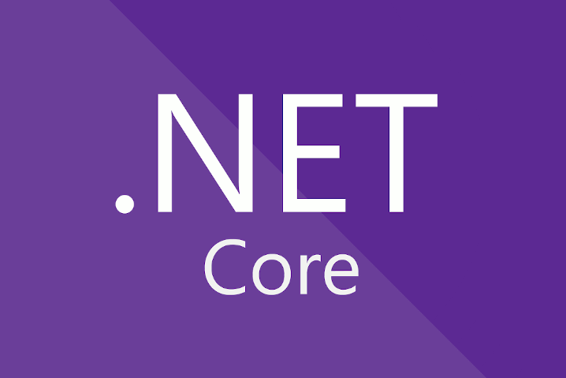
</p>

**C#:**

C# es el lenguaje de programación empleado en la implementación de los Web Services mediante ASP.NET Core y Entity Framework Core.

https://dotnet.microsoft.com/languages/csharp

<p align="center">
  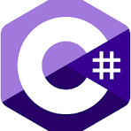
</p>

**Entity Framework Core:**

Entity Framework Core es el ORM utilizado para la persistencia de usuarios, unidades de transporte, operaciones e incidencias desde el RESTful API hacia la base de datos relacional.

https://learn.microsoft.com/ef/core/

<p align="center">
  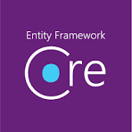
</p>

**MySQL Server:**

MySQL es el sistema de gestión de base de datos relacional (RDBMS) definido en el Container Level Diagram del modelo C4 para almacenar la información operativa de la plataforma.

https://www.mysql.com/

<p align="center">
  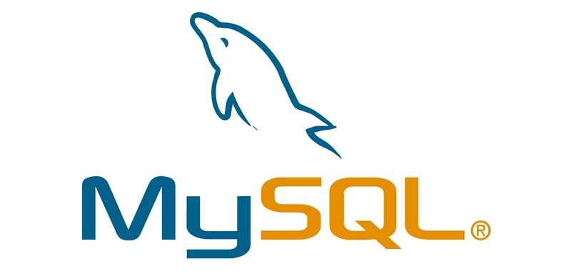
</p>

**Git:**

Git es el sistema de control de versiones distribuido utilizado localmente por cada integrante para registrar cambios, crear ramas y sincronizar el código fuente con el repositorio remoto.

https://git-scm.com/

<p align="center">
  
</p>

**GitHub:**

GitHub es la plataforma de colaboración donde se alojan los repositorios del proyecto. Sobre ella se aplican el flujo GitFlow, las revisiones mediante Pull Requests y el registro de contribuciones por integrante.

https://github.com/

<p align="center">
  
</p>

**5. Software Deployment**

**GitHub Pages:**

GitHub Pages es el servicio de hosting estático utilizado para publicar la versión `v1.0.0` de la Landing Page de AgroFlet directamente desde la rama `main` del repositorio. El archivo `.nojekyll` incluido en la raíz del proyecto deshabilita el procesamiento por Jekyll y garantiza la carga correcta de los directorios de assets.

https://pages.github.com/

<p align="center">
  
</p>

**Proveedor de hosting en la nube para ASP.NET Core:**

Para el despliegue del RESTful API se utilizará un proveedor de hosting en la nube compatible con ASP.NET Core y MySQL. El proveedor definitivo se determinará en función de los requerimientos de disponibilidad y costo del proyecto.

<p align="center">
  
</p>

**6. Software Documentation**

**Markdown + Visual Studio Code:**

Markdown es el formato utilizado para la elaboración del `README.md` del repositorio y de los capítulos del Project Report. Visual Studio Code permite editar y previsualizar dichos archivos antes de publicarlos en GitHub.

<p align="center">
  
</p>

**Swagger / OpenAPI:**

Swagger se utilizará para documentar los endpoints del RESTful API mediante la especificación OpenAPI, permitiendo visualizar e interactuar con los servicios desde una interfaz web. Su uso corresponde a los Sprints en los que se implemente el backend.

https://swagger.io/

<p align="center">
  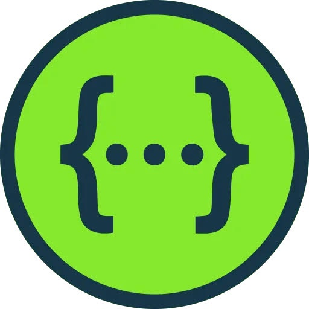
</p>

El entorno seleccionado permite mantener coherencia entre el diseño elaborado en Figma y la implementación web desarrollada por el equipo: Visual Studio Code, Live Server y Chrome DevTools facilitan la construcción y validación local del producto; Git y GitHub aseguran la trazabilidad de los cambios; GitHub Pages permite publicar la solución; y la combinación de Gherkin y Cucumber documenta y ejecuta las pruebas de aceptación asociadas a los requerimientos funcionales.

---

### 5.1.2. Source Code Management

La administración del código fuente es un pilar del trabajo colaborativo del equipo. En este apartado se define el modelo organizativo y de control de versiones aplicado mediante GitHub y el flujo de trabajo GitFlow, junto con las convenciones de nombrado de ramas, estructura de mensajes de commit y versionado semántico de los lanzamientos.

**1. Establecimiento de repositorios en GitHub**

La solución distribuida de AgroFlet se organiza en repositorios independientes, separando las responsabilidades de cada producto:

*Landing Page:* repositorio dedicado al sitio web informativo y promocional del producto. Contiene la totalidad de los recursos estáticos (HTML5, CSS3, JavaScript, diccionarios de internacionalización e imágenes) orientados a comunicar la propuesta de valor de AgroFlet a los segmentos objetivo. En este mismo repositorio se alojarán los archivos `.feature` de las pruebas de aceptación asociadas al landing.

*Frontend Web Application:* repositorio destinado a la aplicación web del lado del cliente desarrollada con Vue.js y PrimeVue. Contiene las vistas, componentes y la lógica de consumo del RESTful API.

*Web Services:* repositorio que aloja la lógica del backend implementada con ASP.NET Core y Entity Framework Core, incluyendo las pruebas unitarias, de integración y de aceptación.

*Project Report:* repositorio destinado a la redacción y versionamiento de los capítulos del informe del proyecto en formato Markdown.

**Enlaces a los repositorios:**

* Repositorio de Landing Page: `[COMPLETAR: https://github.com/<organizacion>/agroflet-landing-page]`
* Repositorio de Frontend Web Application: Disponible en futuras entregas
* Repositorio de Web Services: Disponible en futuras entregas
* Repositorio del Project Report: `[COMPLETAR: https://github.com/<organizacion>/agroflet-project-report]`

**2. Estructura del repositorio de la Landing Page**

La organización de directorios sigue una arquitectura modular y desacoplada, separando estilos, scripts, diccionarios de idioma y recursos gráficos:

```text
agroflet-landing-page/
├── assets/
│   ├── css/
│   │   └── styles.css              # Design tokens, layouts y componentes
│   ├── i18n/
│   │   ├── es.json                 # Diccionario de traducción en español
│   │   └── en.json                 # Diccionario de traducción en inglés
│   ├── js/
│   │   └── app.js                  # Interactividad, validaciones, i18n y carrusel
│   └── images/
│       ├── logo.jpg                # Identidad visual oficial
│       └── team/                   # Fotografías de los integrantes
│           ├── adriano.jpg
│           ├── bernie.png
│           ├── cesar.jpg
│           ├── christoper.jpeg
│           └── jose.png
├── docs/
│   └── Terms-and-conditions.html   # Términos y condiciones del servicio
├── .editorconfig                   # Formato consistente entre editores
├── .gitignore                      # Exclusión de archivos temporales
├── .nojekyll                       # Compatibilidad con GitHub Pages
├── index.html                      # Landing Page principal
├── LICENSE                         # Licencia MIT
└── README.md                       # Documentación técnica del repositorio
```


**3. Workflow de control de versiones (GitFlow)**

Para gestionar la integración de nuevas características y coordinar los cambios del equipo se emplea el modelo **GitFlow**, que define ramas con propósitos estrictos y permite el desarrollo en paralelo sin afectar la estabilidad del producto publicado.

| Nombre de la rama | Descripción |
| --- | --- |
| **Main Branch** (`main`) | Rama base que refleja el estado de producción. Solo recibe código validado y aprobado para despliegue. Es la rama publicada por GitHub Pages. |
| **Develop Branch** (`develop`) | Rama de integración del equipo. Unifica el código de las funcionalidades en curso antes de preparar un lanzamiento. |
| **Feature Branches** (`feature/*`) | Ramas temporales creadas desde `develop` para desarrollar funcionalidades de forma aislada. <br> **Convención:** `feature/nombre-de-la-funcionalidad` |
| **Release Branches** (`release/*`) | Ramas de estabilización previas al pase a producción: pruebas finales, documentación y corrección de fallos menores. <br> **Convención:** `release/vX.Y.Z` |
| **Hotfix Branches** (`hotfix/*`) | Ramas de emergencia creadas desde `main` para corregir fallos críticos en producción. Se fusionan en `main` y en `develop`. <br> **Convención:** `hotfix/descripcion-del-parche` |

*Ramas utilizadas durante el Sprint 1:*

```text
feature/header-navigation
feature/hero-section
feature/plans-section
feature/testimonials-carousel
feature/solve-section
feature/team-section
feature/videos-section
feature/auth-modal
feature/i18n
feature/footer-legal
feature/responsive-layout
release/v1.0.0
```

Las funcionalidades desarrolladas en ramas `feature/*` se integran a `develop` mediante Pull Requests con al menos una revisión cruzada (Code Review). Una vez validado el Sprint, la versión se estabiliza en una rama `release/*` y posteriormente se fusiona en `main`, lo que dispara la publicación automática en GitHub Pages.

**4. Versionado Semántico (Semantic Versioning 2.0.0)**

AgroFlet adopta el estándar **Semantic Versioning 2.0.0** bajo el formato `MAJOR.MINOR.PATCH`:

* **Major:** cambios profundos que rompen la compatibilidad con versiones anteriores.
* **Minor:** incorporación de nuevas funcionalidades manteniendo la compatibilidad.
* **Patch:** correcciones de errores o mejoras que no alteran la funcionalidad general.

Ejemplos de aplicación en el proyecto:

* `v1.0.0`: primera versión desplegada de la Landing Page (Spr
int 1).
* `v1.1.0`: incorporación del formulario de contacto y nuevas secciones informativas.
* `v1.0.1`: corrección de comportamiento del menú responsive en dispositivos móviles.

**5. es de mensajes de commit (Conventional Commits)**

Todos los mensajes de commit siguen la especificación **Conventional Commits**, redactados en inglés e iniciados con un prefijo que indica la naturaleza del cambio:

* `feat:` incorpora una funcionalidad nueva (ej. `feat: implement testimonials carousel`).
* `fix:` corrige un error o comportamiento anómalo (ej. `fix: correct mobile navigation behavior`).
* `docs:` modifica exclusivamente documentación (ej. `docs: update landing page README`).
* `style:` aplica ajustes de formato o estilos sin alterar la lógica (ej. `style: improve responsive card layout`).
* `refactor:` reestructura código existente sin añadir funcionalidades ni corregir errores.
* `test:` agrega o corrige pruebas (ej. `test: add gherkin scenarios for landing navigation`).
* `chore:` tareas de mantenimiento y configuración (ej. `chore: add .nojekyll for GitHub Pages`).

---

### 5.1.3. Source Code Style Guide & Coding Conventions

En esta sección se definen las normativas de codificación aplicadas al desarrollo de la solución, con el objetivo de estandarizar la escritura de HTML, CSS, JavaScript y C#, asegurando código legible, mantenible y escalable.

Como regla transversal, **toda la nomenclatura técnica (identificadores, clases, variables, funciones, métodos y comentarios) se redacta exclusivamente en inglés**. El equipo se alinea con las siguientes guías de la industria:

* HTML Style Guide and Coding Conventions (W3Schools)
* Google HTML/CSS Style Guide
* Google JavaScript Style Guide
* MDN JavaScript Guidelines
* BEM Methodology (Block, Element, Modifier)
* C# Coding Conventions (Microsoft)
* Microsoft ASP.NET Core Coding Guidelines

**Principios transversales**

* **Idioma:** todo el nombrado técnico y la documentación interna se redactan en inglés.
* **DRY (Don't Repeat Yourself):** se evita la duplicidad mediante clases reutilizables y variables CSS centralizadas.
* **KISS (Keep It Simple, Stupid):** se prioriza la simplicidad y claridad de la lógica.
* **Indentación:** consistente y estandarizada mediante el archivo `.editorconfig` (2 espacios, UTF-8, LF, eliminación de espacios finales).

---

**HTML**

Se utiliza HTML5 para definir la estructura semántica y accesible de la Landing Page.

*Convenciones de formato y estructura:*

* **Indentación:** 2 espacios por nivel; no se utilizan tabulaciones.
* **Etiquetas y atributos:** siempre en minúsculas (ej. `<section>`, `<article>`).
* **Comillas:** dobles para todos los valores de atributos (ej. `class="container"`).
* **Documento base:** declaración `<!DOCTYPE html>` en la primera línea y atributo de idioma `<html lang="es">`.
* **Semántica:** uso prioritario de `<header>`, `<nav>`, `<main>`, `<section>`, `<footer>` sobre el uso indiscriminado de `<div>`.
* **Nomenclatura:** identificadores y clases redactados en inglés (`#hero`, `#plans`, `#testimonials`, `#what-we-solve`, `#team`, `#videos`).
* **Accesibilidad:** atributo `alt` obligatorio en imágenes informativas y `aria-label` en controles cuyo propósito no resulta evidente (ej. `aria-label="Cambiar idioma"`, `aria-label="Abrir menú"`, `aria-expanded`).
* **Internacionalización:** los nodos traducibles se marcan mediante el atributo `data-i18n`, lo que permite actualizar el contenido sin recargar la página.

Ejemplo aplicado en el proyecto:

```html
<section id="testimonials" class="testimonials section section--dark">
  <div class="container">
    <div class="section__header">
      <span class="section__tag" data-i18n="testimonials.tag">Testimonios</span>
      <h2 class="section__title" data-i18n="testimonials.title">Lo que dicen nuestros usuarios</h2>
    </div>
  </div>
</section>
```

<p align="center">
  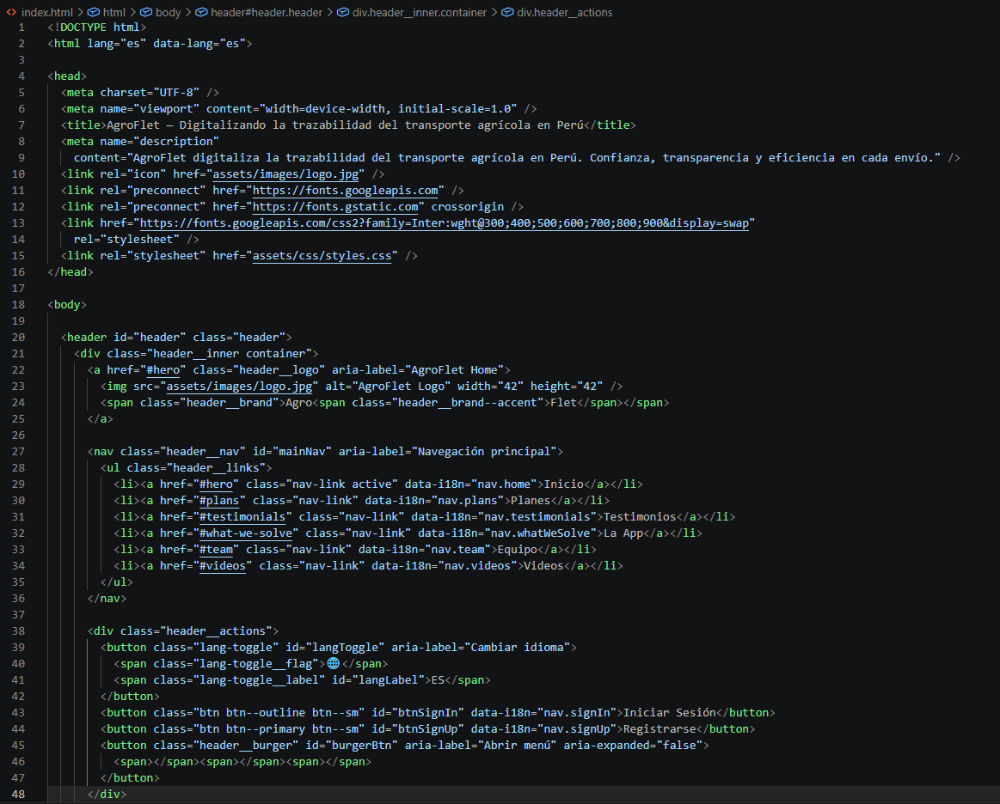
</p>

---

**CSS**

Se utiliza CSS3 puro para controlar la presentación visual, bajo un enfoque modular y responsivo (Mobile-First).

*Convenciones de formato y arquitectura:*

* **Indentación:** 2 espacios por nivel.
* **Sintaxis:** espacio antes de la llave de apertura `{`, llave de cierre `}` en una línea propia y cada declaración terminada en punto y coma `;`.
* **Nomenclatura BEM:** clases escritas como bloque, elemento y modificador (`.plan-card`, `.plan-card__title`, `.plan-card--featured`; `.header`, `.header__nav`, `.header__logo`).
* **Design Tokens:** las variables globales de marca se centralizan en `:root` mediante Custom Properties.
* **Orden de propiedades:** posicionamiento, modelo de caja, tipografía, aspecto visual y animaciones.
* **Especificidad:** se evita anidar selectores más de tres niveles y se restringe el uso de `!important`.
* **Responsive:** media queries incrementales con puntos de corte en `768px` y `1024px`, más ajustes específicos en `max-width: 767px` y `480px`.
* **Accesibilidad:** se respeta la preferencia del sistema mediante `@media (prefers-reduced-motion: reduce)`.

Ejemplo aplicado en el proyecto:

```css
:root {
  /* Brand Colors */
  --green:        #27AE60;
  --navy:         #0B3B60;
  --orange:       #F39C12;
  --font-family:  'Inter', -apple-system, BlinkMacSystemFont, 'Segoe UI', sans-serif;
}

.plan-card {}
.plan-card__title {}
.plan-card--featured {}
```

<p align="center">
  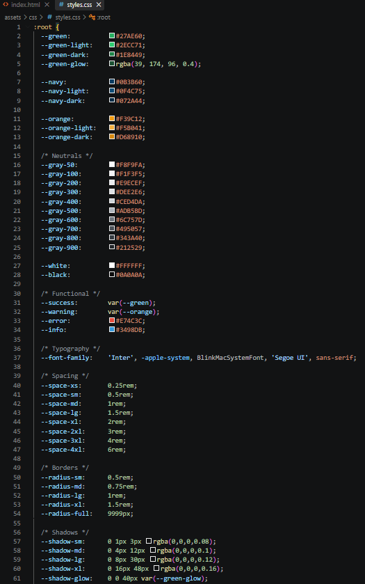
</p>

---

**JavaScript**

Se aplica JavaScript moderno (ECMAScript ES6+) para la interactividad del lado del cliente, sin frameworks ni dependencias externas.

*Convenciones de formato y nomenclatura:*

* **Indentación:** 2 espacios.
* **Modo estricto:** el código se ejecuta dentro de `'use strict';` y se inicializa con `document.addEventListener('DOMContentLoaded', ...)`.
* **Nomenclatura:** `camelCase` para variables y funciones (`setLanguage`, `openAuthModal`, `saveUserSession`, `clearUserSession`); `PascalCase` para clases y componentes; `UPPER_SNAKE_CASE` para constantes globales.
* **Declaración de variables:** `const` por defecto, `let` únicamente para variables reasignables; se prohíbe `var`.
* **Igualdad estricta:** uso obligatorio de `===` y `!==`.
* **Manejo de eventos:** exclusivamente mediante `addEventListener`, evitando atributos de evento en el HTML.
* **Organización:** el archivo se estructura en bloques lógicos numerados y comentados (internacionalización, scroll del header, menú móvil, partículas del hero, contadores, carrusel de testimonios, modales, validaciones y sesión).
* **APIs del navegador:** uso de `IntersectionObserver` para animaciones al hacer scroll y de `localStorage` para persistir preferencias de idioma y la sesión demostrativa.

Ejemplos de funciones implementadas:

```javascript
setLanguage(lang);
openAuthModal(mode, preselectedPlan);
closeAuthModal();
saveUserSession(userData);
clearUserSession();
validateEmail(email);
getPasswordStrength(password);
```

<p align="center">
  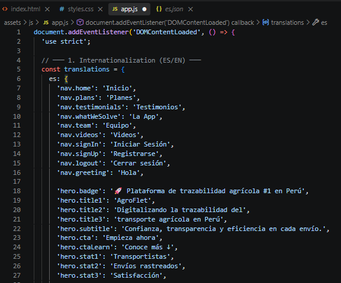
</p>

---

**C# (.NET Core)**

Estas convenciones se aplicarán durante la implementación del RESTful API en los siguientes Sprints, siguiendo las guías oficiales de Microsoft.

*Convenciones de formato y nomenclatura:*

* **Indentación:** 4 espacios.
* **Llaves:** estilo Allman (cada llave en su propia línea).
* **Nomenclatura:** `PascalCase` para clases, métodos y propiedades públicas (`ShipmentsController`, `GetActiveShipments`); prefijo `I` para interfaces (`IShipmentRepository`); `camelCase` para parámetros y variables locales; guion bajo inicial para campos privados (`_dbContext`).
* **Longitud de línea:** máximo 120 caracteres.
* **Inyección de dependencias:** servicios y repositorios inyectados por constructor, evitando instanciaciones directas de lógica de negocio.
* **Controladores ligeros:** la lógica de negocio se delega a la capa de Services.
* **Asincronismo:** los métodos de acceso a datos o I/O son asíncronos y llevan el sufijo `Async` (`GetShipmentByIdAsync`).
* **LINQ:** uso de métodos de extensión para manipular colecciones de forma declarativa.

> Durante el Sprint 1 no se ha implementado código C#, por lo que esta sección constituye la definición normativa que regirá el desarrollo del RESTful API en los Sprints posteriores.

---

### 5.1.4. Software Deployment Configuration

En esta sección se detalla el proceso de configuración y despliegue definido para los productos que componen la solución de AgroFlet.

**1. Landing Page (GitHub Pages)**

* **Plataforma de hosting:** GitHub Pages.
* **Origen del despliegue:** contenido estático de la rama `main` del repositorio de la Landing Page, directorio raíz (`/root`).
* **Archivo de compatibilidad:** `.nojekyll` en la raíz del proyecto, que evita el procesamiento del sitio por Jekyll y garantiza la carga correcta de `assets/`.

*Procedimiento de despliegue aplicado:*

1. Integrar los cambios aprobados de las ramas `feature/*` hacia `develop` mediante Pull Requests con revisión cruzada.
2. Crear la rama `release/v1.0.0` a partir de `develop`.
3. Validar localmente la versión mediante Live Server y Chrome DevTools (desktop y responsive).
4. Integrar la rama de release en `main`.
5. Crear el tag correspondiente según Semantic Versioning (`v1.0.0`).
6. Ingresar a `Settings > Pages` en el repositorio de GitHub.
7. Seleccionar la opción `Deploy from a branch`.
8. Seleccionar la rama `main`.
9. Seleccionar la carpeta `/root` como directorio de origen.
10. Guardar la configuración y esperar la ejecución del workflow de publicación.
11. Validar la URL pública generada, verificando la carga de estilos, scripts, imágenes, el cambio de idioma y el enlace a `docs/Terms-and-conditions.html`.

* **Repositorio:** `[COMPLETAR: URL DEL REPOSITORIO]`
* **Versión desplegada:** `v1.0.0`
* **URL de producción:** `[COMPLETAR: URL DE GITHUB PAGES]`

**Evidencia de la configuración:**

<p align="center">
  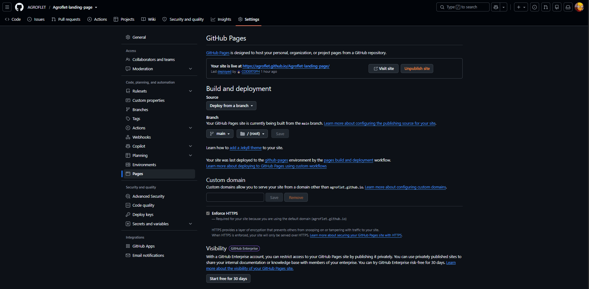 Pages" width="700">
</p>

<p align="center">
  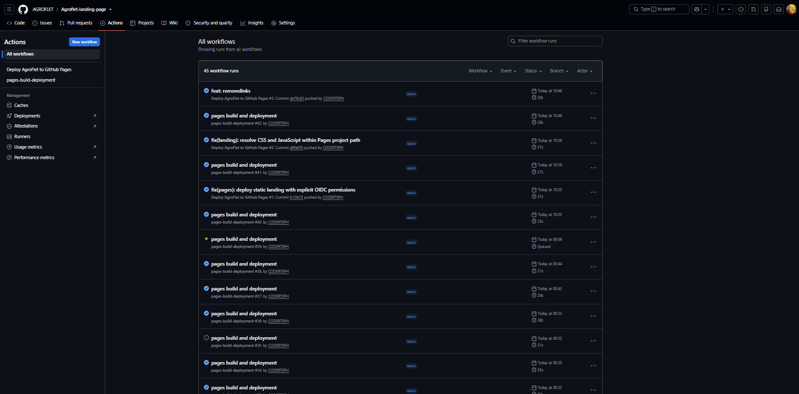
</p>

**2. Frontend Web Application**

* **Tecnología:** Vue.js + PrimeVue.
* **Proceso previsto:** integración de ramas `feature/*` hacia `develop` mediante Pull Requests; al fusionar en `main` se ejecuta el proceso de construcción (`npm install` y `npm run build`), se inyectan las variables de entorno de producción (URL base del API) y se publica el directorio `dist/` resultante.
* **Estado actual:** pendiente de implementación. Planificado para los siguientes Sprints.

**3. Web Services (RESTful API)**

* **Tecnología:** ASP.NET Core, C# y Entity Framework Core sobre MySQL.
* **Proceso previsto:** los Pull Requests hacia `develop` deben aprobar las pruebas unitarias y de integración; tras la fusión en `main`, el proyecto se compila con `dotnet publish -c Release` y el artefacto se despliega en el proveedor de nube seleccionado, configurando de forma segura la cadena de conexión y las claves de los tokens JWT. La documentación de endpoints queda expuesta mediante Swagger/OpenAPI.
* **Estado actual:** pendiente de implementación. Planificado para los siguientes Sprints.

---

## 5.2. Landing Page, Services & Applications Implementation

### 5.2.1. Sprint 1

Durante el Sprint 1 el equipo se concentró en la implementación y despliegue de la primera versión funcional y responsive de la Landing Page de AgroFlet, así como en la elaboración de la documentación técnica del repositorio.

#### 5.2.1.1. Sprint Planning 1

| Sprint # | Sprint 1 |
| :--- | :--- |
| **Sprint Planning Background** | |
| Date | 08/09/2026 |
| Time | 8:00 PM |
| Location | Google Meet (reunión virtual) |
| Prepared By | Alca Morán, César Alejandro |
| Attendees (to planning meeting) | Alca Morán, César Alejandro<br>Centeno León, Adriano Samir<br>Rivas Méndez, Bernie Aarón<br>Rivas Castillo, Christoper Steven<br>Tello Lima, Jose Alejandro |
| **Sprint 1 Review Summary** | Durante este primer ciclo el equipo consolidó los artefactos de UX definidos en los capítulos anteriores (User Personas, Journey Maps, Arquitectura de la Información, wireframes y mockups) y los tradujo en una implementación web funcional. Se desarrolló y desplegó la primera versión de la Landing Page de AgroFlet, la cual comunica la propuesta de valor orientada a la trazabilidad del transporte agrícola, presenta las funcionalidades proyectadas de la plataforma, los planes de suscripción, los testimonios de los segmentos objetivo, el equipo fundador y el contenido institucional. Se incorporaron navegación responsive, internacionalización español/inglés, carrusel interactivo de testimonios y modales demostrativos de registro e inicio de sesión. |
| **Sprint 1 Retrospective Summary** | El equipo evaluó positivamente la distribución del trabajo mediante ramas `feature/*`, que permitió desarrollar secciones de forma aislada y redujo los conflictos de integración sobre `index.html` y `styles.css`. Se identificó como principal aprendizaje la necesidad de mantener coherencia entre las funcionalidades descritas en el Project Report y aquellas efectivamente implementadas en el producto: la User Story UH28 (formulario de contacto) fue reprogramada para el Sprint 2 al no haberse implementado un `<form>` de contacto en esta versión, manteniéndose únicamente los canales de contacto en el footer. Como oportunidad de mejora se acordó unificar la carga de los diccionarios de internacionalización desde `assets/i18n/` y afinar la estimación de los puntos de historia. |
| **Sprint Goal & User Stories** | |
| **Sprint 1 Goal** | *Our focus is on* publicar la primera versión funcional y responsive de la Landing Page de AgroFlet, que comunica la propuesta de valor del producto, sus funcionalidades proyectadas, los planes de suscripción, el equipo y el contenido institucional, con navegación responsive e internacionalización español/inglés.<br>*We believe it delivers* a los productores agrícolas, transportistas fletistas y compradores mayoristas una comprensión clara y accesible de la solución y del plan de suscripción que les corresponde, sin necesidad de contacto previo con el equipo comercial.<br>*This will be confirmed when* un visitante puede, desde la URL pública de producción y en cualquiera de los dos idiomas, recorrer las secciones mediante el menú, comparar los tres planes y llegar al llamado a la acción de su segmento en no más de tres interacciones, tanto en navegador de escritorio como en dispositivo móvil. |
| **Sprint 1 Velocity** | 24 |
| **Sum of Story Points** | 24 |

**Nota:** Cuadro resumen que detalla la planificación, las metas establecidas, los resultados obtenidos y las métricas de esfuerzo correspondientes al Sprint 1 de AgroFlet.

#### 5.2.1.2. Aspect Leaders and Collaborators

| Team Member | GitHub Username | Landing Page (código) | Diseño UI/UX | Documentación | Deployment |
| :--- | :--- | :--- | :--- | :--- | :--- |
| Alca Morán, César Alejandro | `CesarAlcaM` | Líder | Colaborador | Colaborador | Colaborador |
| Centeno León, Adriano Samir | `AdrianoCenteno` | Colaborador | Colaborador | Líder | Colaborador |
| Rivas Méndez, Bernie Aarón | `BernieRivasM` | Colaborador | Líder | Colaborador | Colaborador |
| Rivas Castillo, Christoper Steven | `ChristoperRivasC` | Colaborador | Colaborador | Colaborador | Colaborador |
| Tello Lima, Jose Alejandro | `JoseTelloL` | Colaborador | Colaborador | Colaborador | Líder |

**Distribución por aspecto técnico del Sprint 1:**

| Aspecto | Líder | Colaboradores |
| :--- | :--- | :--- |
| Landing Page UX/UI | Rivas Méndez, Bernie Aarón | Tello Lima, Jose Alejandro / Alca Morán, César Alejandro |
| HTML Structure & Semántica | Alca Morán, César Alejandro | Centeno León, Adriano Samir / Rivas Castillo, Christoper Steven |
| CSS & Responsive Design | Rivas Méndez, Bernie Aarón | Alca Morán, César Alejandro / Rivas Castillo, Christoper Steven |
| JavaScript Interactions | Rivas Castillo, Christoper Steven | Alca Morán, César Alejandro / Centeno León, Adriano Samir |
| Internationalization (i18n) | Centeno León, Adriano Samir | Rivas Castillo, Christoper Steven / Tello Lima, Jose Alejandro |
| Documentation (README & Report) | Centeno León, Adriano Samir | Tello Lima, Jose Alejandro / Rivas Méndez, Bernie Aarón |
| Deployment (GitHub Pages) | Tello Lima, Jose Alejandro | Alca Morán, César Alejandro / Centeno León, Adriano Samir |

**Nota:** Distribución de responsabilidades durante el Sprint 1, indicando el liderazgo y la colaboración en las principales áreas de trabajo. Los usuarios de GitHub consignados deben coincidir con las cuentas registradas como Contributors del repositorio.

#### 5.2.1.3. Sprint Backlog 1

| User Story Id | User Story Title | Work Item / Task Id | Work Item / Task Title | Description | Estimation (h) | Assigned To | Status |
| :--- | :--- | :--- | :--- | :--- | :---: | :--- | :---: |
| UH24 | Visualización de la propuesta de valor en el landing page | T01 | Estructuración base en HTML5 e implementación del Hero | Creación del esqueleto semántico del documento (`header`, `main`, `section`, `footer`) e implementación de la sección principal con el nombre de la plataforma, el titular de propuesta de valor, contadores estadísticos animados y llamados a la acción diferenciados. | 4 | Alca Morán, César Alejandro | Done |
| UH25 | Consulta de funcionalidades principales desde el landing page | T02 | Implementación de la sección informativa de funcionalidades | Maquetación de la grilla de tarjetas de la sección "La App", con seis funcionalidades clave, ícono SVG representativo y descripción breve para cada una. | 3 | Rivas Castillo, Christoper Steven | Done |
| UH26 | Consulta de planes y precios en el landing page | T03 | Maquetación de la sección de planes de suscripción | Implementación de las tarjetas de los planes Básico, Estándar y Profesional, con unidades incluidas, funcionalidades habilitadas, cinta de plan destacado y botón de llamado a la acción por segmento. | 3 | Rivas Méndez, Bernie Aarón | Done |
| UH27 | Consulta de testimonios de usuarios en el landing page | T04 | Desarrollo del carrusel interactivo de testimonios | Implementación del carrusel con cinco testimonios (nombre, rol y procedencia), navegación circular, indicadores, rotación automática con pausa en interacción y soporte de gestos táctiles y arrastre con mouse. | 4 | Rivas Castillo, Christoper Steven | Done |
| UH29 | Navegación fluida entre secciones del landing page | T05 | Implementación de navegación responsive y scroll suave | Desarrollo del header fijo con cambio de estado al hacer scroll, resaltado del ítem activo, menú hamburguesa para dispositivos móviles y desplazamiento suave mediante anchors sin recargar la página. | 3 | Alca Morán, César Alejandro | Done |
| UH30 | Visualización del landing page en múltiples idiomas | T06 | Implementación del sistema de internacionalización ES/EN | Integración de los diccionarios de traducción y del selector de idioma del encabezado, actualización dinámica de todos los nodos marcados con `data-i18n` (incluidos placeholders y mensajes de validación) y persistencia de la preferencia en `localStorage`. | 4 | Centeno León, Adriano Samir | Done |
| UH24 | Visualización de la propuesta de valor en el landing page | T07 | Configuración del diseño responsive (Mobile-First) | Definición de los design tokens en `:root` y de las media queries en 480 px, 768 px y 1024 px para garantizar la correcta visualización en smartphones, tablets y escritorio. | 3 | Rivas Méndez, Bernie Aarón | Done |
| UH24 | Visualización de la propuesta de valor en el landing page | T08 | Desarrollo de la sección del equipo y sección de videos | Implementación de las tarjetas de perfil de los cinco integrantes del equipo fundador y de las tarjetas de acceso a los videos institucionales mediante modal con reproducción embebida. | 2 | Tello Lima, Jose Alejandro | Done |
| UH24 | Visualización de la propuesta de valor en el landing page | T09 | Implementación del footer institucional y documento legal | Desarrollo del pie de página con enlaces de navegación, canales de contacto y accesos legales, e implementación del documento de Términos y Condiciones en `docs/Terms-and-conditions.html`. | 2 | Centeno León, Adriano Samir | Done |
| UH24 | Visualización de la propuesta de valor en el landing page | T10 | Despliegue de la versión v1.0.0 en GitHub Pages | Configuración del repositorio, creación del archivo `.nojekyll`, habilitación de GitHub Pages desde la rama `main` y validación de la URL pública de producción. | 2 | Tello Lima, Jose Alejandro | Done |
| UH28 | Envío de mensaje de contacto desde el landing page | T11 | Implementación del formulario de contacto | Desarrollo de un formulario de contacto con validación de campos obligatorios y confirmación de envío. | 3 | Rivas Méndez, Bernie Aarón | In Process |

**Nota:** Tabla que vincula las User Stories del EPIC-09 abordadas durante el Sprint 1 con sus respectivas tareas técnicas, el esfuerzo estimado en horas, el responsable asignado y el estado de cada asignación. La tarea T11, asociada a la User Story UH28, se mantiene en estado *In Process* y se reprograma para el Sprint 2, dado que la versión `v1.0.0` de la Landing Page expone los canales de contacto en el footer pero aún no incorpora un formulario de contacto.

#### 5.2.1.4. Development Evidence for Sprint Review

Esta sección expone la evidencia técnica del progreso alcanzado durante el Sprint con relación a los productos definidos en el alcance. Durante el Sprint 1 se implementó la primera versión funcional de la Landing Page de AgroFlet utilizando HTML5, CSS3 y JavaScript (ES6+), sin frameworks ni dependencias externas.

Las principales funcionalidades desarrolladas incluyen:

* navegación responsive con header fijo, resaltado de sección activa y menú hamburguesa;
* sección principal (Hero) con propuesta de valor, contadores estadísticos animados y sistema de partículas optimizado;
* sección de planes de suscripción (Básico, Estándar y Profesional);
* carrusel interactivo de testimonios con soporte táctil, arrastre y rotación automática;
* sección informativa de funcionalidades proyectadas de la plataforma;
* presentación del equipo fundador;
* sección de videos con modal de reproducción embebida y corte automático al cerrar;
* internacionalización español/inglés con persistencia en `localStorage`;
* formularios demostrativos de registro e inicio de sesión con validación en tiempo real e indicador de fortaleza de contraseña;
* modales informativos de Términos de Uso, Política de Privacidad y Preguntas Frecuentes;
* sistema de notificaciones tipo *toast*;
* diseño adaptable para escritorio, tablet y dispositivos móviles.

> La autenticación incluida en esta versión es exclusivamente demostrativa: se ejecuta en el cliente mediante JavaScript y `localStorage`, y no se encuentra integrada con el RESTful API de AgroFlet.

**Registro de commits del Sprint 1:**

| Repository | Branch | Commit Id | Commit Message | Commit Message Body | Commited on (Date) |
| :--- | :--- | :--- | :--- | :--- | :--- |
| agroflet-landing-page | `feature/header-navigation` | `[COMMIT_ID]` | feat: implement responsive header and navigation | Added fixed header, scroll state, active section tracking and mobile burger menu. | `[DD/MM/2026]` |
| agroflet-landing-page | `feature/hero-section` | `[COMMIT_ID]` | feat: implement hero section with animated counters | Added value proposition hero, animated statistics counters and particle background. | `[DD/MM/2026]` |
| agroflet-landing-page | `feature/plans-section` | `[COMMIT_ID]` | feat: add subscription plans section | Implemented Basic, Standard and Professional plan cards with segmented call to action. | `[DD/MM/2026]` |
| agroflet-landing-page | `feature/testimonials-carousel` | `[COMMIT_ID]` | feat: add testimonials carousel | Implemented touch and drag enabled carousel with auto rotation and dot indicators. | `[DD/MM/2026]` |
| agroflet-landing-page | `feature/solve-section` | `[COMMIT_ID]` | feat: implement platform features section | Added responsive grid with six key platform features and SVG icons. | `[DD/MM/2026]` |
| agroflet-landing-page | `feature/team-section` | `[COMMIT_ID]` | feat: create team and videos presentation | Added founding team profile cards and institutional video modal. | `[DD/MM/2026]` |
| agroflet-landing-page | `feature/auth-modal` | `[COMMIT_ID]` | feat: implement demo authentication modal | Added sign up and sign in forms with live validation and password strength indicator. | `[DD/MM/2026]` |
| agroflet-landing-page | `feature/i18n` | `[COMMIT_ID]` | feat: implement bilingual landing page | Added ES/EN dictionaries, language toggle and localStorage persistence. | `[DD/MM/2026]` |
| agroflet-landing-page | `feature/footer-legal` | `[COMMIT_ID]` | feat: add footer and terms and conditions page | Implemented institutional footer and legal document under docs directory. | `[DD/MM/2026]` |
| agroflet-landing-page | `feature/responsive-layout` | `[COMMIT_ID]` | style: improve responsive card layout | Adjusted design tokens and media queries for mobile, tablet and desktop breakpoints. | `[DD/MM/2026]` |
| agroflet-landing-page | `develop` | `[COMMIT_ID]` | docs: update landing page documentation | Updated README with project structure, features and local execution instructions. | `[DD/MM/2026]` |
| agroflet-landing-page | `main` | `[COMMIT_ID]` | chore: prepare release v1.0.0 and trigger deployment | Merged release branch and triggered GitHub Pages deployment. | `[DD/MM/2026]` |

**Nota:** Los identificadores de commit y las fechas deben completarse con los valores reales obtenidos desde el historial del repositorio (`git log --oneline` o la pestaña *Commits* de GitHub).

**Evidencia del código HTML:**

<p align="center">
  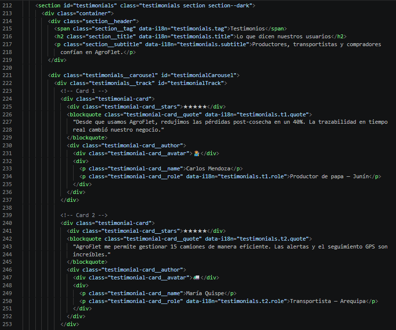
</p>

**Evidencia de los estilos CSS:**

<p align="center">
  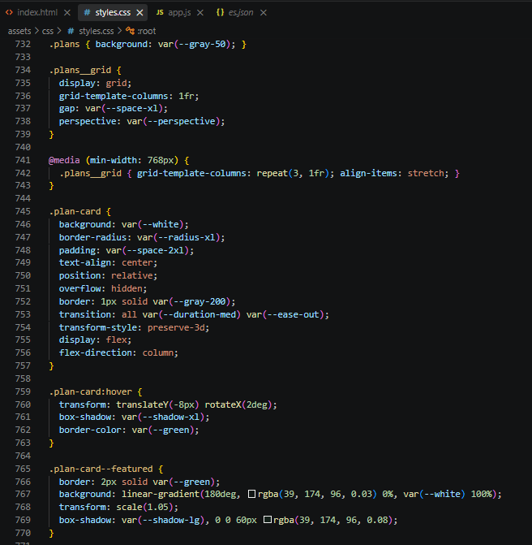
</p>

**Evidencia del código JavaScript:**

<p align="center">
  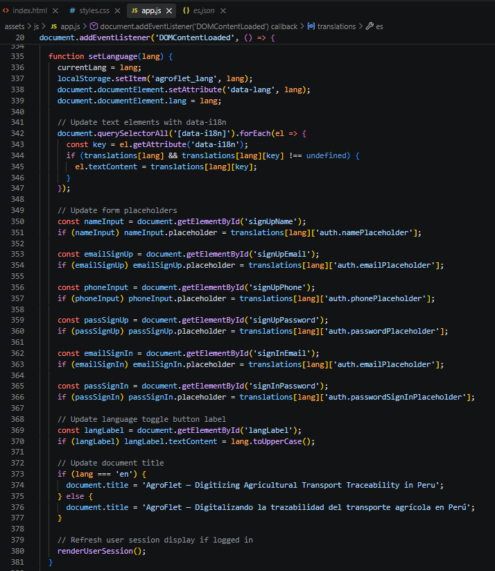
</p>

**Evidencia de los diccionarios de internacionalización:**

<p align="center">
  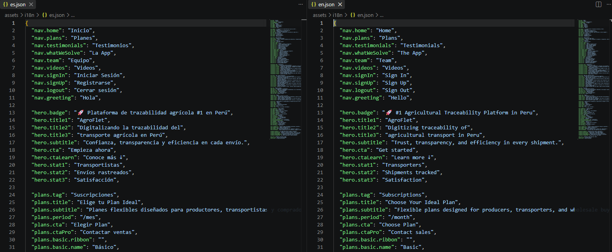
</p>

**Evidencia de commits y Pull Requests en GitHub:**

<p align="center">
  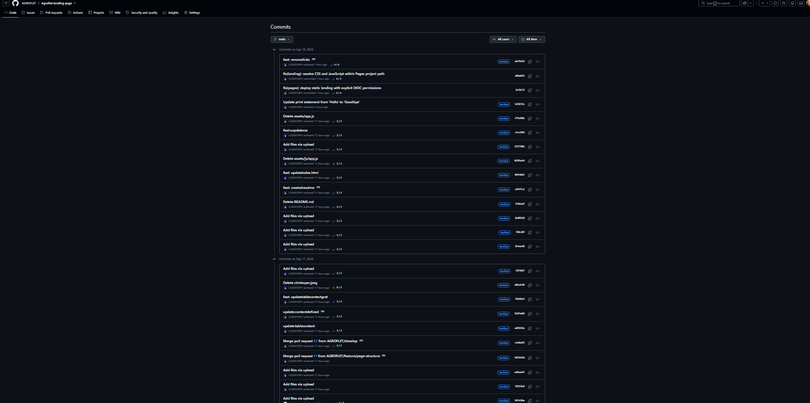
</p>

<p align="center">
  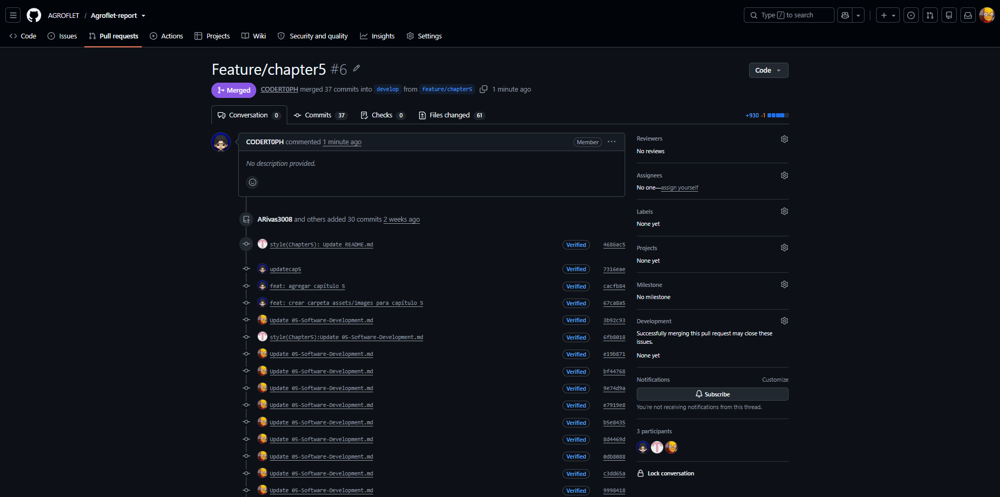
</p>

#### 5.2.1.5. Execution Evidence for Sprint Review

Se verificó la ejecución de la Landing Page de AgroFlet en navegador de escritorio y mediante las herramientas responsive de Google Chrome DevTools, validando los siguientes comportamientos:

* navegación mediante anchors con desplazamiento suave y resaltado de la sección activa;
* apertura y cierre del menú responsive en dispositivos móviles;
* adaptación del contenido en resoluciones de escritorio, tablet y smartphone;
* cambio de idioma español/inglés sin recarga de página y persistencia de la preferencia;
* funcionamiento del carrusel de testimonios mediante botones, indicadores, gestos táctiles y arrastre;
* apertura de los modales de registro, inicio de sesión, video y documentos legales;
* validación en tiempo real de los campos de registro e inicio de sesión demostrativo;
* presentación correcta del contenido institucional y del documento de Términos y Condiciones.

**Evidencia visual:**

**1. Sección principal (Hero) — propuesta de valor**

*Desarrollado por: Alca Morán, César Alejandro*

<p align="center">
  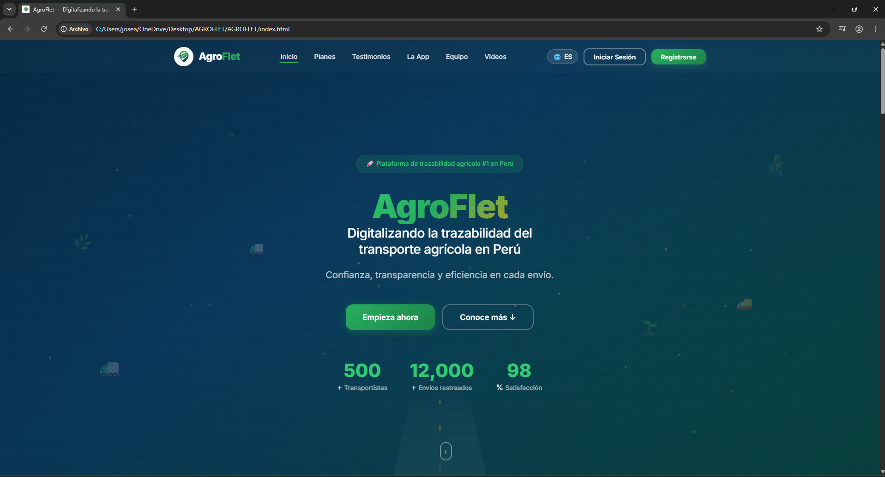
</p>

**2. Planes de suscripción**

*Desarrollado por: Rivas Méndez, Bernie Aarón*

<p align="center">
  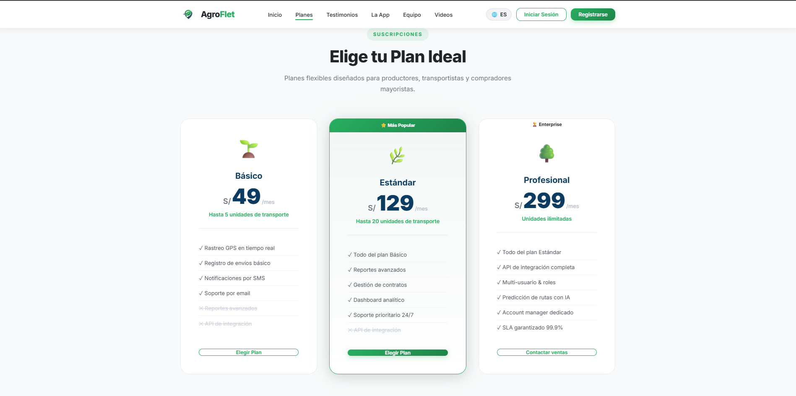
</p>

**3. Testimonios de usuarios**

*Desarrollado por: Rivas Castillo, Christoper Steven*

<p align="center">
  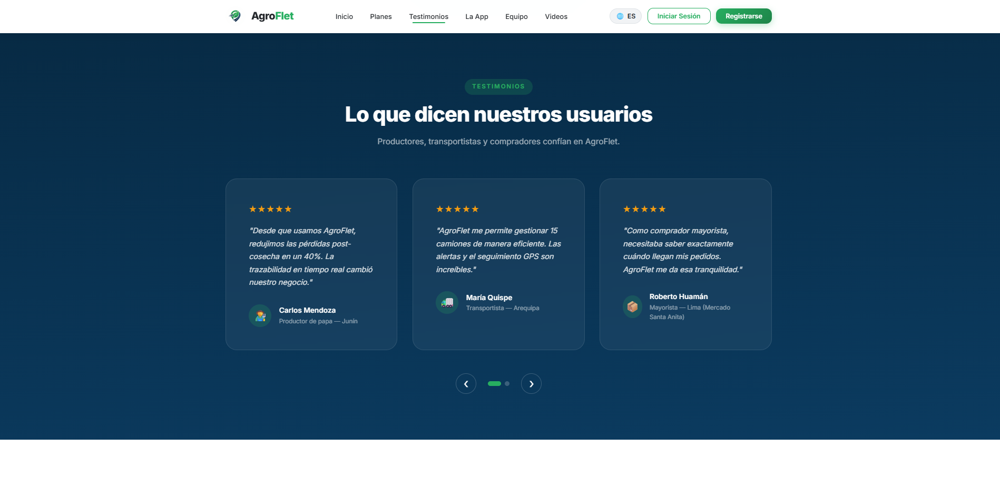
</p>

**4. Funcionalidades de la plataforma (La App)**

*Desarrollado por: Rivas Castillo, Christoper Steven*

<p align="center">
  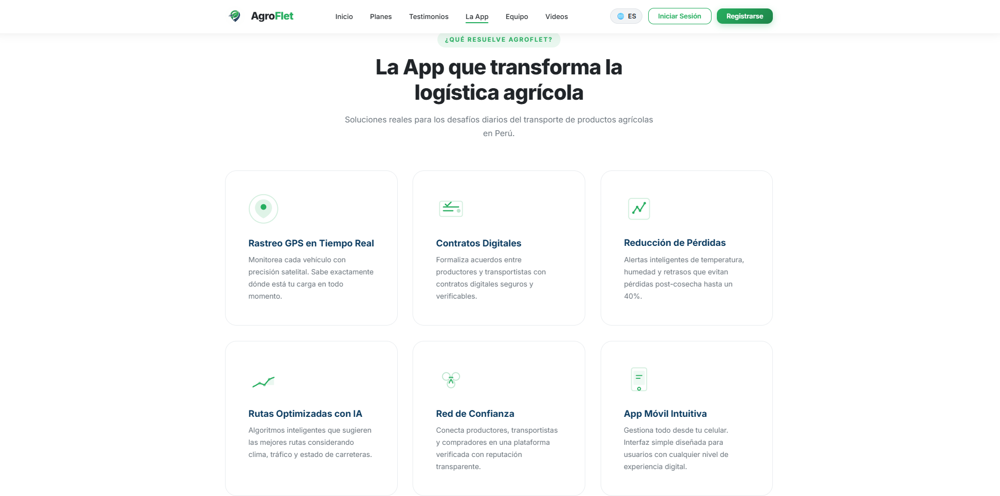
</p>

**5. Equipo y videos institucionales**

*Desarrollado por: Tello Lima, Jose Alejandro*

<p align="center">
  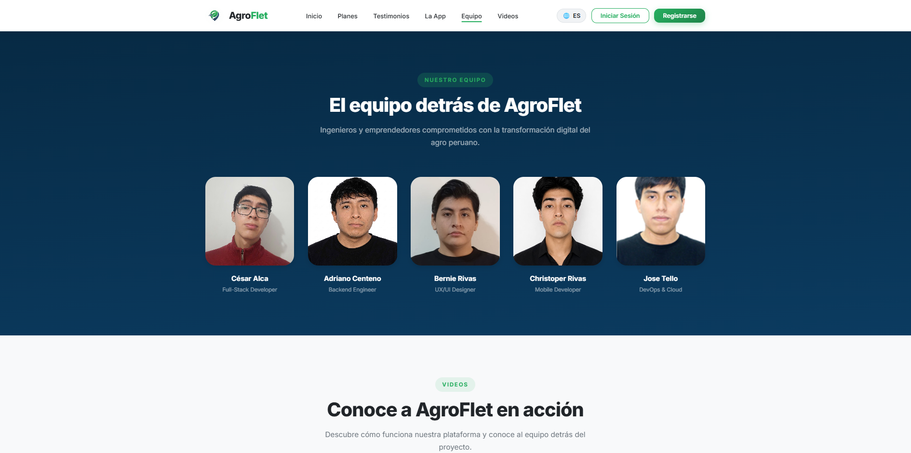
</p>

<p align="center">
  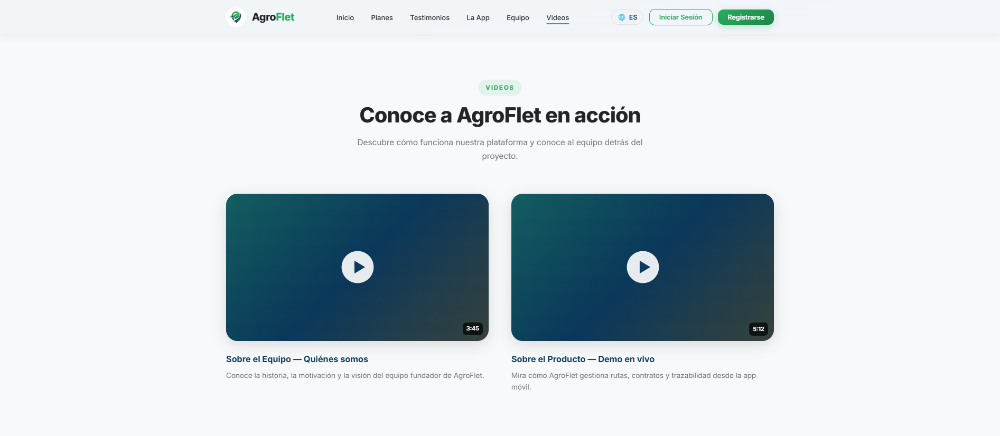
</p>

**6. Footer institucional y Términos y Condiciones**

*Desarrollado por: Centeno León, Adriano Samir*

<p align="center">
  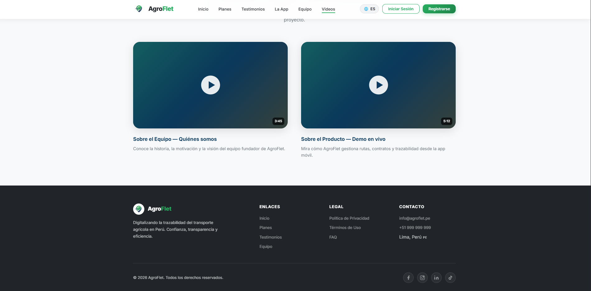
</p>

<p align="center">
  
</p>

**7. Internacionalización (ES / EN)**

*Desarrollado por: Centeno León, Adriano Samir*

<p align="center">
  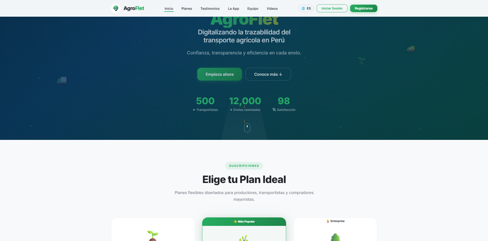
</p>

<p align="center">
  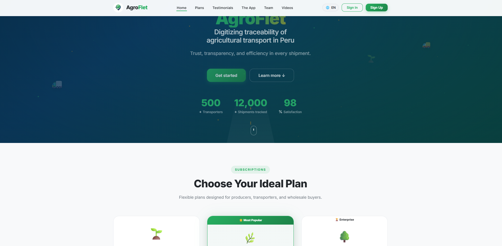
</p>

**8. Modales demostrativos de registro e inicio de sesión**

*Desarrollado por: Alca Morán, César Alejandro*

<p align="center">
  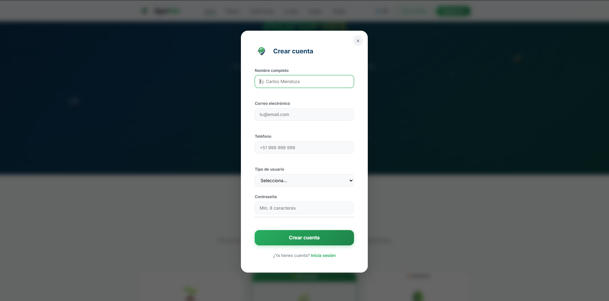
</p>

<p align="center">
  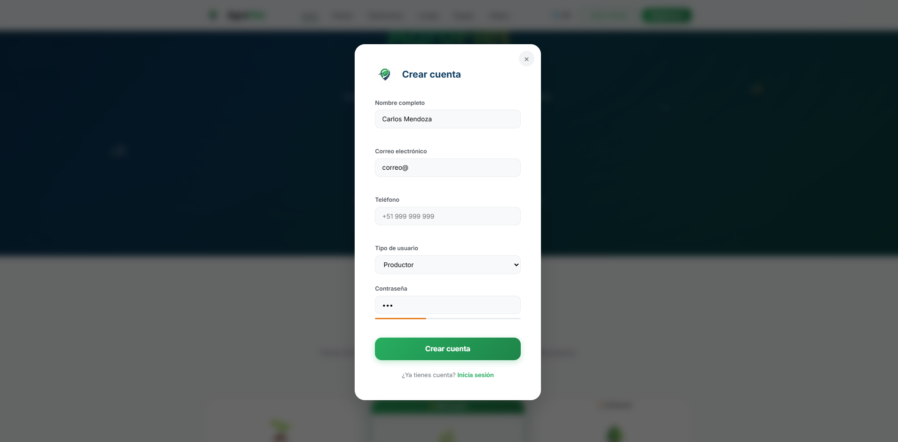
</p>

**9. Vista móvil y validación responsive**

*Desarrollado por: Rivas Méndez, Bernie Aarón*

<p align="center">
  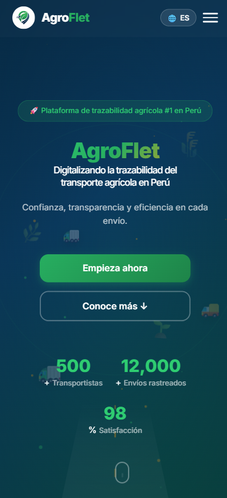
</p>

<p align="center">
  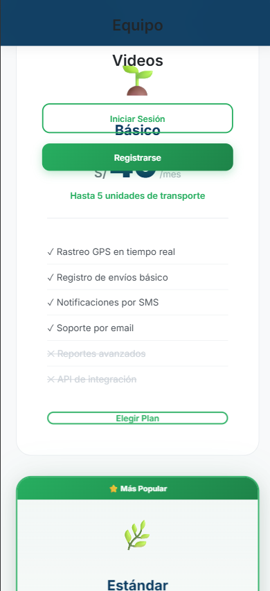
</p>

<p align="center">
  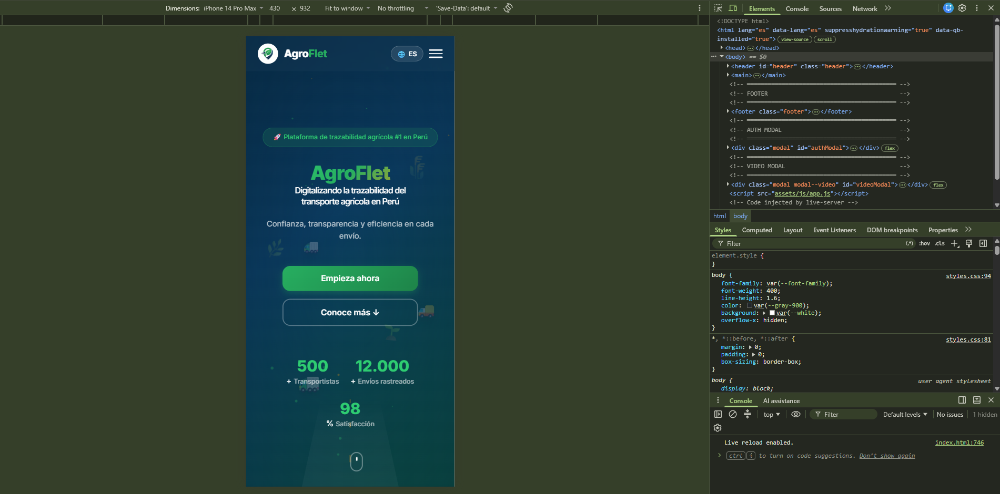
</p>

**Video del Sprint Review:** `[COMPLETAR: enlace al video de ejecución del Sprint 1]`

#### 5.2.1.6. Services Documentation Evidence for Sprint Review

Durante el Sprint 1, la Landing Page de AgroFlet no consume todavía el RESTful API de la plataforma ni servicios externos orientados a los procesos logísticos.

Las funcionalidades interactivas de registro e inicio de sesión presentes en esta versión corresponden a una demostración ejecutada íntegramente en el cliente mediante JavaScript y `localStorage`, tal como se declara en la sección 5.2.1.4. Del mismo modo, las cifras mostradas en los contadores del Hero y los testimonios son contenido estático de presentación.

La integración con los servicios RESTful internos (endpoints de autenticación, gestión de flotas, operaciones de transporte e incidencias especificados como Technical Stories en el Capítulo III) se incorporará en los siguientes Sprints desde la Frontend Web Application desarrollada con Vue.js.

Por lo tanto, en este Sprint no corresponde presentar documentación OpenAPI o Swagger como evidencia de consumo de servicios desde la Landing Page. En las siguientes entregas esta sección se actualizará para incluir:

* la relación completa de los endpoints implementados;
* el verbo HTTP asociado a cada acción (GET, POST, PUT, PATCH, DELETE) y la sintaxis de las llamadas;
* el detalle de los parámetros requeridos y la explicación estructurada de las respuestas;
* capturas de pantalla de la interacción funcional con la API mediante Swagger UI con datos de muestra;
* el enlace al repositorio de Web Services y los identificadores de los commits asociados a la documentación.

#### 5.2.1.7. Software Deployment Evidence for Sprint Review

La versión `v1.0.0` de la Landing Page de AgroFlet fue publicada exitosamente utilizando GitHub Pages. Dado que el alcance de esta iteración se limitó a la presentación web estática, aún no se han configurado entornos de despliegue para la Frontend Web Application ni para los Web Services.

**Actividades de despliegue realizadas:**

**1. Configuración del repositorio de código fuente**

* Se creó un repositorio público dedicado exclusivamente a la Landing Page dentro de la organización del equipo.
* Se estructuró el control de versiones bajo GitFlow para facilitar la publicación desde la rama `main`.
* Enlace del repositorio: `[COMPLETAR: URL DEL REPOSITORIO]`

**2. Habilitación y configuración de GitHub Pages**

* Se activó el servicio de alojamiento estático desde `Settings > Pages` del repositorio.
* Se definió la rama `main` y el directorio raíz (`/root`) como origen de los archivos publicados.
* Se incorporó el archivo `.nojekyll` en la raíz del proyecto para evitar el procesamiento por Jekyll y asegurar la carga del directorio `assets/`.

<p align="center">
   Pages" width="700">
</p>

**3. Publicación automatizada**

* Cada integración aprobada hacia `main` dispara automáticamente el workflow de publicación de GitHub Pages, actualizando el contenido en producción sin intervención manual del equipo.

<p align="center">
  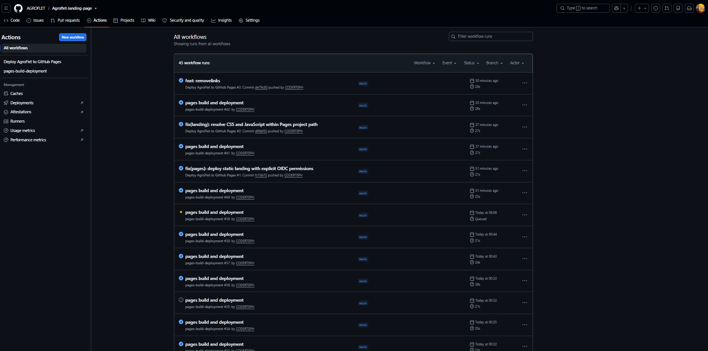
</p>

**4. Verificación y validación en producción**

* Se validó la correcta carga de estilos, scripts e imágenes desde la URL pública.
* Se verificó el funcionamiento del cambio de idioma, del carrusel de testimonios y de los modales en el entorno desplegado.
* Se comprobó el acceso al documento `docs/Terms-and-conditions.html` desde el footer.

* **Versión desplegada:** `v1.0.0`
* **URL de producción:** `[COMPLETAR: URL DE GITHUB PAGES]`

<p align="center">
  
</p>

#### 5.2.1.8. Team Collaboration Insights during Sprint

Durante el Sprint 1 el equipo distribuyó el desarrollo de la Landing Page en aspectos claramente delimitados: estructura HTML semántica, diseño responsive, componentes visuales, interacciones JavaScript, internacionalización, documentación y despliegue.

**Actividades de implementación desarrolladas:**

* **Planificación visual:** se tomaron como referencia los wireframes y mockups elaborados en Figma durante el Capítulo IV para definir la jerarquía de la información, las secciones y la aplicación de la paleta de marca de AgroFlet.
* **Desarrollo modular:** la maquetación se dividió en componentes independientes (Header, Hero, Plans, Testimonials, Solve, Team, Videos, Footer y Modales), permitiendo que cada integrante trabajara en una rama `feature/*` propia.
* **Integración de funcionalidades:** se aplicaron estilos responsivos mediante CSS Grid, Flexbox y Custom Properties, y se incorporó la lógica de interactividad en JavaScript, incluyendo el sistema de internacionalización español/inglés.
* **Gestión de versiones y despliegue:** se utilizó GitHub como plataforma central, aplicando Pull Requests y revisiones cruzadas antes de integrar los cambios a `develop` y, posteriormente, a `main` para su publicación en GitHub Pages.

La estrategia de ramas permitió reducir los conflictos de integración sobre archivos compartidos como `index.html` y `styles.css`, y mantener trazabilidad sobre las contribuciones individuales. Como principal aprendizaje, el equipo identificó la importancia de mantener coherencia entre las funcionalidades descritas en el Project Report y aquellas efectivamente implementadas en el producto, criterio que motivó la reprogramación de la User Story UH28 al Sprint 2.

**Analíticas de colaboración en GitHub:**

**1. Evidencia de ramas del repositorio**

<p align="center">
  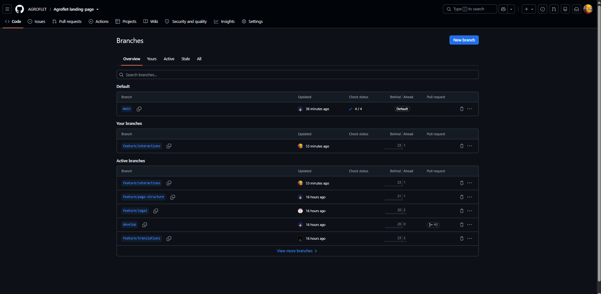
</p>

**2. Historial de commits por integrante**

*Alca Morán, César Alejandro (`CesarAlcaM`)*
<p align="center">
  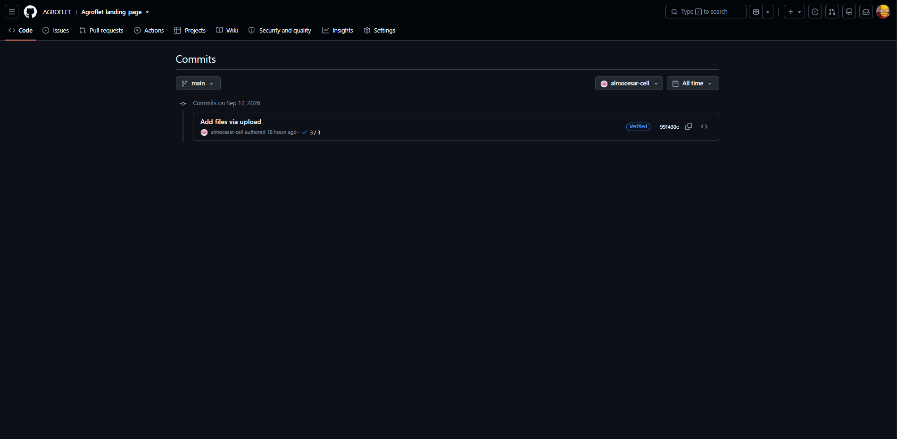
</p>

*Centeno León, Adriano Samir (`AdrianoCenteno`)*
<p align="center">
  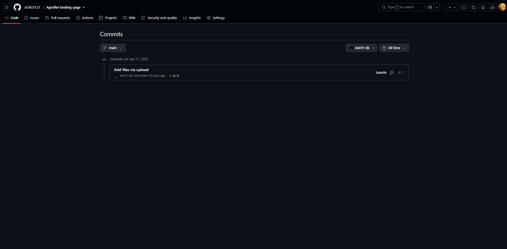
</p>

*Rivas Méndez, Bernie Aarón (`BernieRivasM`)*
<p align="center">
  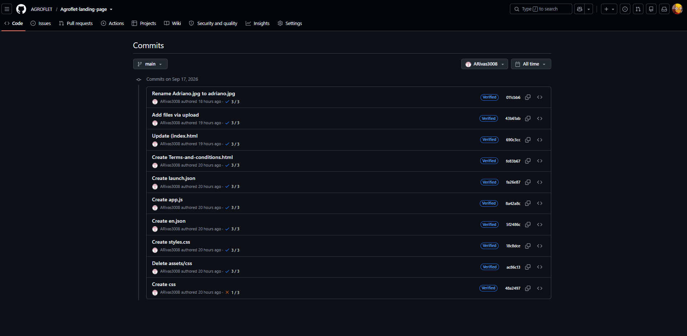
</p>

*Rivas Castillo, Christoper Steven (`ChristoperRivasC`)*
<p align="center">
  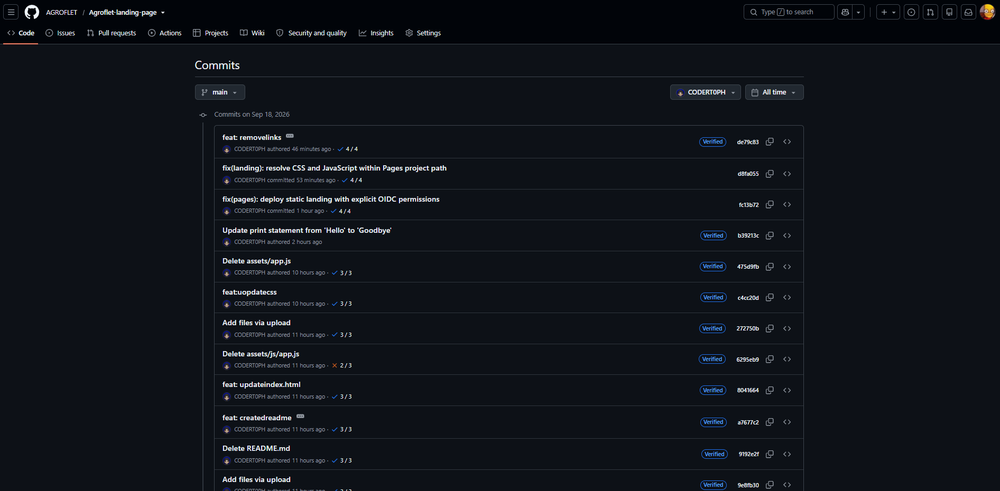
</p>

*Tello Lima, Jose Alejandro (`JoseTelloL`)*
<p align="center">
  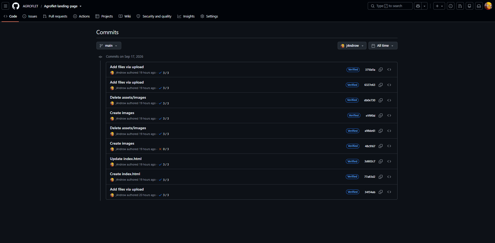
</p>

**3. Colaboradores activos en el repositorio**

*Gráfica de la actividad conjunta del equipo y de la distribución de aportes (adiciones y eliminaciones de código) durante el Sprint.*

<p align="center">
  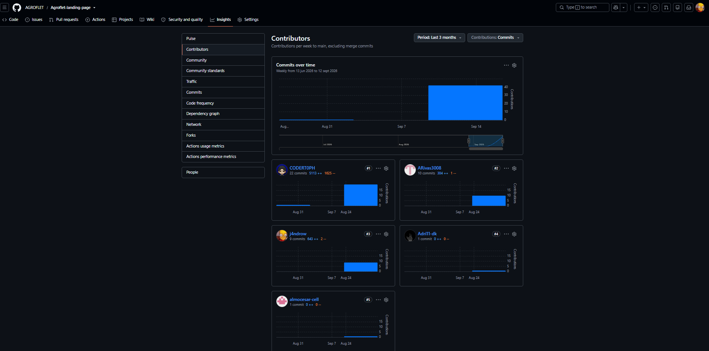 Contributors" width="700">
</p>

**4. Histograma de contribuciones en el tiempo**

*Frecuencia de commits realizados durante el Sprint, evidenciando un esfuerzo sostenido y coordinado hacia la integración final.*

<p align="center">
  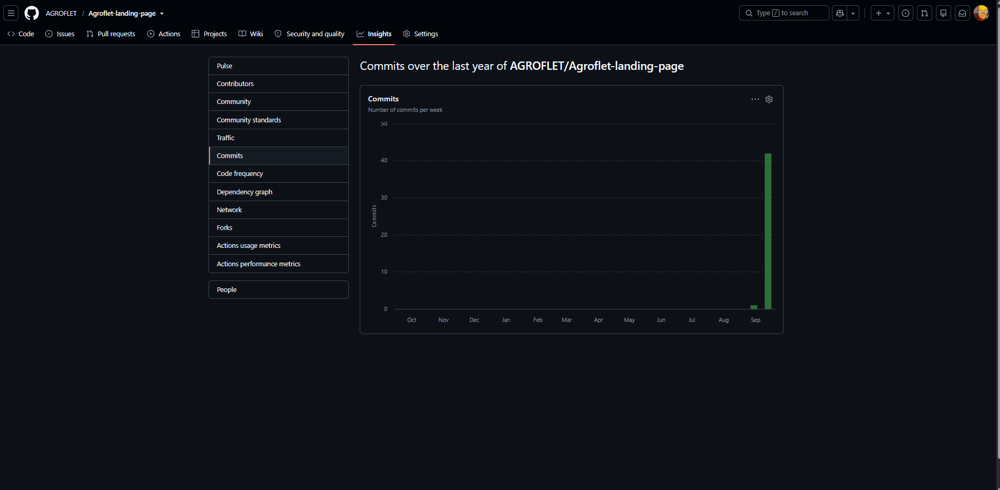 Commits" width="700">
</p>

---

