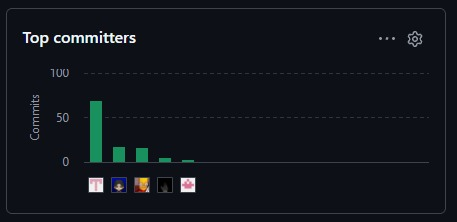
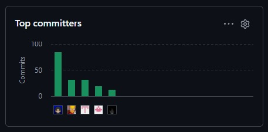

  

# UNIVERSIDAD PERUANA DE CIENCIAS APLICADAS

### Facultad de Ingeniería

### Carrera de Ingeniería de Software

 

### **1ASI0730**

### **Aplicaciones Web**

NRC

### **16127**

 

# **Informe del Trabajo Final**

Docente

### **Villafuerte Bazán, Óscar Iván**

 

Equipo

### **NexaWeb**

Proyecto

### **AgroFlet**

 

## **INTEGRANTES**

| Código | Apellidos y Nombres |
| :---: | :--- |
| U20241F027 | Alca Morán, César Alejandro |
| U20241D920 | Centeno León, Adriano Samir |
| U20241F109 | Rivas Méndez, Bernie Aarón |
| U202323551 | Rivas Castillo, Christoper Steven |
| U202421618 | Tello Lima, Jose Alejandro |

 

### **Período 202620**

### **Septiembre 2026**

## Registro de Versiones del Informe

    <table style="margin: 0 auto; display: inline-table; text-align: left;">
        <tr>
            <th>Versión</th>
            <th>Fecha</th>
            <th>Autor</th>
            <th>Descripción de modificación</th>
        </tr>
        <tr>
            <td><strong>AV1</strong></td>
            <td>16/09/2026</td>
            <td>- Alca Morán, César Alejandro - Centeno León, Adriano Samir - Rivas Méndez, Bernie Aarón - Rivas Castillo, Christoper Steven - Tello Lima, Jose Alejandro</td>
            <td>Capítulo I: Introducción Capítulo II: Requirements Elicitation & Analysis. Capítulo III: Requirements Specification.  Capítulo IV: Product Design.  Capítulo V: Product Implementation, Validation & Deployment. 5.1. Software Configuration Management. 5.1.1. Software Development Environment Configuration. 5.1.2. Source Code Management. 5.1.3. Source Code Style Guide & Conventions. 5.1.4. Software Deployment Configuration. 5.2. Landing Page, Services & Applications Implementation. 5.2.1. Sprint 1 5.2.1.1. Sprint Planning 1. 5.2.1.2. Aspect Leaders and Collaborators. 5.2.1.3. Sprint Backlog 1. 5.2.1.4. Development Evidence for Sprint Review. 5.2.1.5. Execution Evidence for Sprint Review. 5.2.1.6. Services Documentation Evidence for Sprint Review. 5.2.1.7. Software Deployment Evidence for Sprint Review. 5.2.1.8. Team Collaboration Insights during Sprint</td>
        </tr>
        <tr>
            <td><strong>TB1</strong></td>
            <td>Por definir</td>
            <td>- Alca Morán, César Alejandro - Centeno León, Adriano Samir - Rivas Méndez, Bernie Aarón - Rivas Castillo, Christoper Steven - Tello Lima, Jose Alejandro</td>
            <td></td>
        </tr>
        <tr>
            <td><strong>AV2</strong></td>
            <td>Por definir</td>
            <td>- Alca Morán, César Alejandro - Centeno León, Adriano Samir - Rivas Méndez, Bernie Aarón - Rivas Castillo, Christoper Steven - Tello Lima, Jose Alejandro</td>
            <td></td>
        </tr>
        <tr>
            <td><strong>TB2</strong></td>
            <td>Por definir</td>
            <td>- Alca Morán, César Alejandro - Centeno León, Adriano Samir - Rivas Méndez, Bernie Aarón - Rivas Castillo, Christoper Steven - Tello Lima, Jose Alejandro</td>
            <td></td>
        </tr>
    </table>

# Project Report Collaboration Insights

En está versión del trabajo se realizaron los capítulos I a IV en su totalidad, a la vez que se avanzo el capítulo V hasta el punto 5.2 como dispone la rúbrica para el primer entregable, semana 4.
Debido a que se realizaron dos repositorios, principalmente para realizar el gitflow de forma correcta, por lo cuan contamos actividades ambas. Se presentarán ambos en está entrega.

Link de la organización: https://github.com/AGROFLET

Collaboration Insight (First repository):
    

## **AV1:**

Durante este avance del trabajo, se desarrollaron los siguientes puntos del reporte para AgroFlet:

- Carátula e información esencial
- Registro de versiones y Project Report Collaboration Insights
- **Capítulo I: Introducción**
- **Capítulo II: Requirements Elicitation & Analysis**
- **Capítulo III: Requirements Specification**
- **Capítulo IV: Product Design**
- **Capítulo V: Product Implementation, Validation & Deployment (Sprint 1)**
- Conclusiones y Anexos

Collaboration Insight (Second repository):
    

## Commits por integrante

- **Alca Morán, César Alejandro (`USER GITHUB`)**: 14 commits
- **Centeno León, Adriano Samir (`USER GITHUB`)**: 5 commits
- **Rivas Méndez, Bernie Aarón (`USER GITHUB`)**: 8 commits
- **Rivas Castillo, Christoper Steven (`CODERT0PH`)**: 37 commits
- **Tello Lima, Jose Alejandro (`USER GITHUB`)**: 26 commits
- **Total de commits en AV1:** 90

La colaboracion del equipo al realizar el primer avance del proyecto fue activa, donde cada quien realizo una parte del reporte.

---

Repositorio de GitHub: [Proyecto]([https://github.com/upc-pre-202620-1asi0729-7747-refrio/refrio-report.git](https://github.com/AGROFLET/Agroflet-report.git))

## Contenido
**Tabla de Contenidos:**

- [Carátula](#universidad-peruana-de-ciencias-aplicadas)
- [Registro de Versiones del Informe](#registro-de-versiones-del-informe)
- [Project Report Collaboration Insights](#project-report-collaboration-insights)
- [Contenido](#contenido)
- [Student Outcome](report/01-student-outcome.md)
- [Capítulo I: Introducción](report/11-chapter1-introduction.md#capítulo-i-introducción)
    - [1.1. Startup Profile](report/11-chapter1-introduction.md#11-startup-profile)
        - [1.1.1. Descripción de la Startup](report/11-chapter1-introduction.md#111-descripción-de-la-startup)
        - [1.1.2. Perfiles de integrantes del equipo](report/11-chapter1-introduction.md#112-perfiles-de-integrantes-del-equipo)
    - [1.2. Solution Profile](report/11-chapter1-introduction.md#12-solution-profile)
        - [1.2.1. Antecedentes y problemática](report/11-chapter1-introduction.md#121-antecedentes-y-problemática)
        - [1.2.2. Lean UX Process](report/11-chapter1-introduction.md#122-lean-ux-process)
            - [1.2.2.1. Lean UX Problem Statements](report/11-chapter1-introduction.md#1221-lean-ux-problem-statements)
            - [1.2.2.2. Lean UX Assumptions](report/11-chapter1-introduction.md#1222-lean-ux-assumptions)
            - [1.2.2.3. Lean UX Hypothesis Statements](report/11-chapter1-introduction.md#1223-lean-ux-hypothesis-statements)
            - [1.2.2.4. Lean UX Canvas](report/11-chapter1-introduction.md#1224-lean-ux-canvas)
    - [1.3. Segmentos objetivo](report/11-chapter1-introduction.md#13-segmentos-objetivo)
- [Capítulo II: Requirements Elicitation & Analysis](report/12-chapter2-requirements-elicitation.md#capítulo-ii-requirements-elicitation--analysis)
    - [2.1. Competidores](report/12-chapter2-requirements-elicitation.md#21-competidores)
        - [2.1.1. Análisis competitivo](report/12-chapter2-requirements-elicitation.md#211-análisis-competitivo)
        - [2.1.2. Estrategias y tácticas frente a competidores](report/12-chapter2-requirements-elicitation.md#212-estrategias-y-tácticas-frente-a-competidores)
    - [2.2. Entrevistas](report/12-chapter2-requirements-elicitation.md#22-entrevistas)
        - [2.2.1. Diseño de entrevistas](report/12-chapter2-requirements-elicitation.md#221-diseño-de-entrevistas)
        - [2.2.2. Registro de entrevistas](report/12-chapter2-requirements-elicitation.md#222-registro-de-entrevistas)
        - [2.2.3. Análisis de entrevistas](report/12-chapter2-requirements-elicitation.md#223-análisis-de-entrevistas)
    - [2.3. Needfinding](report/12-chapter2-requirements-elicitation.md#23-needfinding)
        - [2.3.1. User Personas](report/12-chapter2-requirements-elicitation.md#231-user-personas)
        - [2.3.2. User Task Matrix](report/12-chapter2-requirements-elicitation.md#232-user-task-matrix)
        - [2.3.3. User Journey Mapping](report/12-chapter2-requirements-elicitation.md#233-user-journey-mapping)
        - [2.3.4. Empathy Mapping](report/12-chapter2-requirements-elicitation.md#234-empathy-mapping)
    - [2.4. Big Picture Event Storming](report/12-chapter2-requirements-elicitation.md#24-big-picture-eventstorming)
    - [2.5. Ubiquitous Language](report/12-chapter2-requirements-elicitation.md#25-ubiquitous-language)
- [Capítulo III: Requirements Specification](report/13-chapter3-requirements-specification.md#capítulo-iii-requirements-specification)
    - [3.1. User Stories](report/13-chapter3-requirements-specification.md#31-user-stories)
    - [3.2. Impact Mapping](report/13-chapter3-requirements-specification.md#32-impact-mapping)
    - [3.3. Product Backlog](report/13-chapter3-requirements-specification.md#33-product-backlog)
- [Capítulo IV: Product Design](report/14-chapter4-product-design.md#capítulo-iv-product-design)
    - [4.1. Style Guidelines](report/14-chapter4-product-design.md#41-style-guidelines)
        - [4.1.1. General Style Guidelines](report/14-chapter4-product-design.md#411-general-style-guidelines)
        - [4.1.2. Web Style Guidelines](report/14-chapter4-product-design.md#412-web-style-guidelines)
    - [4.2. Information Architecture](report/14-chapter4-product-design.md#42-information-architecture)
        - [4.2.1. Organization Systems](report/14-chapter4-product-design.md#421-organization-systems)
        - [4.2.2. Labeling Systems](report/14-chapter4-product-design.md#422-labeling-systems)
        - [4.2.3. SEO Tags and Meta Tags](report/14-chapter4-product-design.md#423-seo-tags-and-meta-tags)
        - [4.2.4. Searching Systems](report/14-chapter4-product-design.md#424-searching-systems)
        - [4.2.5. Navigation Systems](report/14-chapter4-product-design.md#425-navigation-systems)
    - [4.3. Landing Page UI Design](report/14-chapter4-product-design.md#43-landing-page-ui-design)
        - [4.3.1. Landing Page Wireframe](report/14-chapter4-product-design.md#431-landing-page-wireframe)
        - [4.3.2. Landing Page Mock-up](report/14-chapter4-product-design.md#432-landing-page-mock-up)
    - [4.4. Web Applications UX/UI Design](report/14-chapter4-product-design.md#44-web-applications-uxui-design)
        - [4.4.1. Web Applications Wireframes](report/14-chapter4-product-design.md#441-web-applications-wireframes)
        - [4.4.2. Web Applications Wireflow Diagrams](report/14-chapter4-product-design.md#442-web-applications-wireflow-diagrams)
        - [4.4.3. Web Applications Mock-ups](report/14-chapter4-product-design.md#443-web-applications-mock-ups)
        - [4.4.4. Web Applications User Flow Diagrams](report/14-chapter4-product-design.md#444-web-applications-user-flow-diagrams)
    - [4.5. Web Applications Prototyping](report/14-chapter4-product-design.md#45-web-applications-prototyping)
    - [4.6. Domain-Driven Software Architecture](report/14-chapter4-product-design.md#46-domain-driven-software-architecture)
        - [4.6.1. Design-Level Event Storming](report/14-chapter4-product-design.md#461-design-level-eventstorming)
        - [4.6.2. Software Architecture Context Diagram](report/14-chapter4-product-design.md#462-software-architecture-context-level-diagram)
        - [4.6.3. Software Architecture Container Diagrams](report/14-chapter4-product-design.md#463-software-architecture-container-level-diagrams)
        - [4.6.4. Software Architecture Components Diagrams](report/14-chapter4-product-design.md#464-software-architecture-component-level-diagrams)
    - [4.7. Software Object-Oriented Design](report/14-chapter4-product-design.md#47-software-object-oriented-design)
        - [4.7.1. Class Diagrams](report/14-chapter4-product-design.md#471-class-diagrams)
    - [4.8. Database Design](report/14-chapter4-product-design.md#48-database-design)
        - [4.8.1. Database Diagrams](report/14-chapter4-product-design.md#481-database-diagrams)
- [Capítulo V: Product Implementation, Validation & Deployment](report/15-chapter5-product-implementation.md#capítulo-v-product-implementation-validation--deployment)
    - [5.1. Software Configuration Management](report/15-chapter5-product-implementation.md#51-software-configuration-management)
        - [5.1.1. Software Development Environment Configuration](report/15-chapter5-product-implementation.md#511-software-development-environment-configuration)
        - [5.1.2. Source Code Management](report/15-chapter5-product-implementation.md#512-source-code-management)
        - [5.1.3. Source Code Style Guide & Conventions](report/15-chapter5-product-implementation.md#513-source-code-style-guide--conventions)
        - [5.1.4. Software Deployment Configuration](report/15-chapter5-product-implementation.md#514-software-deployment-configuration)
    - [5.2. Landing Page, Services & Applications Implementation](report/15-chapter5-product-implementation.md#52-landing-page-services--applications-implementation)
        - [5.2.1. Sprint 1](report/15-chapter5-product-implementation.md#521-sprint-1)
            - [5.2.1.1. Sprint Planning 1](report/15-chapter5-product-implementation.md#5211-sprint-planning-1)
            - [5.2.1.2. Aspect Leaders and Collaborators](report/15-chapter5-product-implementation.md#5212-aspect-leaders-and-collaborators)
            - [5.2.1.3. Sprint Backlog 1](report/15-chapter5-product-implementation.md#5213-sprint-backlog-1)
            - [5.2.1.4. Development Evidence for Sprint Review](report/15-chapter5-product-implementation.md#5214-development-evidence-for-sprint-review)
            - [5.2.1.5. Execution Evidence for Sprint Review](report/15-chapter5-product-implementation.md#5215-execution-evidence-for-sprint-review)
            - [5.2.1.6. Services Documentation Evidence for Sprint Review](report/15-chapter5-product-implementation.md#5216-services-documentation-evidence-for-sprint-review)
            - [5.2.1.7. Software Deployment Evidence for Sprint Review](report/15-chapter5-product-implementation.md#5217-software-deployment-evidence-for-sprint-review)
            - [5.2.1.8. Team Collaboration Insights during Sprint](report/15-chapter5-product-implementation.md#5218-team-collaboration-insights-during-sprint)
- [Conclusiones](report/16-conclusions.md#conclusiones)
    - [Conclusiones y recomendaciones](report/16-conclusions.md#conclusiones-y-recomendaciones)

---

# ABET - EAC - Student Outcome 5

**Criterio:** _La capacidad de funcionar efectivamente en un equipo cuyos miembros juntos proporcionan liderazgo, crean un entorno de colaboración e inclusivo, establecen objetivos, planifican tareas y cumplen objetivos._

En el siguiente cuadro se describe las acciones realizadas y enunciados de conclusiones por parte del grupo, que permiten sustentar el haber alcanzado el logro del ABET – EAC - Student Outcome 5.

| Criterio específico | Acciones realizadas | Conclusiones |
| :--- | :--- | :--- |
| **Trabaja en equipo para proporcionar liderazgo en forma conjunta** | **Alca Morán, César Alejandro** AV1: Asumió liderazgo en el desarrollo de las entrevistas a los usuarios objetivo, el análisis de competidores y el proceso de Needfinding, orientando al equipo en la identificación de necesidades, problemáticas y oportunidades relacionadas con AgroFlet. TB1: AV2: TB2:  **Centeno León, Adriano Samir** AV1: Lideró la organización y definición de las Epics, User Stories y criterios de aceptación del producto. Asimismo, participó en la elaboración del Impact Mapping y Product Backlog, ayudando a establecer y priorizar los requerimientos principales de AgroFlet. TB1: AV2: TB2:  **Rivas Méndez, Bernie Aarón** AV1: Proporcionó liderazgo técnico durante la etapa de implementación del proyecto, participando en la gestión del repositorio, aplicación del flujo de trabajo con GitFlow, desarrollo correspondiente al Sprint 1 e integración de los avances realizados por el equipo. TB1: AV2: TB2:  **Rivas Castillo, Christoper Steven** AV1: Asumió liderazgo en la definición de la problemática, propuesta de valor y segmentos objetivo de AgroFlet. Además, participó activamente en la elaboración de los artefactos de Lean UX, contribuyendo a establecer una visión común del producto y orientar las decisiones iniciales del equipo. TB1: AV2: TB2:  **Tello Lima, Jose Alejandro** AV1: Lideró actividades relacionadas con la identidad visual de AgroFlet, la arquitectura de información y el diseño de wireframes y mockups, orientando al equipo en la construcción de una experiencia visual coherente con las necesidades identificadas para los usuarios. TB1: AV2: TB2: | Durante el AV1, el equipo evidenció un modelo de liderazgo distribuido, donde cada integrante asumió responsabilidad sobre una parte específica del proyecto. Las actividades abarcaron investigación de usuarios y competidores, definición del producto mediante Lean UX, gestión de requerimientos, diseño de experiencia e interfaz e implementación técnica. Esta distribución permitió integrar diferentes perspectivas y avanzar de manera coordinada en el desarrollo de AgroFlet.  *(Por definir para TB1)*  *(Por definir para AV2)*  *(Por definir para TB2)* |
| **Crea un entorno colaborativo e inclusivo, establece metas, planifica tareas y cumple objetivos.** | **Alca Morán, César Alejandro** AV1: Colaboró con el equipo en la planificación y ejecución de entrevistas, recopilando y organizando información de los usuarios para compartir posteriormente los principales hallazgos. Sus resultados aportaron información necesaria para orientar las decisiones tomadas durante el desarrollo del producto. TB1: AV2: TB2:  **Centeno León, Adriano Samir** AV1: Participó activamente en la planificación y priorización de Epics y User Stories, colaborando con los demás integrantes para establecer objetivos alcanzables y mantener organizado el Product Backlog según las necesidades identificadas en AgroFlet. TB1: AV2: TB2:  **Rivas Méndez, Bernie Aarón** AV1: Colaboró en la organización de las actividades técnicas del Sprint 1 y en la integración de los cambios realizados mediante GitFlow, coordinándose con sus compañeros para mantener un repositorio organizado y reducir conflictos durante la implementación. TB1: AV2: TB2:  **Rivas Castillo, Christoper Steven** AV1: Participó en sesiones colaborativas para establecer la problemática, propuesta de valor, segmentos objetivo y artefactos de Lean UX. Contribuyó a alinear al equipo respecto a los objetivos del producto y a mantener una visión compartida sobre las necesidades que AgroFlet debía resolver. TB1: AV2: TB2:  **Tello Lima, Jose Alejandro** AV1: Trabajó coordinadamente con los integrantes en la definición de la identidad visual, arquitectura de información, wireframes y mockups. Incorporó los requerimientos y hallazgos obtenidos por el equipo para mantener consistencia entre la investigación realizada y la propuesta visual desarrollada. TB1: AV2: TB2: | Durante el AV1, el equipo mantuvo una dinámica colaborativa en la que los resultados de cada área fueron utilizados como insumo para las siguientes actividades del proyecto. Los hallazgos obtenidos mediante entrevistas y análisis sirvieron para definir la propuesta de valor y los requerimientos, mientras que estos orientaron posteriormente el diseño y la implementación. Esta coordinación permitió mantener objetivos compartidos y cumplir progresivamente con los entregables establecidos para AgroFlet.  *(Por definir para TB1)*  *(Por definir para AV2)*  *(Por definir para TB2)* |

