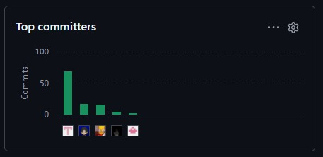
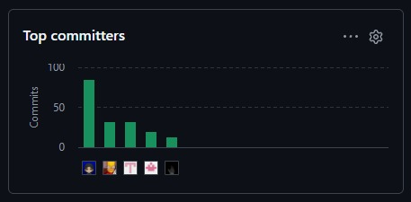
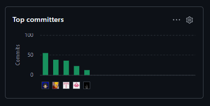

    

  
Universidad Peruana de Ciencias Aplicadas

  
Carrera de Ingeniería de Software

       
  
<b>1ASI0730</b>

  
<b>Aplicaciones Web</b>

  
NRC

  
<b>16127</b>

  
<b>Informe del Trabajo Final — TB1</b>

  
Docente

  
<b>Villafuerte Bazán, Óscar Iván</b>

   
  
Equipo

  
<b>NexaWeb</b>

   
  
Proyecto

  
<b>AgroFlet</b>

   
  
<b>Integrantes</b>

  <table style="font-family: 'Aptos', sans-serif; font-size: 11pt; border-collapse: collapse; border: none; margin: 10px auto;">
    <thead>
      <tr>
        <th style="text-align: left; padding: 2px 15px; border: none;">Código</th>
        <th style="text-align: left; padding: 2px 15px; border: none;">Apellidos y Nombres</th>
      </tr>
    </thead>
    <tbody>
      <tr>
        <td style="text-align: left; padding: 2px 15px; border: none;">U20241F027</td>
        <td style="text-align: left; padding: 2px 15px; border: none;">Alca Morán, César Alejandro</td>
      </tr>
      <tr>
        <td style="text-align: left; padding: 2px 15px; border: none;">U20241D920	</td>
        <td style="text-align: left; padding: 2px 15px; border: none;">Centeno León, Adriano Samir</td>
      </tr>
      <tr>
        <td style="text-align: left; padding: 2px 15px; border: none;">U20241F109	</td>
        <td style="text-align: left; padding: 2px 15px; border: none;">Rivas Méndez, Bernie Aarón</td>
      </tr>
      <tr>
        <td style="text-align: left; padding: 2px 15px; border: none;">U202323551	</td>
        <td style="text-align: left; padding: 2px 15px; border: none;">Rivas Castillo, Christoper Steven</td>
      </tr>
      <tr>
        <td style="text-align: left; padding: 2px 15px; border: none;">U202421618	</td>
        <td style="text-align: left; padding: 2px 15px; border: none;">Tello Lima, José Alejandro</td>
      </tr>
    </tbody>
  </table>
   

  
<b>Período 202620</b>

   
  
<b>Octubre 2026</b>

## Registro de Versiones del Informe

    <table style="margin: 0 auto; display: inline-table; text-align: left;">
        <tr>
            <th>Versión</th>
            <th>Fecha</th>
            <th>Autor</th>
            <th>Descripción de modificación</th>
        </tr>
        <tr>
            <td><strong>AV1</strong></td>
            <td>16/09/2026</td>
            <td>- Alca Morán, César Alejandro - Centeno León, Adriano Samir - Rivas Méndez, Bernie Aarón - Rivas Castillo, Christoper Steven - Tello Lima, Jose Alejandro</td>
            <td>Capítulo I: Introducción Capítulo II: Requirements Elicitation & Analysis. Capítulo III: Requirements Specification.  Capítulo IV: Product Design.  Capítulo V: Product Implementation, Validation & Deployment. 5.1. Software Configuration Management. 5.1.1. Software Development Environment Configuration. 5.1.2. Source Code Management. 5.1.3. Source Code Style Guide & Conventions. 5.1.4. Software Deployment Configuration. 5.2. Landing Page, Services & Applications Implementation. 5.2.1. Sprint 1 5.2.1.1. Sprint Planning 1. 5.2.1.2. Aspect Leaders and Collaborators. 5.2.1.3. Sprint Backlog 1. 5.2.1.4. Development Evidence for Sprint Review. 5.2.1.5. Execution Evidence for Sprint Review. 5.2.1.6. Services Documentation Evidence for Sprint Review. 5.2.1.7. Software Deployment Evidence for Sprint Review. 5.2.1.8. Team Collaboration Insights during Sprint</td>
        </tr>
        <tr>
            <td><strong>TB1</strong></td>
            <td>08/10/2026</td>
            <td>- Alca Morán, César Alejandro - Centeno León, Adriano Samir - Rivas Méndez, Bernie Aarón - Rivas Castillo, Christoper Steven - Tello Lima, Jose Alejandro</td>
            <td> 5.2.2. Sprint 2 5.2.1.1. Sprint Planning 1. 5.2.2.2. Aspect Leaders and Collaborators. 5.2.2.3. Sprint Backlog 2. 5.2.2.4. Development Evidence for Sprint Review. 5.2.2.5. Execution Evidence for Sprint Review. 5.2.2.6. Services Documentation Evidence for Sprint Review. 5.2.2.7. Software Deployment Evidence for Sprint Review. 5.2.2.8. Team Collaboration Insights during Sprint</td></td>
        </tr>
        <tr>
            <td><strong>AV2</strong></td>
            <td>Por definir</td>
            <td>- Alca Morán, César Alejandro - Centeno León, Adriano Samir - Rivas Méndez, Bernie Aarón - Rivas Castillo, Christoper Steven - Tello Lima, Jose Alejandro</td>
            <td></td>
        </tr>
        <tr>
            <td><strong>TB2</strong></td>
            <td>Por definir</td>
            <td>- Alca Morán, César Alejandro - Centeno León, Adriano Samir - Rivas Méndez, Bernie Aarón - Rivas Castillo, Christoper Steven - Tello Lima, Jose Alejandro</td>
            <td></td>
        </tr>
    </table>

# Project Report Collaboration Insights

Para el desarrollo del Project Report de AgroFlet, el equipo de NexaWeb utiliza el repositorio de documentación dentro de la organización AGROFLET en GitHub. Esta sección presenta la evidencia de colaboración correspondiente a AV1 y TB1, en coherencia con el Registro de Versiones del Informe.
Repositorio del informe del proyecto: Agroflet-report.
Commits consignados en el registro de colaboración de TB1: 165, distribuidos entre César (22), Adriano (12), Bernie (38), Christoper (55) y Jose (38). Estas cifras corresponden al corte histórico documentado en el informe; no representan necesariamente commits exclusivos de TB1 ni incluyen las correcciones posteriores.

Autores contribuyentes:
- Alca Morán, César Alejandro (almocesar-cell).
- Centeno León, Adriano Samir (Adri11-dk).
- Rivas Méndez, Bernie Aarón (ARivas3008).
- Rivas Castillo, Christoper Steven (CODERT0PH).
- Tello Lima, Jose Alejandro (j4ndrow).

La actividad del Project Report se organizó en ramas temáticas por capítulos, desde feature/chapter1 hasta feature/chapter5, además de las ramas feature/chapter6 y feature/chapterAnex. La rama develop reúne los avances del informe. Los commits permiten mantener trazabilidad sobre las modificaciones realizadas en investigación, requisitos, diseño, arquitectura y documentación de implementación.
Durante TB1, el equipo documentó el Sprint 2, las evidencias de desarrollo y ejecución de la Web Application, los servicios simulados mediante Fake API, los despliegues y la actualización de la Landing Page V2. La distribución de responsabilidades se sustenta en el Participant Performance Report del equipo.

### AV1 — Informe inicial y Sprint 1

Durante esta fase, el equipo elaboró la primera versión del informe de AgroFlet, incluyendo los siguientes aspectos:

- Carátula con información institucional, de la startup y de los integrantes.
- Registro de Versiones del Informe.
- Tabla de contenidos y desarrollo del Student Outcome.
- **Capítulo I:** introducción, presentación de la startup y descripción del producto.
- **Capítulo II:** avances de Requirements Elicitation & Analysis.
- **Capítulo III:** especificación de requisitos y artefactos asociados.
- **Capítulo IV:** avances de Product Design y diseño de la Landing Page.
- **Capítulo V:** configuración inicial y evidencias de implementación correspondientes al Sprint 1.
- Primera versión de la Landing Page de AgroFlet.
- Conclusiones preliminares, bibliografía y anexos.

### Project Report Collaboration Insights AV1

El siguiente cuadro reproduce los **conteos históricos consignados para AV1 en el README del informe**.

| **Integrante** | **Usuario GitHub** | **Commits registrados para AV1** |
| --- | --- | ---: |
| Alca Morán, César Alejandro | almocesar-cell | 14 |
| Centeno León, Adriano Samir | Adri11-dk | 5 |
| Rivas Méndez, Bernie Aarón | ARivas3008 | 8 |
| Rivas Castillo, Christoper Steven | CODERT0PH | 37 |
| Tello Lima, Jose Alejandro | j4ndrow | 26 |
| **Total del registro de AV1** | | **90** |

La colaboración durante AV1 se centró en la elaboración de los capítulos iniciales, los artefactos de análisis y diseño y las evidencias del Sprint 1. El trabajo se organizó mediante ramas por capítulo para facilitar la actualización de los contenidos asignados a cada integrante.

**Evidencias históricas conservadas en el informe:**

*Figura. Primera captura de colaboración conservada para AV1.*

*Figura. Segunda captura de colaboración conservada para AV1.*

Los valores anteriores se mantienen como antecedentes de la entrega AV1. No se incluyen cifras de adiciones y eliminaciones porque no se dispone de un registro verificado de esas métricas para este corte.

---

### TB1 — Actualización del informe y Sprint 2

Durante esta fase, el equipo amplió el Project Report para documentar el desarrollo realizado en el Sprint 2 y la primera versión funcional de la Web Application de AgroFlet.

Los principales aspectos documentados fueron:

- Definición de los objetivos del Sprint 2 y registro de la planificación.
- Actualización del cuadro de responsables y colaboradores.
- Elaboración del Sprint Backlog 2, con estimaciones y responsables.
- Desarrollo de la Web Application con **Vue y Vite**.
- Implementación de funcionalidades relacionadas con IAM, internacionalización, operaciones de envíos y componentes compartidos de interfaz y seguimiento.
- Documentación de la estructura del código, componentes y vistas del frontend.
- Incorporación de Development Evidence y Execution Evidence para el Sprint Review.
- Documentación de los servicios utilizados mediante **Fake API y OpenAPI**.
- Incorporación de las evidencias de despliegue de la Web Application y la Landing Page V2.
- Actualización de Team Collaboration Insights, Student Outcome, conclusiones y anexos.

El apartado **5.2.2** reúne la documentación correspondiente al Sprint 2, incluyendo planificación, backlog, desarrollo, ejecución, servicios, despliegue y colaboración.

### Project Report Collaboration Insights TB1

El siguiente cuadro presenta los **conteos históricos consignados en el registro de TB1 del README**, junto con los aportes declarados en el Participant Performance Report.

| **Integrante** | **Usuario GitHub** | **Commits consignados en el registro de TB1** | **Principales aportes documentados** |
| --- | --- | ---: | --- |
| Alca Morán, César Alejandro | almocesar-cell | 22 | Desarrollo de Software Deployment Evidence for Sprint Review y actualización de las conclusiones. Participación en el frontend mediante `feature/shipment-operations`. |
| Centeno León, Adriano Samir | Adri11-dk | 12 | Desarrollo de Team Collaboration Insights during Sprint y actualización de anexos. Implementación de IAM e internacionalización en el frontend. |
| Rivas Méndez, Bernie Aarón | ARivas3008 | 38 | Desarrollo de Development Evidence, Execution Evidence y Services Documentation Evidence for Sprint Review. Participación en `feature/shared-ui-and-tracking`. |
| Rivas Castillo, Christoper Steven | CODERT0PH | 55 | Desarrollo de la Web Application, documentación del código, componentes y vistas con Vue y Vite en WebStorm, evidencias de desarrollo y ejecución, video de navegación del producto y despliegues de la aplicación y la Landing Page V2. |
| Tello Lima, Jose Alejandro | j4ndrow | 38 | Redacción de objetivos del sprint y minutas de planificación, actualización del cuadro de roles y elaboración de estimaciones y responsables del Sprint Backlog 2. |
| **Total del registro de TB1** | | **165** | |

**Alcance del conteo:** los 165 commits corresponden al registro histórico documentado para TB1. No se presentan como un conteo verificado de commits individuales realizados exclusivamente después de AV1 ni como un historial filtrado para excluir merges. Los totales de AV1 y TB1 representan cortes documentales distintos y no deben sumarse para calcular un total de contribuciones.

La evidencia muestra aportes de los cinco integrantes en documentación, implementación y despliegue. Las responsabilidades abarcan la planificación del sprint, el desarrollo del frontend, la documentación de servicios, las evidencias de ejecución y la actualización del informe.

### Evidencia de colaboración registrada para TB1

*Figura. Captura de Top committers conservada en el informe de AgroFlet para TB1. Su alcance debe interpretarse junto con el registro histórico del README; no acredita por sí sola un conteo exclusivo del Sprint 2.*

### Trazabilidad de la documentación y los productos

- **Repositorio del informe:** [Agroflet-report](https://github.com/AGROFLET/Agroflet-report).
- **Contributors del informe:** [GitHub Contributors](https://github.com/AGROFLET/Agroflet-report/graphs/contributors).
- **Historial de integración:** [Commits de develop](https://github.com/AGROFLET/Agroflet-report/commits/develop/).
- **Pull Requests cerrados:** [Pull Requests del informe](https://github.com/AGROFLET/Agroflet-report/pulls?q=is%3Apr+is%3Aclosed).
- **Repositorio de la Web Application:** [Agroflet-frontend-application](https://github.com/AGROFLET/Agroflet-frontend-application).
- **Repositorio de la Landing Page:** [Agroflet-landing-page](https://github.com/AGROFLET/Agroflet-landing-page).

Las evidencias del repositorio del informe acreditan la colaboración documental. Las evidencias de los repositorios de la Web Application y la Landing Page permiten consultar los aportes de implementación de cada producto.

El historial de commits, las ramas de trabajo y los Pull Requests permiten relacionar los responsables con los artefactos modificados. Las evidencias complementarias de colaboración durante el Sprint 2 se documentan en **5.2.2.8. Team Collaboration Insights during Sprint**.

## Contenido

- [Carátula y datos académicos](#caratula)
- [Registro de Versiones del Informe](#registro-de-versiones-del-informe)
- [Project Report Collaboration Insights](#project-report-collaboration-insights)
- [Student Outcome 5](#abet---eac---student-outcome-5)
- [Capítulo I: Introducción](01-Chapter-1-Presentation.md#capítulo-i-introducción)
  - [1.1. Startup Profile](01-Chapter-1-Presentation.md#11-startup-profile)
    - [1.1.1. Descripción de la Startup](01-Chapter-1-Presentation.md#111-descripción-de-la-startup)
    - [1.1.2. Perfiles de integrantes del equipo](01-Chapter-1-Presentation.md#112-perfiles-de-integrantes-del-equipo)
  - [1.2. Solution Profile](01-Chapter-1-Presentation.md#12-solution-profile)
    - [1.2.1. Antecedentes y problemática](01-Chapter-1-Presentation.md#121-antecedentes-y-problemática)
      - [1.2.1.1. Objetivos del Proyecto](01-Chapter-1-Presentation.md#1211-objetivos-del-proyecto)
      - [1.2.1.2. Restricciones del Proyecto](01-Chapter-1-Presentation.md#1212-restricciones-del-proyecto)
    - [1.2.2. Lean UX Process](01-Chapter-1-Presentation.md#122-lean-ux-process)
      - [1.2.2.1. Lean UX Problem Statements](01-Chapter-1-Presentation.md#1221-lean-ux-problem-statements)
      - [1.2.2.2. Lean UX Assumptions](01-Chapter-1-Presentation.md#1222-lean-ux-assumptions)
      - [1.2.2.3. Lean UX Hypothesis Statements](01-Chapter-1-Presentation.md#1223-lean-ux-hypothesis-statements)
      - [1.2.2.4. Lean UX Canvas](01-Chapter-1-Presentation.md#1224-lean-ux-canvas)
  - [1.3. Segmentos objetivo](01-Chapter-1-Presentation.md#13-segmentos-objetivo)
- [Capítulo II: Requirements Elicitation & Analysis](02-Chapter-2-Requirements-Development-and-Software-Solution-Design.md#capítulo-ii-requirements-elicitation--analysis)
  - [2.1. Competidores](02-Chapter-2-Requirements-Development-and-Software-Solution-Design.md#21-competidores)
    - [2.1.1. Análisis competitivo](02-Chapter-2-Requirements-Development-and-Software-Solution-Design.md#211-análisis-competitivo)
    - [2.1.2. Estrategias y tácticas frente a competidores](02-Chapter-2-Requirements-Development-and-Software-Solution-Design.md#212-estrategias-y-tácticas-frente-a-competidores)
  - [2.2. Entrevistas](02-Chapter-2-Requirements-Development-and-Software-Solution-Design.md#22-entrevistas)
    - [2.2.1. Diseño de entrevistas](02-Chapter-2-Requirements-Development-and-Software-Solution-Design.md#221-diseño-de-entrevistas)
    - [2.2.2. Registro de entrevistas](02-Chapter-2-Requirements-Development-and-Software-Solution-Design.md#222-registro-de-entrevistas)
    - [2.2.3. Análisis de entrevistas](02-Chapter-2-Requirements-Development-and-Software-Solution-Design.md#223-análisis-de-entrevistas)
  - [2.3. Needfinding](02-Chapter-2-Requirements-Development-and-Software-Solution-Design.md#23-needfinding)
    - [2.3.1. User Personas](02-Chapter-2-Requirements-Development-and-Software-Solution-Design.md#231-user-personas)
    - [2.3.2. User Task Matrix](02-Chapter-2-Requirements-Development-and-Software-Solution-Design.md#232-user-task-matrix)
    - [2.3.3. User Journey Mapping](02-Chapter-2-Requirements-Development-and-Software-Solution-Design.md#233-user-journey-mapping)
    - [2.3.4. Empathy Mapping](02-Chapter-2-Requirements-Development-and-Software-Solution-Design.md#234-empathy-mapping)
  - [2.4. Big Picture EventStorming](02-Chapter-2-Requirements-Development-and-Software-Solution-Design.md#24-big-picture-eventstorming)
  - [2.5. Ubiquitous Language](02-Chapter-2-Requirements-Development-and-Software-Solution-Design.md#25-ubiquitous-language)
- [Capítulo III: Requirements Specification](03-Chapter-3-Solution-UI-UX-Design.md#capítulo-iii-requirements-specification)
  - [3.1. User Stories](03-Chapter-3-Solution-UI-UX-Design.md#31-user-stories)
  - [3.2. Impact Mapping](03-Chapter-3-Solution-UI-UX-Design.md#32-impact-mapping)
  - [3.3. Product Backlog](03-Chapter-3-Solution-UI-UX-Design.md#33-product-backlog)
- [Capítulo IV: Product Design](04-Chapter-4-Product-Implementation-&-Validation.md#capítulo-iv-product-design)
  - [4.1. Style Guidelines](04-Chapter-4-Product-Implementation-&-Validation.md#41-style-guidelines)
    - [4.1.1. General Style Guidelines](04-Chapter-4-Product-Implementation-&-Validation.md#411-general-style-guidelines)
    - [4.1.2. Web Style Guidelines](04-Chapter-4-Product-Implementation-&-Validation.md#412-web-style-guidelines)
  - [4.2. Information Architecture](04-Chapter-4-Product-Implementation-&-Validation.md#42-information-architecture)
    - [4.2.1. Organization Systems](04-Chapter-4-Product-Implementation-&-Validation.md#421-organization-systems)
    - [4.2.2. Labeling Systems](04-Chapter-4-Product-Implementation-&-Validation.md#422-labeling-systems)
    - [4.2.3. SEO Tags and Meta Tags](04-Chapter-4-Product-Implementation-&-Validation.md#423-seo-tags-and-meta-tags)
    - [4.2.4. Searching Systems](04-Chapter-4-Product-Implementation-&-Validation.md#424-searching-systems)
    - [4.2.5. Navigation Systems](04-Chapter-4-Product-Implementation-&-Validation.md#425-navigation-systems)
  - [4.3. Landing Page UI Design](04-Chapter-4-Product-Implementation-&-Validation.md#43-landing-page-ui-design)
    - [4.3.1. Landing Page Wireframe](04-Chapter-4-Product-Implementation-&-Validation.md#431-landing-page-wireframe)
    - [4.3.2. Landing Page Mock-up](04-Chapter-4-Product-Implementation-&-Validation.md#432-landing-page-mock-up)
  - [4.4. Web Applications UX/UI Design](04-Chapter-4-Product-Implementation-&-Validation.md#44-web-applications-uxui-design)
    - [4.4.1. Web Applications Wireframes](04-Chapter-4-Product-Implementation-&-Validation.md#441-web-applications-wireframes)
    - [4.4.2. Web Applications Wireflow Diagrams](04-Chapter-4-Product-Implementation-&-Validation.md#442-web-applications-wireflow-diagrams)
    - [4.4.3. Web Applications Mock-ups](04-Chapter-4-Product-Implementation-&-Validation.md#443-web-applications-mock-ups)
    - [4.4.4. Web Applications User Flow Diagrams](04-Chapter-4-Product-Implementation-&-Validation.md#444-web-applications-user-flow-diagrams)
  - [4.5. Web Applications Prototyping](04-Chapter-4-Product-Implementation-&-Validation.md#45-web-applications-prototyping)
  - [4.6. Domain-Driven Software Architecture](04-Chapter-4-Product-Implementation-&-Validation.md#46-domain-driven-software-architecture)
    - [4.6.1. Design-Level EventStorming](04-Chapter-4-Product-Implementation-&-Validation.md#461-design-level-eventstorming)
    - [4.6.2. Software Architecture Context Level Diagram](04-Chapter-4-Product-Implementation-&-Validation.md#462-software-architecture-context-level-diagram)
    - [4.6.3. Software Architecture Container Level Diagrams](04-Chapter-4-Product-Implementation-&-Validation.md#463-software-architecture-container-level-diagrams)
    - [4.6.4. Software Architecture Component Level Diagrams](04-Chapter-4-Product-Implementation-&-Validation.md#464-software-architecture-component-level-diagrams)
  - [4.7. Software Object-Oriented Design](04-Chapter-4-Product-Implementation-&-Validation.md#47-software-object-oriented-design)
    - [4.7.1. Class Diagrams](04-Chapter-4-Product-Implementation-&-Validation.md#471-class-diagrams)
  - [4.8. Database Design](04-Chapter-4-Product-Implementation-&-Validation.md#48-database-design)
    - [4.8.1. Database Diagrams](04-Chapter-4-Product-Implementation-&-Validation.md#481-database-diagrams)
- [Capítulo V: Product Implementation, Validation & Deployment](05-Software-Development.md#capítulo-v-product-implementation-validation--deployment)
  - [5.1. Software Configuration Management](05-Software-Development.md#51-software-configuration-management)
    - [5.1.1. Software Development Environment Configuration](05-Software-Development.md#511-software-development-environment-configuration)
    - [5.1.2. Source Code Management](05-Software-Development.md#512-source-code-management)
    - [5.1.3. Source Code Style Guide & Coding Conventions](05-Software-Development.md#513-source-code-style-guide--coding-conventions)
    - [5.1.4. Software Deployment Configuration](05-Software-Development.md#514-software-deployment-configuration)
  - [5.2. Landing Page, Services & Applications Implementation](05-Software-Development.md#52-landing-page-services--applications-implementation)
    - [5.2.1. Sprint 1](05-Software-Development.md#521-sprint-1)
      - [5.2.1.1. Sprint Planning 1](05-Software-Development.md#5211-sprint-planning-1)
      - [5.2.1.2. Aspect Leaders and Collaborators](05-Software-Development.md#5212-aspect-leaders-and-collaborators)
      - [5.2.1.3. Sprint Backlog 1](05-Software-Development.md#5213-sprint-backlog-1)
      - [5.2.1.4. Development Evidence for Sprint Review](05-Software-Development.md#5214-development-evidence-for-sprint-review)
      - [5.2.1.5. Execution Evidence for Sprint Review](05-Software-Development.md#5215-execution-evidence-for-sprint-review)
      - [5.2.1.6. Services Documentation Evidence for Sprint Review](05-Software-Development.md#5216-services-documentation-evidence-for-sprint-review)
      - [5.2.1.7. Software Deployment Evidence for Sprint Review](05-Software-Development.md#5217-software-deployment-evidence-for-sprint-review)
      - [5.2.1.8. Team Collaboration Insights during Sprint](05-Software-Development.md#5218-team-collaboration-insights-during-sprint)
    - [5.2.2. Sprint 2](05-Software-Development.md#522-sprint-2)
      - [5.2.2.1. Sprint Planning 2](05-Software-Development.md#5221-sprint-planning-2)
      - [5.2.2.2. Aspect Leaders and Collaborators](05-Software-Development.md#5222-aspect-leaders-and-collaborators)
      - [5.2.2.3. Sprint Backlog 2](05-Software-Development.md#5223-sprint-backlog-2)
      - [5.2.2.4. Development Evidence for Sprint Review](05-Software-Development.md#5224-development-evidence-for-sprint-review)
      - [5.2.2.5. Execution Evidence for Sprint Review](05-Software-Development.md#5225-execution-evidence-for-sprint-review)
      - [5.2.2.6. Services Documentation Evidence for Sprint Review](05-Software-Development.md#5226-services-documentation-evidence-for-sprint-review)
      - [5.2.2.7. Software Deployment Evidence for Sprint Review](05-Software-Development.md#5227-software-deployment-evidence-for-sprint-review)
      - [5.2.2.8. Team Collaboration Insights during Sprint](05-Software-Development.md#5228-team-collaboration-insights-during-sprint)
- [Conclusiones y recomendaciones](06-Chapter-6-Conclusion.md#conclusiones-y-recomendaciones)
- [Anexos](10-Chapter-Anex-Biblio.md#anexos)
- [Bibliografía](10-Chapter-Anex-Biblio.md#bibliografía)

---

# ABET - EAC - Student Outcome 5

**Criterio:** _La capacidad de funcionar efectivamente en un equipo cuyos miembros juntos proporcionan liderazgo, crean un entorno de colaboración e inclusivo, establecen objetivos, planifican tareas y cumplen objetivos._

En el siguiente cuadro se describe las acciones realizadas y enunciados de conclusiones por parte del grupo, que permiten sustentar el haber alcanzado el logro del ABET – EAC - Student Outcome 5.

| Criterio específico | Acciones realizadas | Conclusiones |
| :--- | :--- | :--- |
| **Trabaja en equipo para proporcionar liderazgo en forma conjunta** | **Alca Morán, César Alejandro** AV1: Asumió liderazgo en el desarrollo de las entrevistas a los usuarios objetivo, el análisis de competidores y el proceso de Needfinding, orientando al equipo en la identificación de necesidades, problemáticas y oportunidades relacionadas con AgroFlet. TB1: Desarrolló el apartado de Software Deployment Evidence for Sprint Review, contribuyendo a documentar las evidencias relacionadas con el despliegue realizado durante el sprint. Además, participó en la actualización de las conclusiones, aportando a la consolidación de los resultados obtenidos. AV2: TB2:  **Centeno León, Adriano Samir** AV1: Lideró la organización y definición de las Epics, User Stories y criterios de aceptación del producto. Asimismo, participó en la elaboración del Impact Mapping y Product Backlog, ayudando a establecer y priorizar los requerimientos principales de AgroFlet. TB1: Desarrolló el punto de Team Collaboration Insights during Sprint y realizó actualizaciones en el anexo. En el frontend, elaboró el bounded de IAM y el i18n, trabajando cada uno en su rama correspondiente. AV2: TB2:  **Rivas Méndez, Bernie Aarón** AV1: Proporcionó liderazgo técnico durante la etapa de implementación del proyecto, participando en la gestión del repositorio, aplicación del flujo de trabajo con GitFlow, desarrollo correspondiente al Sprint 1 e integración de los avances realizados por el equipo. TB1: Contribuyó a la documentación técnica redactando las secciones de Development Evidence, Execution Evidence y Services Documentation Evidence for Sprint Review. Además, colaboró en la preparación del despliegue mediante la rama `feature/shared-ui-and-tracking`, guiando la integración continua de los componentes clave de la interfaz. AV2: TB2:  **Rivas Castillo, Christoper Steven** AV1: Asumió liderazgo en la definición de la problemática, propuesta de valor y segmentos objetivo de AgroFlet. Además, participó activamente en la elaboración de los artefactos de Lean UX, contribuyendo a establecer una visión común del producto y orientar las decisiones iniciales del equipo. TB1: Coordinó el desarrollo de la Web Application de AgroFlet y su despliegue, y documentó las evidencias del frontend, su estructura, componentes y vistas desarrolladas en WebStorm con Vue + Vite. También realizó el despliegue de la Landing Page V2 y la preparación del video de Product Navigation. AV2: TB2:  **Tello Lima, Jose Alejandro** AV1: Lideró actividades relacionadas con la identidad visual de AgroFlet, la arquitectura de información y el diseño de wireframes y mockups, orientando al equipo en la construcción de una experiencia visual coherente con las necesidades identificadas para los usuarios. TB1: Asumió el liderazgo en la organización y estructuración del Sprint Planning 2, definiendo los objetivos del sprint y redactando las minutas de planificación. Además, se encargó de actualizar el cuadro de Aspect Leaders and Collaborators, guiando al equipo en la correcta distribución de responsabilidades y asegurando que cada miembro tuviera un rol claro para esta etapa. AV2: TB2: | Durante el AV1, el equipo evidenció un modelo de liderazgo distribuido, donde cada integrante asumió responsabilidad sobre una parte específica del proyecto. Las actividades abarcaron investigación de usuarios y competidores, definición del producto mediante Lean UX, gestión de requerimientos, diseño de experiencia e interfaz e implementación técnica. Esta distribución permitió integrar diferentes perspectivas y avanzar de manera coordinada en el desarrollo de AgroFlet.  En el TB1, cada integrante extendió su rol de liderazgo hacia la corrección del AV1 y el desarrollo concreto de la Landing Page y el frontend, consolidando un avance técnico estructurado y alineado con los objetivos del producto.  *(Por definir para AV2)*  *(Por definir para TB2)* |
| **Crea un entorno colaborativo e inclusivo, establece metas, planifica tareas y cumple objetivos.** | **Alca Morán, César Alejandro** AV1: Colaboró con el equipo en la planificación y ejecución de entrevistas, recopilando y organizando información de los usuarios para compartir posteriormente los principales hallazgos. Sus resultados aportaron información necesaria para orientar las decisiones tomadas durante el desarrollo del producto. TB1: Participó mediante la rama feature/shipment-operations, contribuyendo a la implementación de las funcionalidades relacionadas con las operaciones de envío y al avance del desarrollo de la interfaz. AV2: TB2:  **Centeno León, Adriano Samir** AV1: Participó activamente en la planificación y priorización de Epics y User Stories, colaborando con los demás integrantes para establecer objetivos alcanzables y mantener organizado el Product Backlog según las necesidades identificadas en AgroFlet. TB1: Colaboró en la corrección de los requisitos del AV1 y participó en la planificación del Sprint del TB1, estableciendo metas claras para el desarrollo del frontend y cumpliendo con los entregables definidos en el backlog. AV2: TB2:  **Rivas Méndez, Bernie Aarón** AV1: Colaboró en la organización de las actividades técnicas del Sprint 1 y en la integración de los cambios realizados mediante GitFlow, coordinándose con sus compañeros para mantener un repositorio organizado y reducir conflictos durante la implementación. TB1: Promovió un entorno colaborativo trabajando en equipo sobre la rama `feature/shared-ui-and-tracking` para el desarrollo de la interfaz compartida y el rastreo. Asimismo, cumplió a tiempo los objetivos del sprint estructurando las evidencias de ejecución y la documentación OpenAPI, garantizando la trazabilidad en el informe. AV2: TB2:  **Rivas Castillo, Christoper Steven** AV1: Participó en sesiones colaborativas para establecer la problemática, propuesta de valor, segmentos objetivo y artefactos de Lean UX. Contribuyó a alinear al equipo respecto a los objetivos del producto y a mantener una visión compartida sobre las necesidades que AgroFlet debía resolver. TB1: Colaboró con los integrantes en la integración del frontend y en la documentación de Development Evidence y Execution Evidence. Contribuyó al cumplimiento de los entregables mediante la publicación de la Web Application, la Landing Page V2 y el video de navegación del producto, de acuerdo con la distribución de responsabilidades del equipo. AV2: TB2:  **Tello Lima, Jose Alejandro** AV1: Trabajó coordinadamente con los integrantes en la definición de la identidad visual, arquitectura de información, wireframes y mockups. Incorporó los requerimientos y hallazgos obtenidos por el equipo para mantener consistencia entre la investigación realizada y la propuesta visual desarrollada. TB1: Promovió la planificación estructurada y el cumplimiento de metas mediante la elaboración y gestión del Sprint Backlog 2. Coordinó de manera inclusiva con el equipo para detallar las User Stories a trabajar, consensuar las estimaciones de puntos ágiles y asignar a los responsables. Esto permitió establecer metas claras, planificar adecuadamente las tareas y asegurar el cumplimiento de los objetivos del sprint. AV2: TB2: | Durante el AV1, el equipo mantuvo una dinámica colaborativa en la que los resultados de cada área fueron utilizados como insumo para las siguientes actividades del proyecto. Los hallazgos obtenidos mediante entrevistas y análisis sirvieron para definir la propuesta de valor y los requerimientos, mientras que estos orientaron posteriormente el diseño y la implementación. Esta coordinación permitió mantener objetivos compartidos y cumplir progresivamente con los entregables establecidos para AgroFlet.  Durante el TB1, el equipo mantuvo una dinámica colaborativa en la que se integraron las correcciones realizadas en el AV1 con el desarrollo de la Landing Page y el frontend. Esta coordinación permitió mantener una distribución equitativa de las tareas, una comunicación constante entre los integrantes y un avance organizado del proyecto, cumpliendo progresivamente con los entregables establecidos dentro de los plazos definidos.  *(Por definir para AV2)*  *(Por definir para TB2)* |

